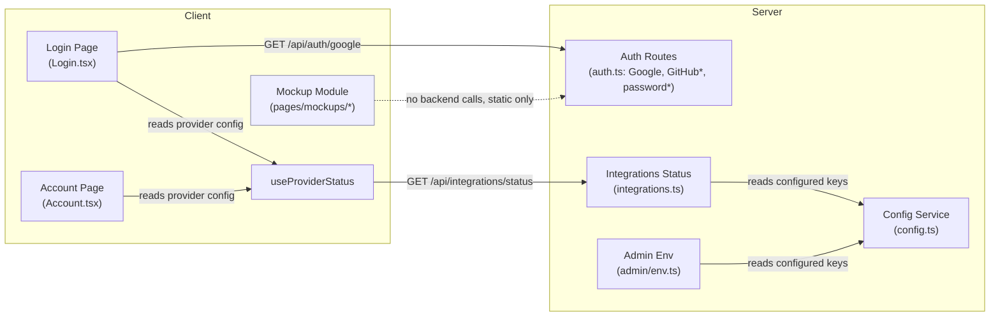
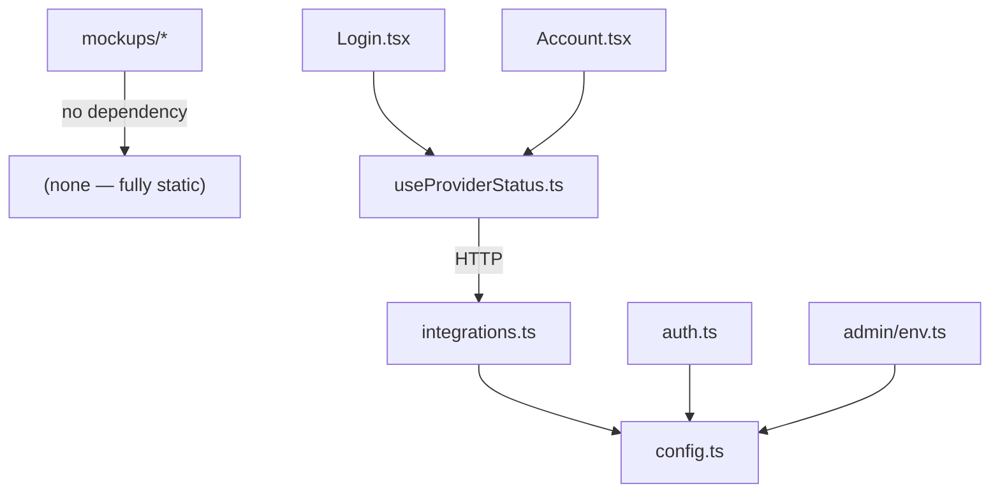

<!-- CLASI: Before changing code or making plans, review the SE process in CLAUDE.md -->

# Architecture Update -- Sprint 001: Wireframe Mockups and Auth Cleanup

No architecture document exists yet for Flyerbot (`docs/architecture/` is
empty). This is the first architecture artifact for the project, but it is
scoped **only** to what this sprint touches: auth surface cleanup and a
set of static wireframe pages. It deliberately does not design the
project/asset/style/knowledge-base domain, the agent/MCP layer, or image
generation — those are out of scope until the stakeholder has reviewed the
wireframes produced here (per `.clasi/design/overview.md` §"Phases",
phase 1 of 4). A future sprint's architecture update will consolidate a
real system architecture once that review has happened.

## Sprint Changes Summary

| Area | Change |
|---|---|
| Server auth | Remove Pike13 route module, strategy references, config keys, integration-status fields. |
| Server config | Remove `PIKE13_*` env vars from `config/dev`, `config/prod`, `config/env.template`. |
| Client auth pages | `Login.tsx` reduced to a single Google sign-in affordance; Pike13 stripped from `Account.tsx`, `admin/UsersPanel.tsx`, `admin/EnvironmentInfo.tsx`, `useProviderStatus.ts`. |
| Client routing | `/register` route removed from `App.tsx` (self-serve registration no longer live); `Register.tsx` component retained but unrouted. |
| Client mockups (new) | New `client/src/pages/mockups/` module + `/mockups/*` routes: index, two-pane main layout, new-project flow, postcard text-region form, Google-only login — all static/stubbed, outside `AppLayout`. |
| Tests | Pike13 test coverage removed; `LoginPage.test.tsx` rewritten for Google-only; `Account.test.tsx` loses its Pike13 cases; new mockup smoke tests added. |

## What Changed

### 1. Auth Module (server) — Pike13 removed, Google-only surfaced

- `server/src/routes/pike13.ts` deleted.
- `server/src/app.ts`: `pike13Router` import and mount removed.
- `server/src/routes/integrations.ts`: `pike13` field removed from
  `GET /api/integrations/status`.
- `server/src/routes/admin/env.ts`: `pike13` field removed from
  `GET /api/admin/env` integrations block.
- `server/src/services/config.ts`: `PIKE13_CLIENT_ID`, `PIKE13_CLIENT_SECRET`,
  `PIKE13_API_BASE` removed from `CONFIG_KEYS`.
- `config/dev/{public,secrets}.env`, `config/prod/{public,secrets}.env`,
  `config/env.template`: `PIKE13_*` lines removed.
- The GitHub and password (`/api/auth/register`, `/api/auth/login`,
  `/api/auth/test-login`) strategies and routes are **not** removed from
  the server in this sprint — see Design Rationale.

### 2. Client Auth Pages — Google-only login surface

- `client/src/pages/Login.tsx`: rewritten to render a single
  "Sign in with Google" affordance (shown only when
  `useProviderStatus().google` is true, else a not-configured message).
  The demo username/password form, GitHub button, Pike13 button, and
  "Register" link are all removed.
- `client/src/hooks/useProviderStatus.ts`: `pike13` field removed from
  `ProviderStatus`.
- `client/src/pages/Account.tsx`: `pike13` removed from `PROVIDER_LABELS`
  and `addButtonStyle`. GitHub linking in this page is **not** removed —
  see Design Rationale.
- `client/src/pages/admin/UsersPanel.tsx`: `pike13` removed from
  `PROVIDER_LOGOS`.
- `client/src/pages/admin/EnvironmentInfo.tsx`: `pike13` removed from
  `INTEGRATION_LABELS`.
- `client/src/App.tsx`: `/register` route removed. `Register.tsx` remains
  as an unrouted component (its tests import it directly and are
  unaffected).

### 3. Wireframe Mockup Module (new)

A new, self-contained module: `client/src/pages/mockups/`, routed under
`/mockups/*` in `App.tsx`, **outside** `AppLayout` (no sidebar/topbar —
these pages exist to preview the layout that will eventually replace most
of `AppLayout`'s role, so embedding them inside the current sidebar shell
would be misleading). Pages:

- `/mockups` — index linking the four mockups below.
- `/mockups/main` — two-pane main layout (left browser, right
  output+chat).
- `/mockups/new-project` — new-project flow (header, empty space, chat).
- `/mockups/postcard-edit` — postcard text-region edit form.
- `/mockups/login` — Google-only login wireframe.

All five pages use static/stub data defined in-component or in a small
local stub-data file; none calls the backend. None is gated by
`ProtectedRoute` — see Design Rationale.

## Why

- Pike13 is confirmed unneeded (stakeholder: "I want you to clean out
  Pike13, which I don't think we need") and its removal is a prerequisite
  for a clean Google-only login surface — leaving dead strategy code and
  config keys around increases the surface Ticket 002's UI rewrite has to
  reconcile with.
- Google-only login directly implements UC-001 and the stakeholder's
  explicit "no managing or creating accounts other than in Google."
- The wireframe mockups implement `overview.md` phase 2 ("wireframe
  mockups — simple, real web pages, not full builds") and give the
  stakeholder something concrete to react to before any real
  project/asset/style domain work is designed.

## Impact on Existing Components

- `AppLayout.tsx` is untouched this sprint. The mockups live outside it
  deliberately; a future sprint will decide how much of `AppLayout`'s
  sidebar survives once the stakeholder has reviewed `/mockups/main`.
- `useProviderStatus.ts` consumers (`Login.tsx`, `Account.tsx`) both
  continue to compile against a narrower `ProviderStatus` shape
  (`{ github, google, loading }`).
- No Prisma schema change. `Config` rows for `PIKE13_*` keys, if any exist
  in a deployed database, become orphaned (harmless — `setConfig`/`getAllConfig`
  only recognize keys in `CONFIG_KEYS`, so stale rows are simply invisible
  to the admin config UI going forward).
- No change to `User`/`UserProvider` schema; any historical `provider:
  'pike13'` row (unlikely in a pre-launch repo, but possible from manual
  testing) becomes an orphaned label with no route to re-authenticate via
  Pike13. Acceptable for a pre-launch app with no real users yet (see
  Migration Concerns).

## Data Model

No schema changes. `Config`, `User`, `UserProvider`, `Session` tables are
unmodified — only the *recognized key set* (`CONFIG_KEYS` in
`config.ts`) and the *set of Passport strategies registered* change. No
ER diagram is included since no entity/relationship/cardinality changes.

## Diagrams

### Component / Module Diagram

*GitHub and password strategies (marked `*`) are retained but no longer
reachable from `LoginPage`; see Design Rationale.*

### Dependency Graph

No cycles. `mockups/*` has zero fan-out into the rest of the app by
design — it is the one new module this sprint and it must not create a
dependency the future real UI has to unwind.

## Migration Concerns

- **Config rows**: any existing `Config` table rows with `key` starting
  `PIKE13_` become inert (not read by any code path after this sprint).
  No migration script needed — they are simply ignored. A follow-up
  cleanup script could `DELETE FROM Config WHERE key LIKE 'PIKE13_%'` but
  is not required for correctness.
- **Env files**: `PIKE13_*` entries are removed from tracked config files
  (`config/dev`, `config/prod`, `config/env.template`). Anyone with a
  local `config/local/*/secrets.env` override containing `PIKE13_*` keys
  will have an unused override — harmless, not automatically cleaned (out
  of scope, personal file).
- **No user-facing data migration**: this is a pre-launch repo with no
  real Pike13-authenticated users to migrate.
- **Deployment sequencing**: none — this is a single deployable change,
  no phased rollout needed.

## Design Rationale

### Decision 1: Keep GitHub and password auth registered server-side; only remove them from the primary login UI

- **Context**: The issue's file list calls out `Login.tsx`'s GitHub
  button and the demo password form for removal, but does not call for
  deleting the GitHub Passport strategy, its OAuth routes, or the
  password `/api/auth/register` and `/api/auth/login` endpoints. A large,
  unrelated server/client test suite (`auth-login.test.ts`,
  `auth-register.test.ts`, `auth-oauth.test.ts`,
  `user-service-password.test.ts`, `RegisterPage.test.tsx`, and the
  `github.test.ts`/account-linking tests) depends on that backend
  surface.
- **Alternatives considered**: (a) delete GitHub and password auth
  entirely, including backend and all dependent tests; (b) keep
  everything, hide nothing.
- **Why this choice**: (a) is disproportionate to a "wireframe + cleanup"
  sprint — it would cascade into deleting or rewriting a test suite the
  issue never mentioned, and risks breaking the demo-user seeding
  (`seed.ts`) other tickets and CI rely on for auth in tests. (b) fails
  the stakeholder's explicit "Google/Gmail only" login requirement. This
  middle path satisfies the user-visible requirement (nothing but Google
  is reachable from `/login`) while leaving a reversible, already-tested
  backend surface alone.
- **Consequences**: `/api/auth/github`, `/api/auth/login`,
  `/api/auth/register`, and `/api/auth/test-login` remain live endpoints,
  reachable by direct HTTP call (not via any linked UI button except
  `Account.tsx`'s GitHub "Add" link — see Decision 2). This is flagged as
  Open Question 1 for the stakeholder.

### Decision 2: Leave GitHub linking in `Account.tsx` untouched

- **Context**: `Account.tsx` lets a signed-in user link/unlink secondary
  OAuth providers, including GitHub. The issue's Account.tsx bullet is
  about removing *Pike13* references there, not GitHub.
- **Alternatives considered**: strip GitHub from `Account.tsx` too, for
  full consistency with "no managing accounts other than Google."
- **Why this choice**: same proportionality argument as Decision 1 — the
  issue scoped `Account.tsx` changes to Pike13 only, and `Account.tsx`'s
  own guardrail (cannot unlink your only login method) already prevents a
  Google-only user from accidentally losing access. Removing the linking
  UI is a bigger, separately-reviewable interaction change.
- **Consequences**: A user could theoretically add a GitHub identity via
  `Account.tsx`'s "Add GitHub" link even though the primary login page
  only offers Google. Flagged as Open Question 1 alongside Decision 1 —
  both are really the same open question at two call sites.

### Decision 3: `/register` route removed from `App.tsx`, but `Register.tsx` and its backend endpoint are not deleted

- **Context**: Self-serve registration directly contradicts "no managing
  or creating accounts other than in Google," but `Register.tsx` is
  covered by `RegisterPage.test.tsx`, which renders the component
  directly (not through `App.tsx` routing).
- **Why this choice**: Removing the live route is the minimal change that
  satisfies the stakeholder requirement (no reachable self-serve signup);
  keeping the component and its test avoids an unrelated deletion and
  keeps the change a one-line route removal, fully reversible.
- **Consequences**: `RegisterPage.test.tsx` requires no changes. Anyone
  navigating to `/register` gets the app's normal not-found/catch-all
  behavior.

### Decision 4: Mockups live outside `AppLayout`, under `/mockups/*`, and are not auth-gated

- **Context**: The mockups exist to preview a UI that will eventually
  replace most of `AppLayout`'s sidebar role (per `overview.md` and spec
  §2). Embedding them inside the current sidebar shell would show two
  competing layouts at once and misrepresent the wireframe.
- **Alternatives considered**: (a) nest mockups inside `AppLayout` like
  other authenticated pages; (b) gate mockups behind `ProtectedRoute`.
- **Why this choice**: (a) actively undermines the point of the
  wireframe (previewing a layout that removes the sidebar). (b) adds
  friction for the stakeholder review this sprint exists to enable, and
  the pages hold no real data or backend calls, so there is no
  confidentiality reason to gate them behind login.
- **Consequences**: `/mockups/*` is reachable by anyone who can reach the
  dev server at all (same exposure as `/login` today). Acceptable for a
  pre-launch, internally-hosted dev environment; flagged as Open Question
  2 for whether this should change once the app nears a real deployment.

## Open Questions

1. **GitHub/password auth backend scope**: Should `/api/auth/github`,
   `/api/auth/login`, `/api/auth/register`, `/api/auth/test-login`, and
   `Account.tsx`'s GitHub linking be removed entirely in a follow-up
   sprint, or kept indefinitely as a dev/test-only escape hatch? This
   sprint keeps them (Decisions 1-2); the stakeholder should confirm the
   target end state.
2. **Mockup route exposure**: Is leaving `/mockups/*` ungated acceptable
   once the app is closer to a real deployment, or should mockup routes
   be stripped or gated before then? Not a concern for this sprint's
   dev-only context.
3. **Sidebar fate**: `AppLayout.tsx` is untouched this sprint by design.
   Once the stakeholder reviews `/mockups/main`, a follow-up sprint needs
   to decide how much of `AppLayout` (sidebar, topbar, admin nav) survives
   the two-pane redesign — this document intentionally does not answer
   that question.
