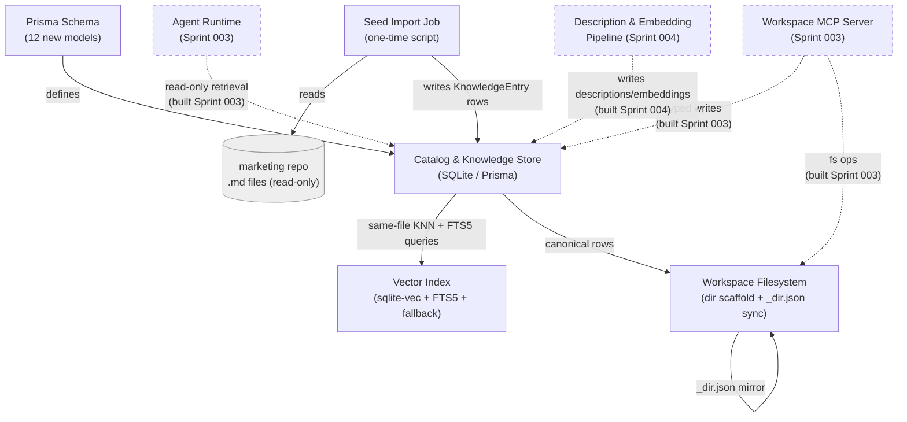
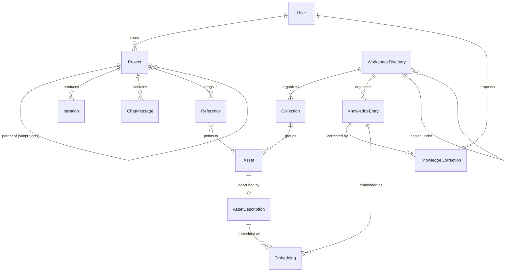

<!-- CLASI: Before changing code or making plans, review the SE process in CLAUDE.md -->

# Architecture Update — Sprint 002: Foundation: Schema, Knowledge Store, Tooling Fixes, Rebrand & Shell

This document scopes architecture-001's design down to what Sprint 002
actually builds. It introduces **no new modules or module boundaries**
beyond one small addition (a one-time Seed Import Job); it is the first
implementation slice of three modules architecture-001 already
specified — Catalog & Knowledge Store, Vector Index, Workspace
Filesystem — plus unrelated engineering-hygiene work (test tooling,
rebrand, shell) that architecture-001 didn't need to cover at
system-design level. Read `docs/architecture/architecture-001.md` first;
this document does not repeat its Data Model prose, only the concrete
sprint-scoped slice of it plus what's new.

## Step 1–2: Problem and Responsibilities

Nothing in architecture-001's domain model exists in the codebase.
Sprints 003–005 all depend on having a real schema, a real workspace
tree, and real seeded knowledge content to build against — without this
sprint, Sprint 003's Agent Runtime would have an empty knowledge store
and no filesystem layout to reorganize, and Sprint 004's description
pipeline would have no `AssetDescription` table to write to.

Distinct responsibilities this sprint introduces or changes, grouped by
what changes for the same reason:

1. **Domain persistence** (Project/Iteration/ChatMessage/Reference/
   Collection/Asset/AssetDescription/KnowledgeEntry/KnowledgeCorrection/
   Embedding/WorkspaceDirectory/Lock) — changes when the domain model
   changes. Belongs to architecture-001's **Catalog & Knowledge Store**.
2. **Similarity/keyword indexing** (`sqlite-vec` + `FTS5` + fallback) —
   changes when the retrieval/ranking strategy changes, independently of
   what's stored. Belongs to architecture-001's **Vector Index**.
3. **Workspace directory scaffolding and DB↔file sync** — changes when
   the on-disk layout convention changes. Belongs to architecture-001's
   **Workspace Filesystem**.
4. **Predecessor content import** — a one-time concern (parse `marketing`
   repo `.md` files into `KnowledgeEntry` rows), run once and then dead
   code / an idempotent re-runnable script — not something that changes
   for the same reasons as the three modules above. New, small module:
   **Seed Import Job**.
5. **Process reliability tooling** (combined `npm test`, flaky-test fix)
   — changes when CI/test infrastructure changes, unrelated to any
   product module.
6. **Shell/branding cleanup** (`AppLayout.tsx` top bar, naming) — a
   contained UI change inside architecture-001's existing **Client App**
   module; does not introduce a new module.

## Step 3: Subsystems and Modules

No new module boundaries beyond one addition. Restating the three
existing architecture-001 modules this sprint implements, plus the one
new module:

### Catalog & Knowledge Store (existing, architecture-001 §Module 5)
- **Purpose**: Persists the canonical record of assets, collections,
  knowledge entries, projects, iterations, and chat messages.
- **Boundary**: `server/prisma/schema.prisma` (additive migration only);
  no route or service logic beyond generated Prisma client access this
  sprint — routes/services that use it arrive in Sprints 003–005.
- **Use cases**: SUC-001, SUC-002, SUC-003 (this document's use cases).

### Vector Index (existing, architecture-001 §Module 6)
- **Purpose**: Answers nearest-neighbor similarity queries over embedded
  workspace content.
- **Boundary**: `vec0` virtual table in the same SQLite file, plus a
  brute-force fallback behind the same interface; no populating pipeline
  yet (Sprint 004 writes real embeddings) — this sprint proves the index
  mechanics work against test-seeded vectors only.
- **Use cases**: SUC-004.

### Workspace Filesystem (existing, architecture-001 §Module 7)
- **Purpose**: Stores the binary images, rendered outputs, and generated
  files referenced by catalog path pointers.
- **Boundary**: the `workspace/` tree scaffold plus the
  `WorkspaceDirectory` ↔ `_dir.json` sync utility; no writer yet beyond
  this sprint's own scaffolding and seed job (Sprint 003's MCP server is
  the real writer).
- **Use cases**: SUC-005.

### Seed Import Job (new, small)
- **Purpose**: Populates the knowledge store with real content from the
  predecessor `marketing` repo at first deploy.
- **Boundary**: `server/src/scripts/import-predecessor-knowledge.ts`, run
  manually or via a `postmigrate` hook — not part of the running Express
  app's request path, has no HTTP surface, and is idempotent (safe to
  re-run without duplicating rows). Reads only from the predecessor
  repo's filesystem (read-only, external to this repo) and writes only
  to `KnowledgeEntry` via the Catalog Store.
- **Use cases**: SUC-003.

No changes to Client App, API Gateway, Agent Runtime, Workspace MCP
Server, Description & Embedding Pipeline, Image & Vision Service, or
Versioning Service module boundaries — those remain exactly as
architecture-001 defined them, unbuilt until Sprints 003–004. The
`AppLayout.tsx` top-bar change is an internal implementation change
within Client App's existing boundary, not a new module.

## Step 4: Diagrams

### Component Diagram (sprint scope)

Solid nodes/edges are built this sprint. Dashed nodes are architecture-001
modules that exist as design but have no code yet — shown for context so
this diagram doesn't read as a change to the whole system.

### Entity-Relationship Diagram (this sprint's schema addition)

Identical to architecture-001's Data Model ERD — reproduced here per the
architecture-authoring methodology's requirement to include an ERD
whenever the data model changes, since this sprint is the first (and
only, for now) implementation of that model. No field differs from
architecture-001's design; see that document's Data Model section for
field-level rationale (D2 polymorphic `KnowledgeEntry`, D6
DB-canonical `WorkspaceDirectory`).

(Field-level attributes omitted here — see architecture-001's ERD for the
full attribute list; this sprint implements it verbatim, including
`Project.version` / `KnowledgeEntry.version` optimistic-lock columns and
`KnowledgeCorrection.diff` as unified-diff text.)

### Dependency Graph

Not repeated in full — architecture-001's dependency graph is unchanged
by this sprint. The three modules this sprint builds (Catalog & Knowledge
Store, Vector Index, Workspace Filesystem) are architecture-001's pure
Infrastructure-layer nodes with zero outward dependencies; building them
first, with no Domain- or Presentation-layer callers yet, is consistent
with that graph's existing shape rather than a change to it.

## Step 5: What Changed / Why / Impact / Migration

### What Changed

- Twelve new Prisma models added additively to `server/prisma/schema.prisma`.
- `Counter` model, its route, and seed entries removed.
- `sqlite-vec` added as a new native-binary dependency; an `FTS5` virtual
  table added; a brute-force cosine-similarity fallback implemented
  behind the same search-function interface.
- `workspace/` filesystem tree scaffolded with a `WorkspaceDirectory` ↔
  `_dir.json` sync utility.
- New one-time `Seed Import Job` populating `KnowledgeEntry` from the
  predecessor `marketing` repo.
- Root `npm test` script added; `admin-sessions.test.ts` flake fixed.
- `package.json` name, `APP_NAME`/`APP_SLUG`, and page titles rebranded;
  `AppLayout.tsx` sidebar replaced with a top bar/hamburger.

### Why

Directly implements architecture-001's Data Model, Indexing Strategy,
and File-System Layout sections (see that document for the full
rationale — D1 through D9 are not re-litigated here). The tooling and
rebrand work is prerequisite hygiene called out in the roadmap: every
ticket in every future sprint needs a reliable single-command test gate
before commit, and the shell needs to be sidebar-free before Sprint 005
adds the two-pane layout, rather than fighting both changes at once.

### Impact on Existing Components

- `Config`, `User`, `UserProvider`, `ScheduledJob`, `Session` — untouched.
- `Counter` — removed (was explicitly a demo model, per architecture-001
  Migration Concerns, already flagged for removal "in a future sprint" —
  this is that sprint).
- `AppLayout.tsx` — sidebar navigation removed; `MAIN_NAV`/`ADMIN_NAV`/
  `BOTTOM_NAV` entries move into a top bar. Account dropdown, admin-role
  link, and mobile behavior preserved. `AdminLayout.tsx` (nested for
  `/admin`) is unaffected beyond whatever shell wrapper it inherits from
  `AppLayout`.
- No existing route, service, or client component reads from the twelve
  new models yet — they are additive and inert until Sprint 003 (Agent
  Runtime, Workspace MCP Server) and Sprint 004 (description pipeline)
  start writing to and reading from them.

### Migration Concerns

- **Additive migration only** — no existing table is altered or dropped
  except `Counter`'s removal, which has no production data to migrate
  (explicitly a demo model).
- **`sqlite-vec` platform coverage** (carried from architecture-001 Open
  Question 1): must be confirmed for the deployment target's Docker base
  image before this sprint's Vector Index ticket is considered done; if
  unconfirmable in time, ship with the brute-force fallback as the active
  path and leave `sqlite-vec` wired but dormant — no data-model change
  either way (D1).
- **Seed import idempotency**: the Seed Import Job must be safe to re-run
  (e.g. upsert on a stable natural key like `kind` + slug) since it may
  run again in a fresh environment or after a schema fix — deployment
  sequencing note for its ticket, not a structural risk.
- **Deployment sequencing**: schema migration must land before the Seed
  Import Job runs; both must land before Sprint 003 tickets begin
  (unchanged from architecture-001's stated schema → MCP tools → agent
  loop → UI ordering).

## Step 6: Design Rationale

### R1: Seed Import Job as a standalone script, not a Prisma seed hook
- **Context**: Prisma supports a `prisma db seed` hook; the existing
  `seed.ts` already creates demo users that way.
- **Alternatives considered**: fold predecessor-content import into
  `seed.ts` directly.
- **Why this choice**: `seed.ts`'s existing job (demo users from env) is
  idempotent and safe to run on every fresh environment; the predecessor
  import reads from a sibling repo path
  (`/Volumes/Proj/proj/league-projects/infrastructure/marketing`) that
  won't exist on every environment (e.g. CI, a future production host).
  Keeping it a separate, explicitly-invoked script avoids making every
  `db seed` run depend on that path existing.
- **Consequences**: the script needs its own idempotency guarantee
  (upsert by `kind`+slug) since it isn't wrapped by Prisma's seed-once
  convention; documented in Migration Concerns above.

### R2: Fallback vector search selected by a runtime capability check, not a build-time flag
- **Context**: architecture-001 D1 requires the fallback to be a
  swappable implementation behind the same interface if `sqlite-vec`
  proves undeployable.
- **Alternatives considered**: a compile-time/env-var flag forcing one
  path or the other.
- **Why this choice**: a runtime check (attempt `loadExtension`, catch
  failure, fall back) means the same build works across environments
  with different native-binary availability without a separate build per
  target — directly serves the Open Question 1 risk architecture-001
  flagged.
- **Consequences**: the search-function interface's test suite must
  exercise both paths explicitly (as SUC-004 requires), since normal CI
  will likely only exercise whichever path is available in that
  container.

### R3: `AppLayout.tsx` top bar ships in this sprint, not deferred to Sprint 005
- **Context**: the collapsible asset-browser drawer (Sprint 005) needs
  the left edge free; the sidebar removal could theoretically wait until
  Sprint 005 needs it.
- **Alternatives considered**: defer the sidebar rework to Sprint 005,
  bundled with the two-pane layout itself.
- **Why this choice**: bundling shell rework with the two-pane layout
  would make Sprint 005 responsible for two independent-risk changes at
  once (navigation-structure regression risk + new-feature risk).
  Landing the top bar now, verified against the existing (still
  mockup-based) app, isolates that risk earlier and gives Sprint 005 one
  less variable.
- **Consequences**: `AppLayout.test.tsx` gets updated twice across the
  roadmap in spirit (structure now, content/behavior review again if
  Sprint 005 finds the top bar needs adjustment for the drawer) — an
  accepted, small duplication cost for the isolation benefit.

## Step 7: Open Questions

1. **`sqlite-vec` platform coverage** — carried forward from
   architecture-001 Open Question 1, unresolved until this sprint's
   ticket verifies it against the actual deployment Docker base image.
2. **Seed import scope** — exactly which predecessor styles/layouts/
   compositions/palettes get imported (all 10 styles + all layouts, or a
   representative subset)? This document defaults to "all of them" for
   completeness, but ticket-level planning should confirm this isn't
   excessive for a first pass, given tag/structured-field vocabulary is
   still TBD (architecture-001 Open Question 5).
3. **`admin-sessions.test.ts` root cause** — genuinely unknown until
   investigated; the fix could be a small mutex/serialization change or a
   larger per-worker-test-DB restructuring. Ticket-level planning should
   timebox investigation and have a fallback (per-worker DB files) ready
   if the root cause resists a small fix.
4. **`workspace/` one-repo-vs-two** — carried forward from
   architecture-001 D7/Open Question 3 (whether `workspace/` ends up as
   its own git repository, pushed to a dedicated remote, or stays nested
   inside this app repo). Ticket 002-004 scaffolds `workspace/` at
   `server/workspace/` (configurable via `WORKSPACE_DIR`, same pattern as
   `BACKUP_DIR`) as a subdirectory of this repo — deliberately not
   foreclosing either option, since its top-level layout (`assets/`,
   `knowledge/`, `projects/`, `exports/`) would not need to change if it
   were later `git init`'d as its own repository. The stakeholder has not
   confirmed a direction; Sprint 003's Versioning Service ticket owns the
   actual decision.

---

## Architecture Self-Review

Run per the `architecture-review` skill's five categories, against
architecture-001 as the baseline this document diffs from.

**Consistency**: The Sprint Changes described in Step 5 match the module
list in Step 3 and the diagrams in Step 4 exactly — three existing
modules (Catalog & Knowledge Store, Vector Index, Workspace Filesystem)
plus one new small module (Seed Import Job), no more, no fewer, appear
consistently across every section. Design rationale (R1–R3) is new to
this document (no prior sprint-scoped rationale to update) and is
cross-referenced from Migration Concerns (R1) and Step 5 (R2, R3). PASS.

**Codebase Alignment**: Verified against the actual repo state described
in architecture-001's own Codebase Alignment check (which already
confirmed `server/prisma/schema.prisma`'s existing models and
`AppLayout.tsx`'s current sidebar shape) — nothing in this sprint
contradicts that prior verification; this document only adds to what was
already confirmed unmodified. The `Counter` removal was explicitly
pre-flagged in architecture-001's own Migration Concerns as "should be
removed in a future sprint" — this sprint is that future sprint, not a
surprise addition. PASS.

**Design Quality**:
- *Cohesion*: the new Seed Import Job's purpose sentence ("populates the
  knowledge store with real content from the predecessor repo at first
  deploy") passes the no-"and" test. It was kept separate from the
  Catalog & Knowledge Store module specifically because it changes for a
  different reason (predecessor-format parsing quirks vs. catalog CRUD
  schema) and runs at a different time (once, manually) than the module
  it writes to (continuously, in-process).
- *Coupling*: Seed Import Job has exactly one write dependency (Catalog
  Store) and one read dependency (an external, read-only filesystem
  path) — fan-out of 1, well under the guideline.
- *Boundaries*: Seed Import Job has no HTTP surface and is not reachable
  from the running app; its boundary (a standalone script) is as narrow
  as the responsibility requires.
- *Dependency direction*: unchanged from architecture-001 — Catalog
  Store, Vector Index, and Workspace Filesystem remain pure
  Infrastructure-layer with zero outward dependencies (Seed Import Job
  is an operational script outside the layered stack entirely, akin to
  the existing `seed.ts`, not a fourth architectural layer).
  PASS.

**Anti-Pattern Detection**: No god component (each of the four
sprint-scope modules has one narrow purpose); no shotgun surgery (the
twelve-model migration is additive, touching no existing model's
callers); no feature envy (Seed Import Job only reaches into Catalog
Store through its normal write interface, not raw SQL); no circular
dependencies (Seed Import Job → Catalog Store is one-directional); no
leaky abstractions introduced; no speculative generality (the fallback
vector-search path is a documented, load-bearing risk mitigation per
architecture-001 D1/Open Question 1, not speculative — it is the
answer to a real, currently-open platform-coverage question). PASS.

**Risks**:
- `sqlite-vec` native-binary deployment risk is real and carried forward
  from architecture-001, not newly introduced or newly hidden by this
  document.
- Seed import scope (Open Question 2) is a sizing risk for the ticket,
  not a structural one — worst case, ticketing under-scopes it and a
  follow-up ticket adds the rest of the predecessor's styles later.
- The flaky-test root cause (Open Question 3) is unknown at planning
  time; ticket-level planning should timebox investigation with a
  concrete fallback so this sprint doesn't stall on it.
- No breaking changes to any existing, currently-used component; no
  deployment-sequencing risk beyond the schema → seed → (future sprints)
  ordering already stated.

### Verdict: **APPROVE**

No structural issues found. All four sprint-scope modules pass the
cohesion/coupling/boundary tests; no anti-pattern requires rework; the
open items (platform coverage, seed scope, flake root cause) are
ticket-level sizing and investigation questions with stated defaults and
fallbacks, not architectural defects requiring a revision pass before
ticketing.
