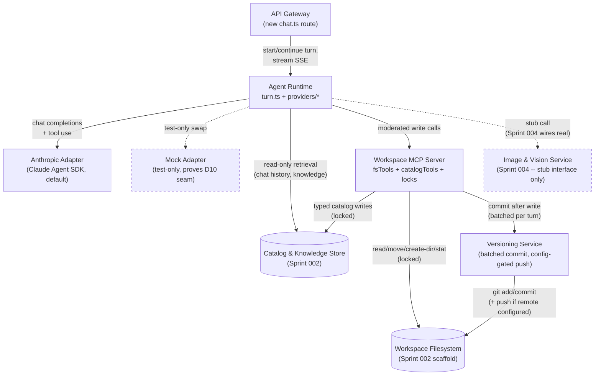
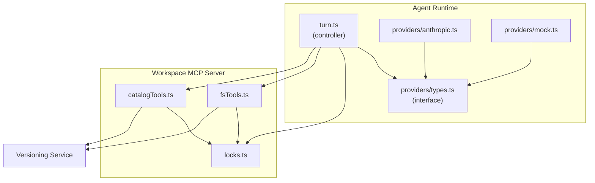

<!-- CLASI: Before changing code or making plans, review the SE process in CLAUDE.md -->

# Architecture Update -- Sprint 003: Agent Runtime, Workspace MCP Server & Versioning

This document scopes architecture-001's design down to what Sprint 003
actually builds. It introduces **no new top-level modules** -- it is the
first implementation of three modules architecture-001 already specified
as designs only: **Agent Runtime** (Module 3, including the
provider-neutral Amendment/D10), **Workspace MCP Server** (Module 4), and
**Versioning Service** (Module 10). It also **revises one design
rationale** -- D7's proposed workspace-git-repo default -- with a scoped,
reversible addendum, since architecture-001 Open Question 3 remains
unconfirmed by the stakeholder going into this sprint's detail planning
(exactly the contingency architecture-001's own sprint.md-facing note and
Sprint 002 ticket 004 both anticipated). Read
`docs/architecture/architecture-001.md` first, especially Module 3
(with the 2026-07-14 Amendment and D10), Module 4, Module 10, and the
Locking/Concurrency Model; this document does not repeat that prose, only
the concrete sprint-scoped slice of it plus what's new or revised.

## Step 1-2: Problem and Responsibilities

Sprint 002 gave the system a schema, an indexed knowledge store, and a
`workspace/` filesystem scaffold with a reusable path-containment helper
(`resolveWorkspacePath`) -- but nothing yet writes to any of it except
test setup and the one-time seed job, and there is no conversational
runtime at all. Per spec §9 the agent must be "fairly flexible" but
explicitly moderated by an MCP server; per spec §16 Q7 (sharpened by the
2026-07-14 Amendment/D10) the runtime is a provider-neutral agent loop
with the Claude Agent SDK as first/default provider, not Claude Code.
Neither exists yet. Separately, spec §12's "everything commits to GitHub
for version control" has no implementation, and architecture-001 Open
Question 3 (one workspace git repo or two) is still unconfirmed.

Distinct responsibilities this sprint introduces, grouped by what changes
for the same reason:

1. **Moderated filesystem mutation** (path-contained read/move/
   create-directory/stat, no shell) -- changes when the allowed
   filesystem operation set changes. Belongs to architecture-001's
   **Workspace MCP Server**, filesystem tool family.
2. **Moderated catalog mutation** (typed create/propose-correction/
   resolve-correction/add-to-collection/create-project/create-iteration/
   create-agent-page calls, optimistic-lock enforcement) -- changes when
   the catalog write contract changes, independently of the filesystem
   tool set. Belongs to the same **Workspace MCP Server** module, catalog
   tool family -- kept as one module with two tool families (not two
   modules) because both share one enforcement mechanism: acquire a
   `Lock` row, execute, release, hand off to versioning.
3. **Write-path locking** (`Lock` table acquire/release for directory
   paths and the per-project turn) -- changes when the concurrency policy
   changes, shared by responsibilities 1, 2, and 4. Not a separate
   module -- a shared internal component (`locks.ts`) inside the
   Workspace MCP Server, reused by the Agent Runtime for its
   `project_turn` lock (architecture-001 already specifies this as the
   same `Lock` table, not two mechanisms).
4. **Conversational turn orchestration** (context reconstruction from
   `ChatMessage` + knowledge retrieval, tool dispatch, streaming,
   persistence) -- changes when the loop's own control flow changes,
   independently of which LLM vendor answers it. Belongs to
   architecture-001's **Agent Runtime**.
5. **Provider adaptation** (translating the loop's provider-neutral
   contract to a specific vendor's wire format) -- changes when a vendor
   SDK's shape changes, or when a new vendor is added -- independently of
   responsibility 4. Belongs to the same **Agent Runtime** module as an
   internal seam (architecture-001 D10 Consequences: "an internal
   provider-adapter seam... not a new top-level module").
6. **Batched git versioning** (stage/commit workspace content + knowledge
   export snapshots, config-gated push) -- changes when the versioning
   policy (batching granularity, remote/push behavior) changes,
   independently of what triggered a write. Belongs to architecture-001's
   **Versioning Service**.

## Step 3: Subsystems and Modules

No new module boundaries. Restating the three existing architecture-001
modules this sprint implements, each with the internal structure this
sprint establishes inside that boundary:

### Agent Runtime (existing, architecture-001 §Module 3)
- **Purpose**: Drives an agent loop per active project conversation,
  translating chat input into moderated tool calls.
- **Boundary**: new `server/src/agent/` module.
  - `providers/types.ts` -- the `ProviderAdapter` interface: the
    provider-neutral contract (chat completions + tool use) architecture-001
    D10 requires.
  - `providers/anthropic.ts` -- the Claude Agent SDK adapter; default and
    only adapter wired into the running app this sprint.
  - `providers/mock.ts` -- a minimal second adapter implementing the same
    interface against a scripted/canned response, test-only, proving the
    D10 swap-containment claim (see **R4**).
  - `turn.ts` -- the turn controller: context reconstruction (D8),
    `project_turn` `Lock` acquisition/release, tool-call dispatch to the
    Workspace MCP Server, image-generation calls routed through a stub
    `ImageVisionClient` interface (real implementation is Sprint 004 --
    this sprint only defines and calls the interface, per sprint.md's
    explicit Out of Scope), `ChatMessage` persistence.
  - `server/src/routes/chat.ts` -- new API Gateway route: starts/
    continues a turn, streams token/tool-call/status events over SSE.
    Admin-only or test-harness-gated this sprint -- no client UI consumes
    it yet (Sprint 005 wires `MockupChatPanel.tsx` to this endpoint; that
    wiring is explicitly out of this sprint's scope per sprint.md).
- **Use cases**: SUC-003, SUC-004.

### Workspace MCP Server (existing, architecture-001 §Module 4)
- **Purpose**: Mediates every workspace mutation the agent requests
  through a narrow, locked tool surface.
- **Boundary**: new `server/src/agent-mcp/` module -- a second, separate
  `McpServer` instance (named `workspaceMcpServer` in code, distinct from
  `server/src/mcp`'s existing `devMcpServer`, per D5), connected
  in-process to the Agent Runtime only, never exposed over HTTP.
  - `server.ts` -- instance creation, registers both tool families.
  - `fsTools.ts` -- `read_file`, `move_file`, `create_directory`, `stat`;
    reuses `resolveWorkspacePath` from Sprint 002's
    `services/workspaceDirectorySync.ts` verbatim (that module's own
    header already earmarks it for this reuse) -- no shell tool exists
    here or anywhere else in the codebase.
  - `catalogTools.ts` -- `create_knowledge_entry`, `propose_correction`,
    `resolve_correction`, `add_asset_to_collection`, `create_project`,
    `create_iteration`, `create_agent_page` (generic mechanism only --
    postcard-specific content generation is Sprint 004/005, per
    sprint.md).
  - `locks.ts` -- shared `Lock` table acquire/release helper (see Step 1
    responsibility 3), used by both tool families and imported by the
    Agent Runtime for its `project_turn` lock.
- **Use cases**: SUC-001, SUC-002.

### Versioning Service (existing, architecture-001 §Module 10)
- **Purpose**: Commits workspace content changes to git, pushing them
  when a remote is configured.
- **Boundary**: new `server/src/services/versioning.ts`. Invoked by the
  Workspace MCP Server after a successful filesystem or catalog write,
  batched per agent turn (one commit per turn, not per tool call).
  Operates on `workspace/` plus periodic JSON export snapshots into
  `workspace/exports/`; never the live `.db` file (D7, unchanged).
  **Revises D7's proposed repo topology for this sprint -- see Step 5 and
  R1.**
- **Use cases**: SUC-005.

No changes to Client App, API Gateway's existing routes, Catalog &
Knowledge Store, Vector Index, Workspace Filesystem, Description &
Embedding Pipeline, or Image & Vision Service module boundaries -- those
remain exactly as architecture-001 defined them (Image & Vision Service
and Description & Embedding Pipeline are still unbuilt, Sprint 004; the
Agent Runtime calls a stub interface for image generation this sprint,
per Step 3 above, not the real service).

## Step 4: Diagrams

### Component Diagram (sprint scope)

Solid nodes/edges are built this sprint. Dashed nodes are
architecture-001 modules that exist as design but have no code yet (or,
for Catalog/Vector/FS, were already built in Sprint 002 and are shown
only as the read/write surface this sprint's new modules touch).

### Entity-Relationship Diagram

No ERD included -- this sprint adds no new Prisma models and modifies no
existing field. `Project`, `ChatMessage`, `KnowledgeEntry`,
`KnowledgeCorrection`, `Collection`, `Asset`, `WorkspaceDirectory`, and
`Lock` were all already added additively in Sprint 002 (verified against
the current `server/prisma/schema.prisma`) and are used as-is:
`ChatMessage.toolCalls` (already `Json?`) now gets real content for the
first time, shaped `{ name, args, result }` per adapter (D10
Consequences) rather than a raw SDK object -- a usage convention, not a
schema change. `Lock` (`resourceType`, `resourceKey`, unique constraint)
is used exactly as architecture-001 specified it, with `resourceType`
values `'directory'` and `'project_turn'` as this sprint's first real
values for that column.

### Dependency Graph (sprint-scope detail)

architecture-001's system-level dependency graph is unchanged (Agent
Runtime and Workspace MCP Server remain the two Domain-layer nodes,
fan-out 3 each, no cycles). This sprint's internal decomposition adds no
new top-level nodes, only sub-component edges inside those two module
boundaries:

No cycles. `providers/types.ts` (the interface) has zero outward
dependencies -- both adapters depend on it, not the reverse, which is the
structural guarantee behind D10's swap claim. `locks.ts` has zero
outward dependencies within this graph (it only touches the `Lock`
table, which is Catalog & Knowledge Store, an existing Infrastructure
dependency already accounted for at the system level).

## Step 5: What Changed / Why / Impact / Migration

### What Changed

- New `server/src/agent/` module: `ProviderAdapter` interface, Anthropic
  adapter (Claude Agent SDK), mock adapter (test-only), turn controller,
  `server/src/routes/chat.ts` (SSE, admin/test-harness gated).
- New `server/src/agent-mcp/` module: a second, in-process-only
  `McpServer` instance (`workspaceMcpServer`) with filesystem tools
  (`read_file`, `move_file`, `create_directory`, `stat`) and catalog
  tools (`create_knowledge_entry`, `propose_correction`,
  `resolve_correction`, `add_asset_to_collection`, `create_project`,
  `create_iteration`, `create_agent_page`), plus a shared `Lock`
  acquire/release helper.
- New `server/src/services/versioning.ts`: batched-per-turn git commit,
  config-gated push.
- New dependencies: an Anthropic/Claude Agent SDK package, a git-wrapper
  package (e.g. `simple-git`) -- both additive, no schema impact.
- New config values: `WORKSPACE_GIT_ROOT` (default: app repo root),
  `WORKSPACE_GIT_REMOTE` (default: unset -> local-commit-only, no push
  attempted). No GitHub remote is created this sprint.
- **Revision to D7** (architecture-001's proposed workspace-git-repo
  topology): this sprint implements the **one-repo** branch of Open
  Question 3 (workspace/ stays nested inside the app repo's own git
  working tree, exactly as Sprint 002 ticket 004 scaffolded it) instead
  of D7's originally-proposed dedicated second repo/remote, because the
  stakeholder has not yet confirmed OQ3. See **R1** below for the full
  rationale and the seam that keeps a later repo split a config change,
  not a rewrite.
- No Prisma migration. No changes to `Catalog & Knowledge Store`,
  `Vector Index`, or `Workspace Filesystem` module boundaries.

### Why

Directly implements architecture-001's Agent Runtime Details, Workspace
MCP Server module design, Locking/Concurrency Model, and D5/D7 (as
revised)/D8/D9/D10 rationale. Resolves the sprint's stated goal: stand up
the moderated write path and the conversational loop every later feature
(generation, description, postcard editing, the real two-pane UI) calls
into, demoable as a backend capability without the client chat UI
(Sprint 005).

### Impact on Existing Components

- `server/src/mcp/*` (the existing dev-tooling MCP server, `get_version`/
  `list_users`, HTTP-exposed at `/api/mcp`) is **unaffected** --
  `workspaceMcpServer` is a second, distinctly-named instance of the same
  already-installed `@modelcontextprotocol/sdk`, never HTTP-exposed, per
  D5. No risk of the two being confused in code: different directories,
  different instance names.
- `server/src/services/workspaceDirectorySync.ts`'s `resolveWorkspacePath`
  is imported and reused by `agent-mcp/fsTools.ts`, not reimplemented --
  one path-containment implementation, one test suite, as that module's
  own header already anticipated.
- `server/src/services/search.ts` is unaffected; the Agent Runtime's
  knowledge-retrieval step calls it directly and unmoderated, per D9 --
  no new read path is added, no existing read path is locked.
- `ServiceRegistry` (`server/src/services/service.registry.ts`) gains no
  new getter this sprint. The Agent Runtime and Workspace MCP Server are
  process-lifetime singletons wired at app startup (like
  `server/src/mcp/server.ts` already is), not per-request CRUD services
  constructed through `ServiceRegistry.create()` -- a deliberate,
  explained difference from that pattern, not an inconsistency (see
  Design Quality in the Self-Review below).
- No existing route, service, or client component is modified.

### Migration Concerns

- **Additive only** -- no existing Prisma model is altered; no migration
  runs this sprint.
- **`ANTHROPIC_API_KEY`**: already declared in the dotconfig cascade
  (`config/dev/secrets.env`, confirmed present) per architecture-001
  Security Considerations -- no cascade change needed. The actual secret
  *value* is a stakeholder-supplied precondition for real Anthropic API
  calls; every ticket's test suite must pass against the mock adapter
  (R4) with no real key present, so `npm test` stays green without it.
- **New env vars**: `WORKSPACE_GIT_ROOT`, `WORKSPACE_GIT_REMOTE` --
  need to be added to `config/{dev,prod}/public.env` (non-secret path/
  URL values) as part of implementation.
- **No new GitHub remote** -- unlike architecture-001's original
  Migration Concerns entry ("GitHub remote -- workspace repo (new
  precondition)"), this sprint does not need that precondition resolved,
  because it does not create a dedicated workspace remote (R1). The
  unrelated "GitHub remote -- app repo" ops precondition (flyerbot's own
  remote still points at `docker-node-template`) is carried forward,
  untouched, out of this sprint's scope.
- **Deployment sequencing**: within this sprint, the Versioning Service
  (no dependencies on the other two modules) lands first, then the
  Workspace MCP Server's filesystem tools (need Versioning to call after
  a write), then its catalog tools (same MCP instance, same lock
  helper), then the provider adapters, then the Agent Runtime turn
  controller (needs the finished tool surface and a provider to
  dispatch through) -- matches architecture-001's stated "schema -> MCP
  tools -> agent loop" ordering, schema already done in Sprint 002.

## Step 6: Design Rationale

### R1: One workspace git repo for now, with a clean seam to split later (revises D7's proposed default)
- **Context**: architecture-001 D7 proposed `workspace/` as its own git
  repository with a dedicated GitHub remote, flagged as unconfirmed Open
  Question 3. Sprint 002 ticket 004 deliberately scaffolded `workspace/`
  as a subdirectory of the app repo "structured so it can be `git
  init`'d separately later without a file-layout change," explicitly
  leaving the decision to this sprint's Versioning Service ticket. Going
  into this sprint's detail planning, the stakeholder still has not
  confirmed OQ3.
- **Alternatives considered**: (a) implement D7's original two-repo
  proposal now, creating a new GitHub repository and remote for
  `workspace/` -- rejected, this would foreclose an explicitly-open
  stakeholder question and requires an ops action (new repo creation,
  new credentials in the dotconfig cascade) with no confirmation it's
  wanted; (b) build the Versioning Service with no remote/push code at
  all, hardcoded to local-only commits -- rejected, would make adding
  push support later a code change instead of a config change, and the
  stakeholder's spec §12 ("everything commits to GitHub") makes push
  support a near-certain eventual requirement even if the timing/topology
  isn't confirmed yet.
- **Why this choice**: the Versioning Service is written against
  `WORKSPACE_GIT_ROOT` (defaults to the app repo root, so `workspace/`
  commits land in the same repository/history as the rest of the app,
  matching Sprint 002's existing scaffold) and `WORKSPACE_GIT_REMOTE`
  (unset by default -- no push is attempted, no remote is required to
  exist). Confirming OQ3 later and splitting `workspace/` into its own
  repository becomes: `git init` a new repo at `workspace/`'s current
  location, point `WORKSPACE_GIT_ROOT` at it, set `WORKSPACE_GIT_REMOTE`
  -- no change to the commit-staging, batching, or push logic itself.
- **Consequences**: this sprint does not resolve architecture-001 Open
  Question 3 -- it implements against the "one repo" branch of that
  still-open question. Generated binary content (images, rendered
  outputs, knowledge export snapshots) lands in the app repo's own git
  history for now, which is the exact outcome D7's original rationale
  wanted to avoid ("generated binary content never enters the app's
  CI/PR history") -- accepted here as a scoped, reversible, stakeholder-
  directed tradeoff for this sprint, not a silent reversal of D7. Flagged
  again in Step 7's Open Questions.

### R2: Fixed, statically-registered MCP tool surface, not a dynamic/config-driven registry
- **Context**: architecture-001 Non-Goals explicitly rules out "a
  third-party/plugin MCP tool system."
- **Alternatives considered**: a config- or DB-driven tool registry, so
  new catalog tools could be added without a code deploy.
- **Why this choice**: the moderation guarantee spec §9 asks for
  ("probably not running full Unix commands") depends on the tool
  surface being fixed and code-reviewed, not runtime-configurable -- a
  dynamic registry would reopen exactly the boundary the spec is
  protecting, one tool definition at a time.
- **Consequences**: adding a future catalog tool (e.g. a hypothetical
  `delete_asset`) is a code change plus review, by design, not a config
  toggle -- consistent with architecture-001's existing Non-Goals.

### R3: Reject-and-surface optimistic locking implemented as this sprint's concrete default (architecture-001 Open Question 2)
- **Context**: architecture-001 proposed reject-and-surface over
  last-write-wins for `Project`/`KnowledgeEntry` version conflicts, but
  flagged it as Open Question 2 pending stakeholder confirmation.
- **Alternatives considered**: last-write-wins (simpler to implement,
  but silently discards a concurrent style correction or project edit --
  the exact failure mode architecture-001 already argued against).
- **Why this choice**: SUC-002 and SUC-004 need one concrete, testable
  behavior; reject-and-surface is architecture-001's own stated
  preference and the safer default absent stakeholder direction
  otherwise.
- **Consequences**: Open Question 2 remains open for explicit stakeholder
  confirmation (carried to Step 7). If the stakeholder later prefers
  last-write-wins, that is a contained change inside the Workspace MCP
  Server's catalog-write path (the `version` column already supports
  either policy) -- not a schema or module-boundary change.

### R4: A minimal mock provider adapter ships this sprint to prove the D10 seam, not a second real-vendor adapter
- **Context**: architecture-001 D10 specifies the loop as provider-
  neutral with exactly one implemented (Anthropic) adapter; Open
  Question 9 leaves a second *real* provider's timeline unresolved --
  the stakeholder named no second vendor.
- **Alternatives considered**: (a) ship only the Anthropic adapter, with
  D10's "swap is contained to the adapter" claim untested until some
  future sprint actually needs a second provider -- rejected, this
  sprint's own success criteria require proving the interface is real,
  not just documented; (b) implement a second real-vendor adapter (e.g.
  OpenAI's Chat Completions API) now -- rejected as speculative
  generality Open Question 9 explicitly declines to resolve yet, and it
  would add a second set of real credentials/rate-limit concerns with no
  named need.
- **Why this choice**: a minimal mock adapter, implementing the exact
  same `ProviderAdapter` interface against a scripted/canned response
  instead of a live API call, proves the seam is real -- the turn
  controller, tool dispatch, and `ChatMessage` storage provably do not
  change when the adapter is swapped -- without committing to a second
  vendor's SDK or credentials. This is also what makes the full test
  suite runnable with no real `ANTHROPIC_API_KEY` present (see Migration
  Concerns).
- **Consequences**: the mock adapter is test/CI scaffolding, not a
  production-selectable provider option; a real second vendor adapter
  remains a future ticket, tracked at Open Question 9 (unchanged).

### R5: Lock granularity is per-directory-path for filesystem writes and per-project for turns, not one global lock
- **Context**: architecture-001's Locking/Concurrency Model already
  specifies `resourceType` + `resourceKey`; this sprint is the first to
  actually implement acquisition/release against it.
- **Alternatives considered**: one global Workspace MCP Server write
  lock -- simplest to implement, but would serialize unrelated writes
  across different projects and different directories for no benefit,
  directly contradicting UC-013's "different projects... proceed fully in
  parallel."
- **Why this choice**: matches architecture-001's design directly;
  `resourceKey` is the workspace-relative directory path for
  `resourceType: 'directory'` locks and `Project.id` for `resourceType:
  'project_turn'` locks.
- **Consequences**: `resourceKey` needs a stable, collision-free
  convention per `resourceType` -- documented here explicitly so a future
  tool addition (e.g. a per-`KnowledgeEntry` lock, if ever needed) picks
  a convention consistent with these two rather than inventing a third
  ad hoc one.

## Step 7: Open Questions

1. **One workspace git repo or two** (architecture-001 Open Question 3,
   revised default per **R1**): this sprint implements the one-repo
   default; still unconfirmed by the stakeholder. If confirmed against
   D7's original two-repo proposal instead, the migration is config-only
   (see R1) -- not a rework of this sprint's Versioning Service ticket.
2. **Conflict-resolution mechanism** (architecture-001 Open Question 2,
   implemented default per **R3**): reject-and-surface is this sprint's
   concrete behavior; still flagged for explicit stakeholder
   confirmation.
3. **Git-automation timing** (architecture-001 Open Question 8):
   implemented as automatic, batched-per-turn (no explicit agent
   "commit now" tool this sprint). Still open whether the agent should
   also have an explicit commit-trigger tool -- a small, additive change
   to the catalog tool family if confirmed later, not a Versioning
   Service redesign.
4. **Second LLM provider timeline** (architecture-001 Open Question 9):
   this sprint's mock adapter (R4) proves the seam works but is not a
   real second vendor. Still open whether a real second adapter should
   be built proactively before external distribution, or only when a
   concrete need arises.
5. **Lock wait/timeout behavior**: architecture-001 specifies "a bounded
   wait with a clear chat-surfaced timeout" for a conflicting lock
   acquisition, but does not state the bound. This sprint's ticketing
   picks a concrete default (implementer's call, expected to be a small,
   fixed number of seconds) -- flagged here so a future sprint revisiting
   UX around long-running turns can reconsider it deliberately rather
   than discover it as an undocumented constant.

---

## Architecture Self-Review

Run per the `architecture-review` skill's five categories, against
architecture-001 as the baseline this document diffs from (via Sprint
002's architecture-update.md, which this document is the next diff
against in sequence).

**Consistency**: The "What Changed" list in Step 5 matches the module
list in Step 3 and both diagrams in Step 4 exactly -- three existing
architecture-001 modules (Agent Runtime, Workspace MCP Server, Versioning
Service), each with the internal sub-components enumerated in Step 3 and
reflected in the sprint-scope dependency graph, no more, no fewer. The
one design-rationale revision (R1, revising D7) is stated once, in Step
5's "What Changed," cross-referenced from Step 6 (R1's full rationale)
and Step 7 (Open Question 1's updated framing) -- it does not appear as a
silent contradiction anywhere else in the document. PASS.

**Codebase Alignment**: Verified against the actual repo, not just
architecture-001's prior verification -- `server/prisma/schema.prisma`
confirmed to already contain `Lock`, `ChatMessage`, `Project`,
`KnowledgeEntry`, `KnowledgeCorrection`, `Collection`, `Asset`, and
`WorkspaceDirectory` (Sprint 002, unmodified by this document, no new
migration needed); `server/src/services/workspaceDirectorySync.ts`
confirmed to already export `resolveWorkspacePath` with a docstring
explicitly earmarking it for this sprint's MCP filesystem tools to reuse;
`server/src/mcp/{server,tools}.ts` confirmed as the existing, distinct,
HTTP-exposed dev-tooling MCP server (`get_version`, `list_users`) that
D5 says must not be confused with the new `workspaceMcpServer`;
`server/package.json` confirmed to already depend on
`@modelcontextprotocol/sdk` (reused, not re-added) and to **not** yet
depend on any Anthropic/Claude Agent SDK or git-wrapper package (both
correctly listed as new in Step 5); `config/dev/secrets.env` confirmed
to already declare `ANTHROPIC_API_KEY` (so no dotconfig-cascade key
addition is needed, only the secret value, a stakeholder precondition
noted in Migration Concerns); no `server/workspace/`-adjacent git
repository exists yet (confirmed via `git remote -v`, which shows only
the app repo's own `origin`), consistent with this document proceeding
on R1's one-repo default rather than assuming a second remote already
exists. No drift found between documented and actual current-state code.
PASS.

**Design Quality**:
- *Cohesion*: every sub-component's purpose passes the no-"and" test
  (Step 3). `providers/types.ts` was kept separate from `turn.ts`
  specifically because the interface changes only when the provider
  contract changes, while the turn controller changes when the loop's
  own control flow changes -- independent reasons, per D10. `locks.ts`
  was kept as one shared component (not duplicated per tool family)
  because lock semantics change for one reason (concurrency policy),
  used identically by both MCP tool families and the Agent Runtime.
- *Coupling*: the sprint-scope dependency graph (Step 4) shows
  `providers/types.ts` and `locks.ts` each with zero outward
  dependencies within this sprint's new code -- the narrowest possible
  coupling for the two components everything else in this sprint depends
  on. Fan-out stays under the system-level graph's existing 3-per-node
  ceiling; no new node exceeds it.
- *Boundaries*: the Workspace MCP Server's tool surface remains the
  system's narrowest interface by design (R2) -- fixed, code-reviewed,
  no shell, no dynamic registration. The `ProviderAdapter` interface is
  equally narrow: chat-completions-plus-tool-use only, no vendor-specific
  leakage into `turn.ts` or `ChatMessage` storage (verified by R4's mock
  adapter existing at all).
- *Dependency direction*: unchanged from architecture-001 -- Agent
  Runtime and Workspace MCP Server remain Domain-layer, depending on
  Infrastructure-layer Catalog/FS/Versioning, never the reverse; within
  Agent Runtime, both provider adapters depend on the interface, never
  the reverse (the structural basis for D10's swap claim).
  PASS.

**Anti-Pattern Detection**:
- *God component*: none -- `turn.ts` orchestrates but delegates every
  actual mutation to the Workspace MCP Server and every provider-specific
  concern to an adapter; it does not itself talk to git, the filesystem,
  or a vendor SDK directly.
- *Shotgun surgery*: a hypothetical future catalog tool addition touches
  exactly one file (`catalogTools.ts`) plus its test -- not the fs tools,
  the lock helper, or the turn controller. A hypothetical future provider
  addition touches exactly one new adapter file -- not `turn.ts`,
  `catalogTools.ts`/`fsTools.ts`, or the `ChatMessage` schema (this is
  R4's mock adapter's whole point, demonstrated rather than assumed).
- *Feature envy*: `catalogTools.ts`/`fsTools.ts` write through the
  Catalog Store's/filesystem's normal interfaces (Prisma client,
  `resolveWorkspacePath`), not by reaching around them; `turn.ts` never
  bypasses the Workspace MCP Server to write directly.
- *Circular dependencies*: none (Step 4's sprint-scope graph is acyclic,
  verified above).
- *Leaky abstractions*: `ChatMessage.toolCalls`'s provider-neutral shape
  (`{ name, args, result }`, D10 Consequences) is the one place this
  sprint must actively guard against a leak (an adapter serializing its
  own SDK's raw tool-call object into storage) -- called out explicitly
  in Step 4's ERD note and R4, not left implicit.
- *Speculative generality*: R2 explicitly declines a dynamic tool
  registry; R4 explicitly declines a second real-vendor adapter. Nothing
  in this sprint's new code exists to serve a hypothetical not currently
  requested.
  PASS -- no anti-pattern found requiring rework.

**Risks**:
- **R1's one-repo default** (revising D7) means generated binary content
  enters the app repo's git history this sprint -- the exact outcome
  D7's original rationale wanted to avoid. This is a real, documented
  tradeoff (not hidden) with a stated, low-cost reversal path if OQ3 is
  later confirmed the other way; not a structural defect.
- **`sqlite-vec` platform risk** (architecture-001 D1/OQ1) is already
  resolved from this sprint's perspective -- Sprint 002 confirmed the
  brute-force fallback is what actually answers queries in production
  Docker (`node:20-alpine`); this sprint's Agent Runtime knowledge
  retrieval calls the same search-function interface regardless of which
  path answers it, so it carries no additional risk here.
- **Anthropic API cost/availability**: image-generation cost containment
  is explicitly out of scope (Open Question 7, architecture-001,
  untouched by this document) and chat-completion cost is not separately
  addressed either -- both remain flagged, not newly introduced, risks
  for a later sprint or admin-facing control.
- No breaking changes to any existing, currently-used component (verified
  in Impact on Existing Components); no deployment-sequencing risk beyond
  the Versioning-Service-first ordering already stated in Migration
  Concerns.

### Verdict: **APPROVE WITH CHANGES**

No structural issues (no circular dependencies, no god components, no
inconsistency between diagrams and document body, no confirmed anti-
pattern). The significant open items are unresolved stakeholder
decisions carried or newly scoped from architecture-001 (Open Questions
1-5 above) plus one explicit, reversible design-rationale revision (R1,
the one-repo-for-now default) made under this sprint's own dispatch
instruction rather than stakeholder confirmation of OQ3 itself -- these
are exactly the kind of "minor issues addressable during implementation"
and "unresolved stakeholder decisions with a stated default" the
APPROVE WITH CHANGES level covers, not defects requiring a REVISE pass.
Proceeding to ticketing.
