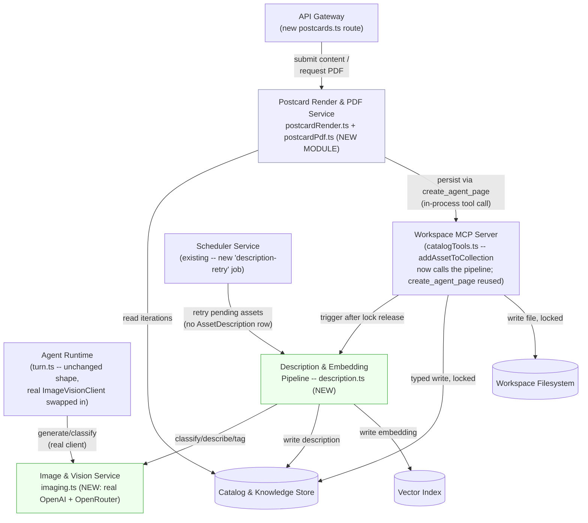
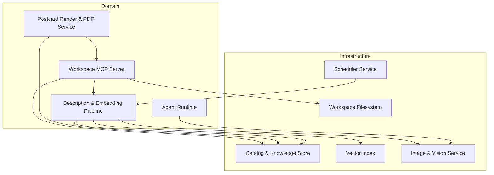

<!-- CLASI: Before changing code or making plans, review the SE process in CLAUDE.md -->

# Architecture Update -- Sprint 004: Generation & Description Pipelines

This document scopes architecture-001's design down to what Sprint 004
actually builds. It is the first real implementation of two modules
architecture-001 already specified as designs only -- **Image & Vision
Service** (Module 9) and **Description & Embedding Pipeline** (Module 8)
-- and it proposes **one addendum**: a new module, **Postcard Render &
PDF Service**, realizing the "Agent-authored pages" mechanism
(architecture-001's Agent Runtime Details) for the postcard case
specifically, exactly as sprint.md's Architecture Notes anticipated. Read
`docs/architecture/architecture-001.md` first, especially Module 8,
Module 9, the Agent-authored pages subsection of Agent Runtime Details,
and D1/D2 (for the data-model precedent this sprint follows); this
document does not repeat that prose, only the concrete sprint-scoped
slice of it plus what's new.

## Step 1-2: Problem and Responsibilities

Sprint 003 gave the system a conversational turn loop, a moderated
catalog/filesystem write path, and batched git versioning -- but nothing
yet calls a real image API, scores or describes anything with vision, or
renders a postcard past its chroma-key template stage. `turn.ts`'s
`generate_image` dispatch already exists behind a stub `ImageVisionClient`
interface (`imageVisionStub.ts`); `add_asset_to_collection` already
creates `Asset` rows with no `AssetDescription`; `create_agent_page`
already writes arbitrary project-output files. This sprint fills those
three seams with real implementations, without touching any of their call
sites' shapes.

Distinct responsibilities this sprint introduces, grouped by what changes
for the same reason:

1. **External generation/vision API access** (OpenAI direct generation,
   OpenAI direct edits-with-references, OpenRouter vision calls,
   dotconfig-sourced credentials, spend logging) -- changes when a
   provider's API contract or model choice changes, independently of who
   calls it (the agent loop for generation, the description pipeline for
   vision). Belongs to architecture-001's **Image & Vision Service**.
2. **Commit-time asset classification and retrieval indexing**
   (vision-model classify/describe/tag call, `AssetDescription` +
   `Embedding` writes, FTS5 indexing, degrade-gracefully retry) --
   changes when the description schema, tag vocabulary, or retry policy
   changes, independently of which vision provider answers the call.
   Belongs to architecture-001's **Description & Embedding Pipeline**.
3. **Postcard content persistence and HTML composition** (accepting a
   content-JSON submission, resolving front/back iteration images,
   rendering positioned text regions + QR overlay to HTML) -- changes
   when the postcard's visual composition rules change, independently of
   how the result is exported. New responsibility, no architecture-001
   home -- see Step 3.
4. **Print-ready PDF export** (headless-browser rasterization at trim
   size, bleed padding, vendor rotation, trim/bleed-box metadata, page
   composition by which faces are present) -- changes when print-vendor
   requirements change, independently of how the HTML was composed.
   Grouped with responsibility 3 in one module (not split further)
   because both together implement one predecessor-parity pipeline
   (`postcard-content.json` -> `postcard.html` -> `postcard.pdf`) with a
   single natural boundary: HTML composition is "what the content looks
   like," PDF export is "how it's packaged for print" -- two stages of
   one pipeline, not two independently-changing concerns (splitting them
   would separate steps that always ship and test together).

## Step 3: Subsystems and Modules

### Image & Vision Service (existing, architecture-001 Module 9 -- first real implementation)
- **Purpose**: Wraps the external image-generation and vision-evaluation
  APIs behind one internal interface.
- **Boundary**: `server/src/services/imaging.ts` (new file; the module
  itself was already named/scoped by architecture-001). Two entry
  points: `generateImage` (OpenAI `/v1/images/generations` or
  `/v1/images/edits`, model from `IMAGE_MODEL`) and `classifyAndDescribe`
  (OpenRouter chat-completions with an image payload, model from
  `OPENROUTER_MODEL`). Stateless -- no DB or filesystem access of its
  own; callers (the turn controller's `ImageVisionClient` swap, and the
  Description & Embedding Pipeline) pass in bytes/paths and get back
  bytes/JSON. Every call logs an approximate spend estimate (static
  price table keyed by model/size/quality) via the existing `pino`
  logger; no cap enforced (Open Question 7, unchanged).
- **Use cases**: SUC-001, SUC-002, SUC-004 (query-side embedding calls
  reuse the same vision/embedding path).

### Description & Embedding Pipeline (existing, architecture-001 Module 8 -- first real implementation)
- **Purpose**: Turns a newly committed asset into a classification,
  description, tag set, and embedding vector at commit time.
- **Boundary**: `server/src/services/description.ts` (new file).
  Triggered by `agent-mcp/catalogTools.ts`'s `addAssetToCollection`
  *after* it releases its directory lock (so the vision-model network
  call never holds up other writers to that directory, and a failure
  never blocks the commit -- UC-008 E4). Calls the Image & Vision
  Service's `classifyAndDescribe`; writes only to the Catalog Store
  (`AssetDescription`) and the Vector Index (`Embedding`) -- never
  touches the Workspace Filesystem directly, matching architecture-001's
  original boundary statement. Retry for a vision-model failure is a
  lazy, idempotent re-check (`Asset` rows with no `AssetDescription` row
  *are* the pending queue -- see Step 6 R2) invoked both opportunistically
  (next commit into the same collection) and via a new `ScheduledJob`
  entry (`description-retry`, reusing the existing `ScheduledJob` model
  and `scheduler.service.ts` rather than a new queue table).
- **Use cases**: SUC-002, SUC-003, SUC-004.

### Postcard Render & PDF Service (new -- addendum to architecture-001's ten modules)
- **Purpose**: Composites a postcard's persisted content JSON and
  template images into a print-ready PDF.
- **Boundary**: `server/src/services/postcardRender.ts` (content-JSON ->
  HTML) and `server/src/services/postcardPdf.ts` (HTML -> PDF), plus a
  new API Gateway route `server/src/routes/postcards.ts` (test/
  admin-harness-gated this sprint, matching Sprint 003's `chat.ts`
  precedent -- no client UI consumes it yet, Sprint 005 wires the text
  editor to these endpoints). Reads `Iteration` rows (Catalog Store,
  read-only, unmoderated, same D9 asymmetry every other read path uses)
  to resolve front/back image paths; persists `postcard-content.json`,
  `postcard.html`, and `postcard.pdf` via the *existing*
  `create_agent_page` Workspace MCP Server tool (Sprint 003, unmodified)
  -- calling that pure function in-process, the same pattern `turn.ts`
  already uses for tool dispatch, so this module never bypasses the
  Workspace MCP Server's lock/version/commit path for its writes even
  though it's invoked directly by the API Gateway, not by the agent
  loop. No new Prisma model (see Step 4 ERD note).
- **Use cases**: SUC-005, SUC-006.

No changes to Client App, API Gateway's existing routes, Agent Runtime's
turn-loop control flow (`turn.ts`'s `generate_image` dispatch shape is
unchanged -- only the `ImageVisionClient` implementation it's constructed
with, per architecture-001's own stated seam), Workspace MCP Server's
tool surface (`create_iteration`/`create_agent_page`/`add_asset_to_collection`
are called, not modified -- `addAssetToCollection` gains one new call to
the Description & Embedding Pipeline after its lock release, not a
changed contract), Catalog & Knowledge Store schema, Vector Index
mechanics, Workspace Filesystem boundary, or Versioning Service.

## Step 4: Diagrams

### Component / Module Diagram (sprint scope)

Solid nodes/edges are built or populated for real this sprint. Dashed
nodes are existing architecture-001/Sprint-003 components shown only as
the surface this sprint's modules touch.

### Entity-Relationship Diagram

No ERD -- this sprint adds no new Prisma model and modifies no existing
field. `AssetDescription` (`isPhotograph`, `isLogo`, `style`,
`peopleReal`, `description`, `tags`) already matches the commit-time
classification schema exactly as architecture-001 defined it; `Embedding`
already supports `ownerType: 'asset'`; `Iteration` already supports
arbitrary output files via `create_agent_page`'s existing
`imagePath`/`modelParams` shape. Two data-model decisions this sprint
makes *without* a migration, both documented in Step 6:

- **R2**: an `Asset` with no `AssetDescription` row is itself the
  "pending description" state -- no new status column.
- **R3**: postcard front/back/text-region/QR state lives entirely inside
  `postcard-content.json` (a `create_agent_page` file, mirroring the
  predecessor's exact JSON shape), not in new `Iteration` columns --
  "which image is front/back" is answered by which `imagePath` the JSON
  currently references, and "front-only vs. front+back" by whether a
  `back_image` value is present.

### Dependency Graph (sprint-scope detail)

No cycles. `Postcard` depends on `MCP` (to persist, reusing its existing
`create_agent_page` tool) and on `Catalog` (read-only, to resolve
iteration images) -- fan-out 2. `Pipeline` depends on `Imaging`,
`Catalog`, `Vector` -- fan-out 3, unchanged from architecture-001's
original count for this module. `Imaging` remains a pure Infrastructure
leaf, zero outward dependencies, exactly as architecture-001 specified.
System-level fan-out ceiling (4-5) is not approached by any node.

## Step 5: What Changed / Why / Impact / Migration

### What Changed

- New `server/src/services/imaging.ts`: `generateImage` (OpenAI direct,
  generations + edits-with-references) and `classifyAndDescribe`
  (OpenRouter vision), replacing Sprint 003's `createStubImageVisionClient`
  as the default the turn controller constructs -- `turn.ts` itself is
  not modified beyond that one default-construction line and adding the
  `generate_image` tool definition to `WORKSPACE_TOOL_DEFINITIONS` (the
  definition Sprint 003's header explicitly deferred to this sprint).
- New `server/src/services/description.ts`: the commit-time pipeline,
  called from `agent-mcp/catalogTools.ts`'s `addAssetToCollection` after
  lock release.
- New `server/src/services/postcardRender.ts` and `postcardPdf.ts`, and
  new `server/src/routes/postcards.ts` (test/admin-harness-gated).
- New dependencies: an HTTP client for OpenAI/OpenRouter calls (reusing
  whatever the repo already has, e.g. native `fetch`, no new package
  needed for that part), `puppeteer-core` (headless Chromium driver, no
  bundled browser download), `sharp` (bleed padding via edge-replication
  -- officially supports Alpine/musl prebuilt binaries, unlike
  `sqlite-vec`'s glibc-only prebuild), `pdf-lib` (pure JS/TS, no native
  binary, for page assembly + `/TrimBox`/`/BleedBox` metadata + rotation).
- New config values: `OPENROUTER_API`, `OPENROUTER_MODEL`, `IMAGE_MODEL`
  added to `config/{dev,prod}/{secrets,public}.env` per spec §14;
  `OPENAI_API_KEY` reconciled (already present in both places, not
  duplicated). `CONFIG_KEYS` in `server/src/services/config.ts` gains
  entries for `OPENROUTER_API`/`OPENROUTER_MODEL`/`IMAGE_MODEL` under an
  "AI Services" group, alongside the existing `ANTHROPIC_API_KEY`/
  `OPENAI_API_KEY` entries.
- New `ScheduledJob` row (`name: 'description-retry'`) registered at
  startup, reusing the existing model and `scheduler.service.ts` -- no
  schema change.
- **Addendum to architecture-001's module list**: Postcard Render & PDF
  Service is added as an eleventh named module (see Step 3). No existing
  module's boundary, purpose, or use-case list changes as a result --
  see Impact below.
- No Prisma migration (Step 4 ERD note).

### Why

Directly implements architecture-001's Image & Vision Service and
Description & Embedding Pipeline module designs (both previously
design-only), and realizes the Agent-authored-pages mechanism for the
postcard case that architecture-001's Agent Runtime Details already
anticipated but never named as its own module. Resolves this sprint's
stated goal: make Sprint 003's turn loop, catalog commit path, and
agent-page mechanism produce real, demoable content instead of stub
placeholders, so Sprint 005's UI has something live to render.

### Impact on Existing Components

- `server/src/agent/turn.ts`: the `ImageVisionClient` constructed by
  `runTurn`'s default (`options.imageVisionClient ??
  createStubImageVisionClient()`) is swapped for the real
  `imaging.ts`-backed client at the call site that wires the app's
  production turn controller (e.g. `routes/chat.ts`); tests continue to
  inject the stub or a mock, unchanged. `WORKSPACE_TOOL_DEFINITIONS`
  gains the `generate_image` tool definition Sprint 003 explicitly left
  out (its header: "no tool definition of this name is included... this
  sprint only needs to register the real tool definition"). No other
  line of `turn.ts` changes.
- `server/src/agent-mcp/catalogTools.ts`'s `addAssetToCollection` gains
  one new call (to `description.ts`) after its `finally` block releases
  the lock, before it calls `versioning.recordChange`. The function's
  signature, return type, and existing locking/versioning behavior are
  unchanged; the new call is wrapped so a pipeline failure never
  propagates out of `addAssetToCollection` (UC-008 E4).
- `server/src/services/search.ts` is unaffected -- `description.ts`
  calls its existing, unmodified `indexAssetDescription` and the
  `Embedding` table's normal Prisma write path (which `nearestNeighbors`
  already reads without a separate "index write" step, per that module's
  own header).
- `server/src/services/config.ts`'s `CONFIG_KEYS` gains three entries
  (additive; no existing entry changes).
- `server/src/services/scheduler.service.ts` gains one new registered
  job; its existing job-running mechanics are reused, not modified.
- No existing route, client component, or Prisma model is modified.

### Migration Concerns

- **Additive only** -- no Prisma migration this sprint (Step 4).
- **`OPENROUTER_API` / `OPENROUTER_MODEL` / `IMAGE_MODEL`**: must be
  added to `config/dev` and `config/prod`; secret *values* are a
  stakeholder-supplied precondition for real API calls (same pattern as
  `ANTHROPIC_API_KEY` in Sprint 003) -- every ticket's test suite must
  pass against recorded fixtures with no real key present and no network
  access, so `npm test` stays green without them.
- **Alpine/musl deployment risk for `puppeteer-core` + headless
  Chromium** (the "remember sqlite-vec's musl lesson" instruction this
  sprint was dispatched under): the app's Docker base image is
  `node:20-alpine` (confirmed, `Dockerfile`). `puppeteer-core`'s own
  bundled Chromium download is a glibc build and will not run on
  Alpine -- the same category of failure `sqlite-vec` hit. Unlike
  `sqlite-vec`, Alpine ships its own natively musl-built `chromium`
  package (`apk add chromium`), which is the standard, widely-used
  pattern for Puppeteer-on-Alpine (point `PUPPETEER_EXECUTABLE_PATH` /
  the launch `executablePath` option at the apk-installed binary, launch
  with `--no-sandbox`). This must be verified against the actual
  container early in ticket 006's work, with the same
  confirm-or-fall-back posture D1 used for `sqlite-vec` -- flagged as
  **Open Question 1** below, not silently assumed to work.
  `sharp` does not carry this risk (officially supports musl/Alpine
  prebuilds); `pdf-lib` carries no native-binary risk at all (pure
  JS/TS).
- **Dockerfile change required, out of this document's write scope**:
  `apk add chromium` (plus whatever font packages are needed for text
  rendering fidelity) must be added to the runtime stage. Flagged here
  as a precondition for ticket 006, not performed by this planning
  document.
- **Deployment sequencing**: within this sprint, the Image & Vision
  Service lands first (both the Description & Embedding Pipeline and the
  `generate_image` tool wiring depend on it), then the description
  pipeline (needs the vision client) and the `generate_image` wiring can
  proceed in either order relative to each other, then the Postcard
  Render & PDF Service last (it depends on nothing new from this sprint
  except the existing `create_agent_page` tool, but is sequenced last to
  keep the ticket list's dependency chain simple -- see tickets).

## Step 6: Design Rationale

### R1: `puppeteer-core` + Alpine's native `chromium` package, not a pure-JS PDF renderer
- **Context**: the postcard PDF export needs pixel-parity with whatever
  HTML/CSS composed the text regions (matching the predecessor's own
  stated rationale for using headless Chromium via Playwright: "so it
  matches the browser preview exactly"), plus the specific edge-replicate
  bleed-padding technique `postcard-4x6.md` documents, which operates on
  a rasterized image, not on PDF page geometry.
- **Alternatives considered**: (a) `@react-pdf/renderer` or `pdfkit` --
  pure JS/TS, no native-binary risk at all, but neither renders arbitrary
  HTML/CSS; adopting either would mean re-implementing the text-region
  layout rules a second time in a different API instead of reusing the
  one HTML render SUC-005 already produces, and neither has a natural
  hook for the edge-replicate raster-padding technique this sprint is
  explicitly asked to preserve; (b) a hosted/serverless headless-browser
  API -- adds an external network dependency and cost for a
  self-hosted, single-Docker-container app with no such dependency
  anywhere else in the stack; (c) Puppeteer's own bundled Chromium
  download -- rejected outright, glibc-only, the exact `sqlite-vec`
  failure mode this dispatch called out to avoid repeating.
- **Why this choice**: `puppeteer-core` (no bundled browser) driving
  Alpine's own `apk`-installed, musl-native `chromium` binary gets
  browser-parity rendering and reuses the predecessor's proven bleed
  technique, without repeating `sqlite-vec`'s glibc-prebuild mistake --
  Alpine's `chromium` package is compiled for musl by Alpine itself, not
  a third party's prebuilt binary of unknown target libc.
- **Consequences**: a Dockerfile change (`apk add chromium` + fonts) is
  required, flagged in Migration Concerns and Open Question 1; this
  sprint's own test suite must not depend on that Chromium binary being
  present (fixtures/mocks stand in for the render step in CI, per
  sprint.md Test Strategy), so `npm test` stays green in any environment
  without a system Chromium installed. If Alpine's `chromium` package
  proves unworkable in the actual container (Open Question 1), the
  fallback is the same shape D1 used for `sqlite-vec`: the interface
  (`renderPostcardPdf(html, faces) -> pdfBytes`) stays fixed, and a
  different rasterization backend (e.g. a `glibc`-based sidecar, or
  switching the base image for this one build stage) becomes an
  implementation swap behind that interface, not a redesign.

### R2: An `Asset` with no `AssetDescription` row is the pending-description queue -- no new status column or table
- **Context**: UC-008 E4 requires a committed-but-undescribed state that
  degrades gracefully and is retryable, without blocking the commit.
- **Alternatives considered**: (a) a new `descriptionStatus` enum column
  on `Asset`/`AssetDescription` (`'pending' | 'ready' | 'failed'`) --
  requires a migration for a concept fully expressible by the existing
  optional 1:1 relation; (b) a dedicated retry-queue table (job id, asset
  id, attempt count, next-attempt time) -- more machinery than this
  sprint's scale needs (a handful of vision-model hiccups, not a
  high-volume job system), and duplicates state the `Asset` <->
  `AssetDescription` relation already encodes for free.
- **Why this choice**: `AssetDescription`'s relation to `Asset` was
  already optional in architecture-001's original data model (`Asset
  ||--o| AssetDescription`) specifically so a commit could succeed
  independently of description generation -- this sprint uses that
  existing optionality as the queue itself: "find assets pending
  description" is `SELECT ... FROM Asset WHERE id NOT IN (SELECT
  assetId FROM AssetDescription)`, no new column needed.
  Retry is invoked opportunistically (see description.ts's header) and
  via the reused `ScheduledJob` mechanism.
- **Consequences**: retry scheduling is coarse-grained (`ScheduledJob`'s
  `frequency` column supports `'hourly'`/`'daily'`/`'weekly'`, not
  sub-minute polling) -- acceptable per UC-008 E4's own language
  ("generated lazily on next access, or queued for a background retry"),
  which does not require near-real-time recovery. If a tighter SLA is
  ever wanted, that's a `ScheduledJob.frequency` value change or a
  dedicated interval timer, not a data-model change.

### R3: Postcard front/back/text-region/QR state lives in `postcard-content.json`, not new `Iteration` columns
- **Context**: sprint.md's success criteria requires the PDF pipeline to
  know "which sides are marked/accepted" for front-only vs. front+back
  composition, but the interactive front/back-pulldown and
  accepted-checkbox UI controls described in the wireframe review
  (`stakeholder-spec-2026-07-13.md` Round 6-7) are explicitly Sprint
  005 scope, not this sprint's.
- **Alternatives considered**: adding `role: String?` (`'front' |
  'back'`) and `accepted: Boolean` columns to `Iteration` now, so Sprint
  005's UI would only need to set existing columns -- rejected for this
  sprint: it would require a migration for a UI concept this sprint
  doesn't build the UI for, and risks guessing wrong about exactly what
  Sprint 005's interaction model needs (e.g. whether "accepted" is
  per-iteration or per-project-per-role).
- **Why this choice**: the predecessor's own `postcard-content.json`
  shape (verified against
  `marketing/projects/Robot-Riot-Postcard/postcard-content.json`) already
  encodes exactly this: `front_image`/`back_image` name which iteration
  file is currently in play for each face, and a project has at most one
  live `postcard-content.json` (each `create_agent_page` call to that
  filename overwrites the file on disk, while still recording a fresh
  `Iteration` provenance row) -- so "marked/accepted" cashes out this
  sprint as "whichever iteration path the current `postcard-content.json`
  references," with zero new columns.
- **Consequences**: front-only vs. front+back PDF composition is decided
  by whether `back_image` is present/non-empty in the content JSON, per
  SUC-006's acceptance criteria. Sprint 005, when it builds the real
  front/back-pulldown and accepted-checkbox UI, may promote this to
  dedicated `Iteration` columns if query/indexing needs demand it --
  flagged as **Open Question 2** below, not decided here.

## Step 7: Open Questions

1. **Alpine `chromium` viability for `puppeteer-core`** (R1): this
   document proposes Alpine's native `apk add chromium` package as the
   PDF-render backend. Must be confirmed against the actual
   `node:20-alpine`-based container before ticket 006 is considered done
   -- if it proves unworkable, R1's stated fallback (swap the
   rasterization backend behind the same interface) applies without a
   redesign.
2. **Front/back/accepted as `Iteration` columns vs. content-JSON-only**
   (R3): this sprint keeps that state entirely inside
   `postcard-content.json`. Sprint 005's UI work may surface a need to
   promote it to dedicated columns (e.g. for listing "all postcard
   projects with an accepted front" without parsing every project's
   JSON) -- left for that sprint to decide with real UI requirements in
   hand, not speculated here.
3. **Tag vocabulary** (carried from architecture-001 Open Question 5,
   still open): this sprint does not fix a vocabulary. It seeds the
   vision model's tagging prompt pragmatically from the predecessor's
   actual `images/catalog.json` tag usage (a concrete, already-observed
   starting point) rather than inventing one from scratch, but tags
   remain a free-form JSON list with no enforced schema -- confirming or
   replacing this seed list with a stakeholder-provided vocabulary
   remains open, unchanged from architecture-001.
4. **Crop marks** (predecessor gap, sprint.md): this sprint's PDF
   pipeline includes `/TrimBox`/`/BleedBox` metadata but, matching the
   predecessor's own documented gap, may or may not include actual drawn
   crop-mark tick lines depending on implementation cost discovered
   during ticket 006 -- sprint.md already directs "include if cheap, else
   record as follow-up"; this document defers the concrete yes/no to
   that ticket's implementation, with the explicit instruction that
   silently dropping it without a record is not acceptable (SUC-006
   acceptance criteria).
5. **Cost containment** (architecture-001 Open Question 7, unchanged):
   this sprint logs spend estimates per generation/vision call but
   enforces no cap, per stakeholder Q&A. Still open for a future sprint.

---

## Architecture Self-Review

Run per the `architecture-review` skill's five categories, against
`docs/architecture/architecture-001.md` as the baseline (via Sprint
003's `architecture-update.md`, which this document is the next diff
against in sequence).

**Consistency**: The "What Changed" list in Step 5 matches the module
list in Step 3 and both diagrams in Step 4 exactly -- two existing
architecture-001 modules populated for real (Image & Vision Service,
Description & Embedding Pipeline) and one new, explicitly-flagged
addendum module (Postcard Render & PDF Service), each with the internal
file-level structure enumerated in Step 3 and reflected in the
sprint-scope dependency graph, no more, no fewer. The three data-model
decisions that avoid a migration (R2, R3, and the ERD note) are each
stated once and cross-referenced consistently across Step 4's ERD note,
Step 5's Migration Concerns, and Step 6's rationale entries -- no
section asserts a schema change contradicted elsewhere. PASS.

**Codebase Alignment**: Verified against the actual repo, not just
architecture-001/Sprint-003's prior verification -- `server/src/agent/
imageVisionStub.ts` confirmed to define exactly the `ImageVisionClient`
interface this sprint implements for real, with a header explicitly
earmarking this swap; `server/src/agent/turn.ts` confirmed to construct
its default client via `createStubImageVisionClient()` and to already
define `IMAGE_GENERATION_TOOL_NAME`/dispatch logic for `generate_image`
while explicitly *not* including a tool definition for it in
`WORKSPACE_TOOL_DEFINITIONS` (confirmed by that file's own comment,
matching this document's Step 5 claim); `server/src/agent-mcp/
catalogTools.ts`'s `addAssetToCollection` confirmed to create only an
`Asset` row today, with a header comment stating "No AssetDescription
row is created... Sprint 004 scope" -- confirming this sprint's claimed
extension point; `server/prisma/schema.prisma` confirmed to already
define `AssetDescription` with exactly the four classification fields
plus `description`/`tags` this sprint's pipeline populates, `Embedding`
with `ownerType`/`ownerId`/`vector`/`model`, and `ScheduledJob` with a
`frequency`/`enabled`/`lastRun`/`nextRun` shape sufficient for R2's
reused-job proposal; `server/src/services/search.ts` confirmed to
already export `indexAssetDescription` and `nearestNeighbors` exactly as
this sprint's pipeline calls them, unmodified; `config/dev/secrets.env`
and `config/prod/secrets.env` confirmed to declare `ANTHROPIC_API_KEY`
and `OPENAI_API_KEY` but *not* `OPENROUTER_API`/`OPENROUTER_MODEL`/
`IMAGE_MODEL` (confirming Step 5's claimed cascade addition is real, not
redundant); `Dockerfile` confirmed to build from `node:20-alpine` with no
`chromium`/`puppeteer` package present today (confirming R1's Alpine risk
is real, not hypothetical); `server/package.json` confirmed to declare
none of `puppeteer-core`, `sharp`, or `pdf-lib` yet (all three correctly
listed as new in Step 5); marketing repo's
`projects/Robot-Riot-Postcard/postcard-content.json` and
`app/layouts/postcard-4x6.md` confirmed to match this document's R3 and
R1 claims about the predecessor's exact JSON shape and bleed/rotation
technique. No drift found between documented and actual current-state
code. PASS.

**Design Quality**:
- *Cohesion*: every module's purpose sentence passes the no-"and" test
  (Step 3). Postcard Render & PDF Service's two responsibilities (HTML
  composition, PDF export) were deliberately kept in one module rather
  than split, with the reasoning stated in Step 1-2 point 4 (they change
  for related-but-distinct reasons that nonetheless always ship and test
  as one pipeline) -- a considered cohesion call, not an oversight, and
  reflected as two separate files (`postcardRender.ts`/`postcardPdf.ts`)
  within the one module boundary so the seam is real even though the
  module isn't split.
- *Coupling*: sprint-scope dependency graph (Step 4) shows `Imaging` as
  a zero-outward-dependency Infrastructure leaf (unchanged from
  architecture-001); `Postcard` and `Pipeline` fan out at 2 and 3
  respectively, both under the system-level 4-5 ceiling.
- *Boundaries*: `Postcard` persists exclusively through the *existing*
  `create_agent_page` tool rather than writing to the workspace
  filesystem directly -- preserving D9's asymmetry (only the Workspace
  MCP Server writes) even though this module is invoked by the API
  Gateway, not the agent loop. This is the one place a new caller could
  have been tempted to bypass the moderation boundary; it doesn't.
- *Dependency direction*: Presentation -> Domain -> Infrastructure holds;
  the two new Domain-layer nodes (`Pipeline`, `Postcard`) both depend
  only on Infrastructure-layer nodes (`Imaging`, `Catalog`, `Vector`,
  `MCP`, `FS`), never the reverse. `Imaging` remains a pure
  Infrastructure leaf.
  PASS.

**Anti-Pattern Detection**:
- *God component*: none -- `imaging.ts` only wraps external APIs,
  `description.ts` only orchestrates one classify-then-write sequence,
  `postcardRender.ts`/`postcardPdf.ts` each do one pipeline stage.
- *Shotgun surgery*: swapping the stub `ImageVisionClient` for the real
  one touches exactly the one default-construction call site in
  `turn.ts` plus one new tool-definition entry -- not the tool-dispatch
  loop, lock handling, or `ChatMessage` persistence, exactly matching
  Sprint 003's own stated design intent for that seam.
- *Feature envy*: `description.ts` writes through the Catalog Store's/
  Vector Index's normal Prisma interfaces, not by reaching around them;
  `postcardRender.ts`/`postcardPdf.ts` write only through the existing
  `create_agent_page` tool function, never `fs.writeFile` directly
  against the workspace tree.
- *Circular dependencies*: none (Step 4's sprint-scope graph is acyclic,
  verified above).
- *Leaky abstractions*: R2 and R3 are both explicit, documented decisions
  to lean on existing optionality/JSON flexibility instead of adding
  schema -- called out with alternatives considered and consequences
  rather than left as an implicit "we just didn't add a column."
- *Speculative generality*: R2 explicitly declines a dedicated queue
  table at this sprint's scale; R3 explicitly declines new `Iteration`
  columns for a UI concept this sprint doesn't build the UI for. Nothing
  in this sprint's new code exists to serve a hypothetical not currently
  requested.
  PASS -- no anti-pattern found requiring rework.

**Risks**:
- **R1's Alpine/`puppeteer-core` risk** is real, not hidden -- flagged in
  Migration Concerns, Design Rationale, and Open Question 1, with a
  stated fallback path (interface-stable backend swap, same shape as
  D1's `sqlite-vec` fallback) if it proves unworkable.
- **External API cost/availability**: image generation and vision calls
  remain metered-but-uncapped (Open Question 5/architecture-001 Open
  Question 7, unchanged) -- not a new risk, carried forward and logged
  per this sprint's spend-logging addition.
- **Vision-model reliability** for the description pipeline is
  explicitly designed around (R2's pending-queue reuse, SUC-003's
  degrade-gracefully requirement) rather than assumed away.
- No breaking changes to any existing, currently-used component (verified
  in Impact on Existing Components); no deployment-sequencing risk beyond
  the Imaging-Service-first ordering already stated in Migration
  Concerns.

### Verdict: **APPROVE WITH CHANGES**

No structural issues (no circular dependencies, no god components, no
inconsistency between diagrams and document body, no confirmed
anti-pattern). The significant open items are either unresolved
stakeholder decisions carried from architecture-001 (tag vocabulary, cost
containment) or scoped, reversible implementation risks this document
already names a concrete fallback for (Alpine/`puppeteer-core`
viability, crop marks) -- exactly the kind of "minor issues addressable
during implementation" and "unresolved stakeholder decisions with a
stated default" the APPROVE WITH CHANGES level covers, not defects
requiring a REVISE pass. Proceeding to ticketing.
