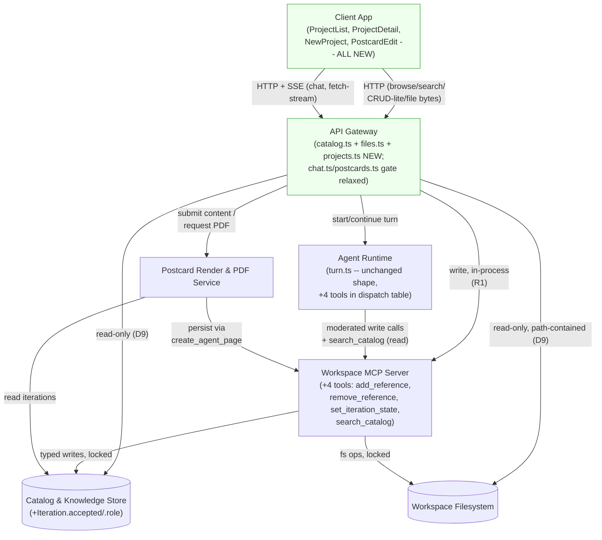
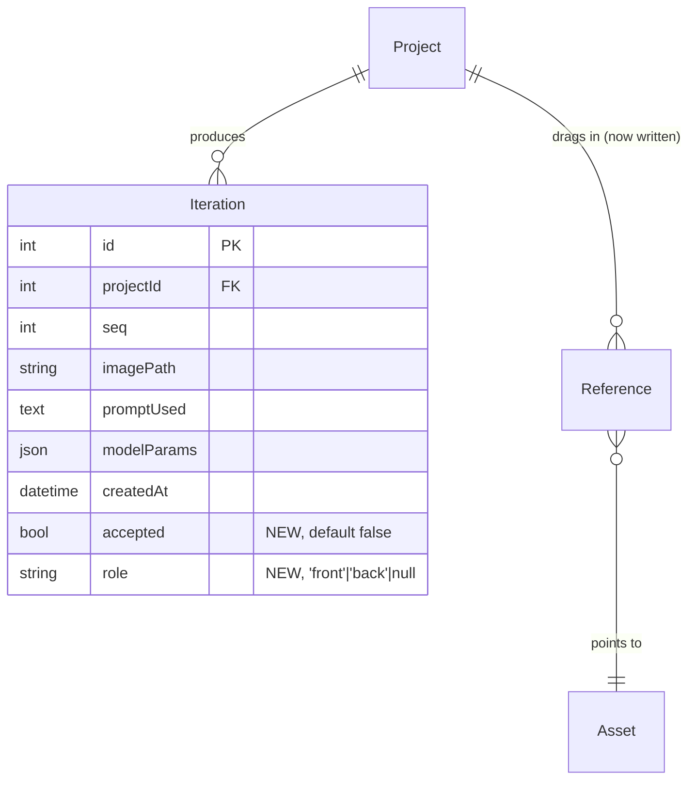
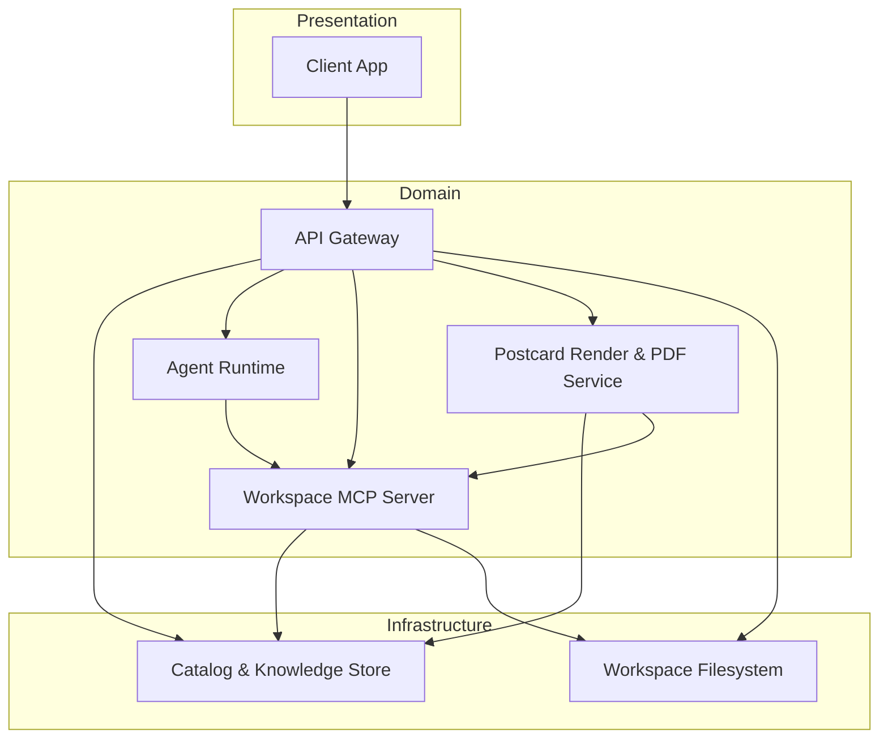

<!-- CLASI: Before changing code or making plans, review the SE process in CLAUDE.md -->

# Architecture Update -- Sprint 005: Real Two-Pane App

**Scope correction (2026-07-15)**: an earlier draft of this document
treated backend completion as constrained -- "no new domain capability
beyond Sprints 002-004," gaps to be flagged rather than built. The
stakeholder corrected this: this sprint's mandate is a working,
stakeholder-demoable end-to-end application, full stop. "Do whatever you
have to do to get a working application." Backend work is fully in
scope. This revision pulls in everything the prior draft deferred,
flagged-instead-of-built, or shaped a ticket around avoiding for that
reason -- and adds two further gaps found by re-verifying the actual
server routes rather than assuming Sprints 002-004 left the backend
complete for what this sprint's UI needs.

This document still scopes architecture-001's design down to what
Sprint 005 actually builds, and it still introduces **no new top-level
modules** -- everything below is either the first real implementation of
an already-named architecture-001 module (Client App, the remainder of
API Gateway) or an additive extension inside an existing module's
boundary (Catalog & Knowledge Store's schema, Workspace MCP Server's
tool family). What changed from the constrained draft is which of those
additions are now built outright instead of flagged as addenda pending
someone else's decision. Read `docs/architecture/architecture-001.md`
first, especially Module 1, Module 2, Module 4, Web App Structure, and
D9 (read/write asymmetry); this document does not repeat that prose,
only the concrete sprint-scoped slice of it plus what's new.

## Step 1-2: Problem and Responsibilities

Sprints 002-004 built a real schema, a real conversational agent loop, a
real moderated write path, and real generation/description/postcard
pipelines -- all reachable only through `chat.ts`/`postcards.ts` routes
explicitly gated `requireAuth + requireAdmin` as a **temporary
test-harness posture**, by both files' own header comments. Nothing in
the client reads or writes any of it: `client/src/pages/mockups/*`
renders exclusively from `mockupStubData.ts`. Re-verifying the actual
`server/src/routes/*` and `server/src/services/*` state (not assuming
completeness) surfaced two gaps beyond what the first draft found:

- **No route serves workspace file bytes to the browser at all.**
  `server/src/app.ts` only calls `express.static(publicDir)` for the
  built client SPA; every image an `Asset`/`Iteration` row points to
  lives under `workspace/` server-side, with no HTTP path to it. Without
  this, no promoted page can render a single real image -- not a
  thumbnail, not an iteration, not a postcard preview, not a project
  hero image. This is the single largest gap the constrained draft
  missed entirely (it was never mentioned, flagged, or built).
- **No query-time text-to-vector path exists for chat-driven catalog
  filtering**, but a usable one can be assembled entirely from code that
  already exists: `description.ts` already exports `embedText(text) ->
  Float32Array` (a deterministic, dependency-free embedding used today
  only at asset-commit time) and `search.ts` already exports
  `nearestNeighbors`/`keywordSearch`. The first draft's "Open Question 3"
  wrongly treated conversational library filtering (UC-014's *primary*
  path, and the literal headline example in `docs/design/overview.md`'s
  own product pitch -- "show me the assets with robots in them") as a
  speculative, out-of-scope protocol feature. It is neither: the pieces
  already exist, unassembled.

Distinct responsibilities this sprint introduces or changes, grouped by
what changes for the same reason:

1. **Live UI rendering of the catalog/project/chat/postcard domain**
   (promoting all six `pages/mockups/*` components plus the project-list/
   home page to real, data-bound components; removing `mockupStubData.ts`
   and the `/mockups/*` stub routes) -- changes when the UI's presentation
   or interaction behavior changes, independently of what data it renders.
   Belongs to architecture-001's **Client App**.
2. **Read/browse/search HTTP surface for the catalog and project domain**
   (`GET /api/catalog/tree`, `GET /api/catalog/search`,
   `GET /api/projects`, `GET /api/projects/:id`) -- changes when the
   client's query shape changes, independently of the UI that calls it or
   the storage it reads. Belongs to architecture-001's **API Gateway**,
   filling in the `catalog.ts`/`projects.ts` route modules that document
   already named as this module's shape.
3. **Workspace file byte-serving** (`GET /api/files/*`) -- changes when
   what's servable or how it's authorized changes, independently of the
   catalog/project query surface (responsibility 2) that tells the client
   *which* paths exist. New, small responsibility inside **API Gateway** --
   a generic, path-contained read, not catalog-specific.
4. **Direct (non-chat) write surface for project-scoped, low-risk user
   actions** (create a project, attach/remove a reference, toggle an
   iteration's accepted/front-back state) -- changes when which direct UI
   actions exist changes, independently of the agent loop's own tool
   surface. Belongs to the same **API Gateway** module as responsibilities
   2-3, each handler calling an existing or new Workspace MCP Server
   catalog tool in-process (Sprint 004's `postcards.ts` precedent -- see
   **R1**), never bypassing the moderated write path even though these
   calls originate from direct UI clicks, not the agent loop.
5. **Persistent accepted/front-back iteration state** -- changes when the
   selection semantics for "which iteration is the working/hero one"
   change, independently of the UI that displays it or the route that
   writes it. Additive extension to architecture-001's **Catalog &
   Knowledge Store** data model -- resolves Sprint 004's own Open
   Question 2, now that the project-list home page needs it universally,
   not just for postcards.
6. **Persistent project references** (`Reference` rows) -- changes when
   how a dragged/attached asset is recorded against a project changes,
   independently of the UI drag/drop interaction itself. The `Reference`
   model has existed in the schema since architecture-001, but no tool
   ever writes to it -- this sprint fills that gap. Extension to
   **Workspace MCP Server**'s existing catalog tool family.
7. **Chat-driven catalog retrieval as an agent tool** (`search_catalog`)
   -- changes when the retrieval strategy the agent uses on the user's
   behalf changes, independently of the literal filter-bar path
   (responsibility 2) or the agent's own knowledge-retrieval step
   (unchanged, `turn.ts`'s existing `retrieveKnowledge`). Extension to
   **Workspace MCP Server**'s tool family, read-only (D9), assembled from
   `embedText`/`nearestNeighbors`/`keywordSearch` -- all already built.
8. **First-user-admin race safety** -- changes when the concurrency
   guarantee around user bootstrap changes, independently of everything
   else in this list. A one-function fix inside the existing **API
   Gateway** boundary (`server/src/routes/auth.ts`).
9. **Account-surface admin-console link** -- changes when what the account
   dropdown/page exposes changes, independently of the admin console
   itself (`client/src/pages/admin/*`, unmodified). Belongs to
   architecture-001's **Client App**, same boundary as responsibility 1.

## Step 3: Subsystems and Modules

No new module boundaries. Restating the two existing architecture-001
modules this sprint builds for real, plus the two existing modules that
gain additive extensions -- all of the following is now ordinary sprint
work, not addenda requiring a flag:

### Client App (existing, architecture-001 Module 1 -- first real implementation)
- **Purpose**: Renders the shared workspace as a browsable left-side
  catalog beside a right-side project view driven by chat.
- **Boundary**: `client/src/` -- unchanged from architecture-001's own
  boundary statement. This sprint's internal structure:
  - `pages/ProjectList.tsx` (promoted from `MockupProjects.tsx`) -- the
    authenticated home route (`/`), My/All/Archive/Library views, hero
    images (real, via the new `/api/files/*` route).
  - `pages/ProjectDetail/` (promoted from `MockupMain.tsx` +
    `MockupOutputPane.tsx` + `MockupChatPanel.tsx` + `MockupLeftBrowser.tsx`)
    -- the two-pane view at `/projects/:id`: output pane, chat panel
    (real SSE, consumed via `fetch()` + a `ReadableStream` reader --
    native `EventSource` cannot be used since the endpoint is `POST`),
    collapsible library drawer with both literal (FTS5) and conversational
    (chat-driven, via `search_catalog`) filtering, reference strip.
  - `pages/NewProject.tsx` (promoted from `MockupNewProject.tsx`) --
    reachable from `ProjectList`'s "New project" button; converges into
    `ProjectDetail` once the project exists (SUC-004).
  - `pages/PostcardEdit.tsx` (promoted from `MockupPostcardEdit.tsx`) --
    the text editor at `/projects/:id/postcard`, full-width, no drawer.
  - `components/AppLayout.tsx` -- gains a full-bleed `<main>` mode for
    `/projects/*` routes (see **R2**) and an Admin-console link on the
    account dropdown, visible only when `hasAdminAccess(role)` (closes
    the account-menu gap; see **R3**).
  - `pages/Account.tsx` -- gains the same Admin-console link (SUC-012),
    consistent with `AppLayout`'s dropdown.
  - **Removed**: `pages/mockups/*` (all seven files) and
    `mockupStubData.ts`; the `/mockups/*` route block in `App.tsx`.
- **Use cases**: SUC-001 through SUC-012, SUC-014, SUC-015.

### API Gateway (existing, architecture-001 Module 2 -- completes the module)
- **Purpose**: Authenticates browser requests then routes them to
  catalog, project, or agent-runtime services.
- **Boundary**: `server/src/routes/*`. This sprint's additions:
  - `catalog.ts` (new) -- `GET /api/catalog/tree`,
    `GET /api/catalog/search` -- read-only, unmoderated (D9), calling
    `services/search.ts`'s existing `keywordSearch` and direct Prisma
    reads over `WorkspaceDirectory`/`Collection`/`KnowledgeEntry`/`Asset`.
    Responses inline full `description`/`bodyText`/`tags` fields rather
    than requiring a separate per-item detail endpoint (a deliberate
    simplification -- see **R6**).
  - `files.ts` (new) -- `GET /api/files/*`, a generic, path-contained
    read of any file under `workspace/`. Resolves the wildcard suffix via
    the existing `resolveWorkspacePath` (Sprint 002's containment
    helper, reused verbatim), streams the file with a content-type
    inferred from its extension, `requireAuth` only, read-only/
    unmoderated (D9 -- reads bypass the Workspace MCP Server). Every
    other new/promoted page depends on this route to render any real
    image at all (see **R7**).
  - `projects.ts` (new) -- `GET /api/projects` (view=mine|all|archive),
    `GET /api/projects/:id` (returns the project row, its `iterations`,
    `references`, and `chatMessages` in one response, so reopening a
    project rehydrates prior chat history and gallery state without a
    second round trip), `POST /api/projects` (calls `create_project`
    in-process, optionally `add_reference` when `sourceAssetId` is
    present -- SUC-004/SUC-011), `POST /api/projects/:id/references` /
    `DELETE /api/projects/:id/references/:refId` (call the
    `add_reference`/`remove_reference` tools), `PATCH
    /api/projects/:id/iterations/:iterId` (calls the
    `set_iteration_state` tool). Every write handler in this file follows
    Sprint 004's `postcards.ts` precedent: call the Workspace MCP Server's
    tool function in-process, never write Prisma directly (**R1**).
  - `chat.ts`, `postcards.ts` (existing, Sprint 003/004) -- auth gate
    changes from `requireAuth + requireAdmin` to `requireAuth` alone,
    exactly the follow-up both files' own header comments already
    anticipated ("a normal, authenticated project-owner user is not
    necessarily an admin"). No other change to either file.
- **Use cases**: SUC-001 through SUC-011, SUC-014, SUC-015 (transport
  layer).

### Catalog & Knowledge Store (existing, architecture-001 Module 5 -- additive extension)
- **Purpose**: Persists the canonical record of assets, collections,
  knowledge entries, projects, iterations, and chat messages.
- **Boundary**: `server/prisma/schema.prisma` -- one additive migration:
  `Iteration.accepted Boolean @default(false)` and `Iteration.role
  String?` (`'front' | 'back' | null`). No other model changes. See
  **R4** for why this is promoted from Sprint 004's content-JSON-only
  approach to real columns now.
- **Use cases**: SUC-007, SUC-010.

### Workspace MCP Server (existing, architecture-001 Module 4 -- additive extension)
- **Purpose**: Mediates every workspace mutation the agent (or, as of
  this sprint, a direct API Gateway write handler) requests through a
  narrow, locked tool surface; also now the home for a new read-only
  catalog-retrieval tool the agent can call on the user's behalf.
- **Boundary**: `server/src/agent-mcp/catalogTools.ts` (existing file)
  gains four new exported functions, registered alongside the existing
  seven on `workspaceMcpServer` and added to `turn.ts`'s
  `DEFAULT_TOOL_HANDLERS`/`WORKSPACE_TOOL_DEFINITIONS` so the agent can
  call them too:
  - `add_reference(projectId, assetId, role)` -- creates a `Reference`
    row (locked/versioned like every other catalog write tool).
  - `remove_reference(referenceId)` -- deletes one.
  - `set_iteration_state(iterationId, { accepted?, role? })` -- updates
    `Iteration.accepted`/`Iteration.role` inside one transaction that
    also clears the same flag from whichever other iteration in the same
    project previously held it (the exclusivity rules in rounds 6-7).
  - `search_catalog(query, k?)` -- **read-only, unlocked** (same
    D9-consistent pattern as the existing `read_file`/`stat` tools, not
    the write tools above): embeds `query` via `description.ts`'s
    existing `embedText`, runs `nearestNeighbors` against it, runs
    `keywordSearch` against the same query text, merges/dedupes the two
    result sets (architecture-001's own "FTS5 as a cheap pre-filter... 
    hybrid retrieval" language), and returns matching `(ownerType,
    ownerId)` pairs plus enough denormalized fields (path, label) for the
    client to render/highlight them without a second lookup. See **R8**
    for why this reuses the existing hash-based `embedText` rather than
    adding a new embedding-API integration.
  No change to the seven existing tools' signatures or behavior.
- **Use cases**: SUC-003, SUC-007, SUC-011, SUC-015.

No changes to Agent Runtime's loop control flow (it gains four more
entries in its fixed tool dispatch table, per R2 [Sprint 003]'s "fixed,
statically-registered tool surface, not a dynamic registry" -- unchanged
mechanism), Vector Index, Workspace Filesystem, Description & Embedding
Pipeline, Image & Vision Service, Versioning Service, or Postcard Render
& PDF Service module boundaries.

## Step 4: Diagrams

### Component / Module Diagram (sprint scope)

Solid nodes/edges are built or populated for real this sprint. Dashed
nodes are existing components shown only as the surface this sprint's
modules touch.

### Entity-Relationship Diagram (this sprint's schema addition)

Only `Iteration` changes; every other model is unchanged from
architecture-001/Sprint 002/004.

`Reference` itself (`id`, `projectId`, `assetId`, `role`) is unchanged --
it already existed in architecture-001's Data Model; this sprint is the
first to write to it. `Embedding`/`AssetDescription` are unchanged --
`search_catalog` only *reads* them (via the already-existing
`nearestNeighbors`) and calls the already-existing `embedText` at query
time; no new column, no new table.

### Dependency Graph (sprint-scope detail)

architecture-001's system-level dependency graph is unchanged in shape --
no new node, no new edge direction, no cycle. `Client App` (previously
disconnected from the running system -- it rendered only stub data) now
has real outward edges to `API Gateway`, matching architecture-001's
original diagram exactly:

No cycles. `Gateway`'s fan-out is now 5 (`Catalog`, `Agent`, `MCP`,
`Postcard`, `FS`) -- at the top of, but not exceeding, the 4-5
guideline; the new `Gateway -> FS` edge (`files.ts`'s direct,
unmoderated read) is the one new edge this revision adds to the sprint-
scope graph, and it's a read-only leaf touch consistent with D9's
existing read/write asymmetry, not a new write path. `Client` remains
fan-out 1 (only `Gateway`).

## Step 5: What Changed / Why / Impact / Migration

### What Changed

- **Client App, first real build**: `client/src/pages/mockups/*` (seven
  files) and `mockupStubData.ts` removed; six pages promoted to live,
  data-bound components under `client/src/pages/` proper (see Step 3);
  `App.tsx`'s `/mockups/*` route block removed, replaced with
  `/`, `/projects/:id`, `/projects/:id/postcard` inside the existing
  `AppLayout`-wrapped route group.
- **`AppLayout.tsx`**: gains a full-bleed content-region mode for
  `/projects/*` (R2) and an Admin-console link on its account dropdown
  (R3); `Account.tsx` gains the same link.
- **New `server/src/routes/catalog.ts`**: `GET /api/catalog/tree`,
  `GET /api/catalog/search`. Read-only, `requireAuth` only.
- **New `server/src/routes/files.ts`**: `GET /api/files/*`. Read-only,
  path-contained, `requireAuth` only.
- **New `server/src/routes/projects.ts`**: `GET /api/projects`,
  `GET /api/projects/:id` (incl. `iterations`/`references`/
  `chatMessages`), `POST /api/projects`,
  `POST|DELETE /api/projects/:id/references[/:refId]`,
  `PATCH /api/projects/:id/iterations/:iterId`. `requireAuth` only.
- **`server/src/routes/chat.ts`, `server/src/routes/postcards.ts`**: auth
  gate changes from `requireAuth + requireAdmin` to `requireAuth`. No
  other change.
- **`server/src/agent-mcp/catalogTools.ts`**: four new exported
  functions (`addReference`, `removeReference`, `setIterationState`,
  `searchCatalog`), registered on `workspaceMcpServer` and added to
  `turn.ts`'s `DEFAULT_TOOL_HANDLERS`/`WORKSPACE_TOOL_DEFINITIONS`. No
  change to the seven existing tools.
- **New additive Prisma migration**: `Iteration.accepted Boolean
  @default(false)`, `Iteration.role String?`.
- **`server/src/routes/auth.ts`**: `findOrCreateOAuthUser`'s
  count-then-create sequence (already implemented, pre-existing code) is
  wrapped in a single `prisma.$transaction` (see **R5**) -- a
  correctness fix, not new behavior; the ADMIN-for-first-user rule itself
  is unchanged.
- No changes to Agent Runtime's loop shape, Vector Index, Workspace
  Filesystem, Description & Embedding Pipeline, Image & Vision Service,
  Versioning Service, or Postcard Render & PDF Service.

### Why

Directly implements architecture-001's Web App Structure section and
completes its Module 1/Module 2 designs, which every prior sprint
(002-004) deliberately built backend-first and left un-consumed by any
client. Resolves this sprint's corrected goal: a working,
stakeholder-demoable end-to-end application -- not a UI skin over
whatever Sprints 002-004 happened to finish, but everything a real user
touching every promoted page actually needs, verified against the actual
routes rather than assumed complete.

### Impact on Existing Components

- `client/src/App.tsx`: `/mockups/*` routes removed; `/`, `/projects/:id`,
  `/projects/:id/postcard` added inside the existing `AppLayout` route
  group. `/login`, `/admin`, `/about`, `/account`, `/mcp-setup`, and all
  `/admin/*` routes are unchanged.
- `client/src/components/AppLayout.tsx`: gains a route-conditional
  full-bleed mode (R2) and one new conditional link (R3) -- its existing
  `isAdminSection` branching, hamburger menu, and account dropdown
  mechanics are otherwise unchanged; `AppLayout.test.tsx` needs new cases
  for both additions.
- `server/src/routes/chat.ts`, `server/src/routes/postcards.ts`: one-line
  auth-gate change each (`requireAdmin` removed from the route
  definition); no other line changes. Existing tests that relied on
  `requireAdmin` gating must be updated to reflect the new, intentionally
  wider gate.
- `server/src/agent-mcp/catalogTools.ts`, `server/src/agent/turn.ts`:
  additive only -- four new functions, four new dispatch-table/
  tool-definition entries; none of the seven existing tools' code changes.
- `server/src/services/description.ts`: `embedText` gains a second
  caller (`search_catalog`, at query time) alongside its existing
  commit-time caller (`describeAsset`) -- no change to the function
  itself, no change to `EMBEDDING_MODEL`/`EMBEDDING_DIMENSION`.
- `server/prisma/schema.prisma`: additive migration on `Iteration` only;
  every other model (including the ten Sprint 002 models, `User`,
  `Config`, `Session`, etc.) is untouched.
- `server/src/routes/auth.ts`: `findOrCreateOAuthUser`'s create-new-user
  branch is wrapped in a transaction; its return shape, the
  email-auto-link path, and the link-mode path are all unchanged.
- `server/src/services/postcardRender.ts`/`postcardPdf.ts`: unaffected --
  `postcards.ts`'s existing `PUT`/`POST .../pdf` handlers are called with
  the same content-JSON shape as Sprint 004 defined; this sprint's
  `Iteration.role` addition is a client-side/route-level convenience for
  *deriving* `front_image`/`back_image` before calling `PUT
  /api/postcards/:id` (SUC-008/SUC-009), not a change to what that
  endpoint accepts or how it renders.
- `server/src/app.ts`: gains three new route mounts (`app.use('/api',
  filesRouter)`, `catalogRouter`, `projectsRouter`, alongside the
  existing five) -- ordering matters only in that all three must land
  before `express.static(publicDir)`'s catch-all in production (already
  true of every existing API route, unchanged pattern).

### Migration Concerns

- **Additive migration only**: `Iteration.accepted`/`Iteration.role` are
  both nullable-or-defaulted; no backfill needed, no existing row
  becomes invalid.
- **Auth-gate widening is a deliberate, reviewed change, not a
  regression**: `chat.ts`/`postcards.ts` moving from `requireAuth +
  requireAdmin` to `requireAuth` is explicitly anticipated by both
  files' own Sprint 003/004 header comments and is consistent with
  architecture-001's Security Considerations ("shared-trust model, by
  design ... no per-user access control below the existing USER/ADMIN
  role split"). The new `files.ts`/`catalog.ts`/`projects.ts` routes use
  the same `requireAuth`-only gate for the same reason -- no route this
  sprint introduces a narrower or wider trust boundary than that already-
  documented model.
- **`files.ts`'s path-containment is load-bearing, not optional**: it
  reuses `resolveWorkspacePath` (Sprint 002), the same function every
  other filesystem-touching module in this codebase already depends on
  for the "no path escapes `workspace/`" guarantee (architecture-001
  Security Considerations). No new containment logic is introduced or
  needed.
- **`search_catalog`'s embedding quality is inherited, not new risk**:
  `embedText`'s hash-based, non-ML embedding (Sprint 004's own documented
  choice, `description.ts` module header) already governs how well
  *commit-time* description embeddings cluster; `search_catalog` reuses
  the identical function for *query-time* text, so its retrieval quality
  is bounded by the same, already-accepted tradeoff -- not a new
  uncertainty this sprint introduces. See **R8** and **Open Questions**.
- **First-user-admin transaction wrap**: purely a concurrency-correctness
  fix inside already-shipped code; no behavior change for the
  already-tested single-request case, no data migration.
- **Deployment sequencing**: within this sprint, the `Iteration` schema
  migration and the four new catalog tools land first (client pages
  depend on all four), then `files.ts`/`catalog.ts`/`projects.ts`
  (`files.ts` and `catalog.ts` need no prior sprint-005 work; `projects.ts`
  depends on the tools), then the `chat.ts`/`postcards.ts` gate
  relaxation (independent, sequenced alongside the new routes so a demo
  doesn't need `requireAdmin` credentials anywhere), then the client
  shell (routing/`AppLayout`), then the client page promotions last (each
  depends on some subset of the routes above already existing).

## Step 6: Design Rationale

### R1: Direct (non-chat) writes call the Workspace MCP Server's tool functions in-process, never Prisma directly
- **Context**: this sprint introduces the first UI-triggered writes that
  are neither the agent loop nor Sprint 004's one precedent
  (`postcards.ts` calling `create_agent_page` in-process). Four more
  direct-write/read actions are needed: create-project, attach/remove
  reference, toggle iteration state, and (read-only) catalog search.
- **Alternatives considered**: have `projects.ts`'s handlers write
  Prisma directly (simpler code, no in-process tool-function call) --
  rejected: it would create a second, unmoderated write path into
  `Project`/`Reference`/`Iteration` alongside the Workspace MCP Server's
  moderated one, silently reintroducing exactly the "two authoritative
  write paths" problem architecture-001's D6/D9 designed against, and
  losing the lock/version/versioning-commit guarantees every other
  catalog write gets for free.
- **Why this choice**: matches Sprint 004's own established precedent
  (`postcards.ts` -> `create_agent_page`) exactly -- an API-Gateway-
  triggered write calls the same pure tool function the agent loop calls,
  in-process, so it goes through `locks.ts`'s acquire/release, the
  version-checked update pattern, and `versioning.recordChange` /
  `commitTurn` identically regardless of whether a human clicked a
  button or Claude decided to act.
- **Consequences**: `add_reference`/`remove_reference`/
  `set_iteration_state`/`search_catalog` are written as MCP-tool-shaped
  functions (return a plain result, accept a `CatalogToolsOptions`-shaped
  options bag) even though most are more often triggered by direct UI
  action than by chat -- a small extra ceremony (tool registration,
  dispatch-table entry) for a write (or, for `search_catalog`, read) path
  this sprint's own reasoning says must stay singular.

### R2: `AppLayout` gains a route-conditional full-bleed mode, rather than the two-pane view rendering its own standalone shell
- **Context**: `MockupMain.tsx`/`MockupNewProject.tsx`/
  `MockupPostcardEdit.tsx` each currently render a duplicate top bar
  (hamburger with hardcoded, non-functional "Home/Account/About/Log out"
  labels) outside `AppLayout` entirely (Sprint 001's Decision 4: mockups
  render standalone). architecture-001's Web App Structure section
  already says `AppLayout`'s top bar "does not disappear entirely ... it
  no longer carries a `MAIN_NAV` product sidebar" -- implying one shared
  shell, not two.
- **Alternatives considered**: (a) keep the two-pane view's own
  standalone header, discarding `AppLayout` for these routes entirely --
  rejected, this duplicates the account/admin-link work (R3) in two
  places and leaves the mockup's non-functional menu items looking real;
  (b) nest the two-pane view inside `AppLayout` unchanged, accepting its
  `p-6 overflow-auto` `<main>` padding/scroll -- rejected, this breaks
  the wireframe's `h-screen`-based, internally-scrolling two-pane layout
  and the drawer's `absolute inset-y-0` positioning (both need a
  zero-padding, non-scrolling ancestor).
- **Why this choice**: `AppLayout` already branches its nav list on
  `isAdminSection`, an established pattern for route-conditional shell
  behavior; adding a second, similarly narrow condition (full-bleed
  `<main>` for `/projects/*`) is consistent with that existing pattern
  rather than a new mechanism, and gives every authenticated route
  exactly one top bar, one account dropdown, one admin link.
- **Consequences**: `AppLayout.tsx` and its test file need a new,
  explicit branch and test cases; the two-pane view's own component code
  is simpler (no header of its own to build or test) as a direct result.

### R3: Admin-console link lives on both `AppLayout`'s dropdown and `Account.tsx`, not just one
- **Context**: `AppLayout`'s hamburger menu already has an `isAdmin &&
  !isAdminSection` conditional `Admin` link (pre-existing code, verified
  in `AppLayout.tsx`) -- but that's a *different* menu (the hamburger)
  from the one the `account-menu-first-user-admin.md` issue describes
  ("clicking the username ... opens the Account view"), which is the
  separate user-avatar dropdown, currently offering only `Account`/`Log
  out`.
- **Alternatives considered**: rely on the pre-existing hamburger-menu
  admin link alone, treating the issue as already satisfied -- rejected:
  the issue is explicit about the *username-click* surface specifically,
  and `Account.tsx` (the page that dropdown's "Account" button navigates
  to) has no admin link at all today, so a user who lands on `/account`
  directly (e.g. a bookmark, a deep link) still has no path to `/admin`
  without going back to the hamburger.
- **Why this choice**: putting the link on both surfaces costs one
  conditional `<NavLink>`/`<a>` each, reuses the existing
  `hasAdminAccess(role)` helper both places already import, and closes
  the issue's literal wording without removing the pre-existing hamburger
  link (no regression).
- **Consequences**: two admin entry points exist post-sprint (hamburger,
  account dropdown/page) -- a minor, intentional redundancy, not
  duplicated logic (`hasAdminAccess` is the single source of truth both
  call).

### R4: `Iteration.accepted`/`Iteration.role` promoted to real columns now, resolving Sprint 004's Open Question 2
- **Context**: Sprint 004's R3 deliberately kept front/back/accepted
  state inside `postcard-content.json` only, explicitly flagging (Open
  Question 2) that "Sprint 005, when it builds the real front/back-
  pulldown and accepted-checkbox UI, may promote this to dedicated
  `Iteration` columns if query/indexing needs demand it." This sprint is
  that sprint, and the need is now concrete and universal: the
  project-list home page's hero-image rule (round 6, SUC-010) requires
  "the most recently accepted iteration" for **every** project kind, not
  just postcards.
- **Alternatives considered**: (a) keep state JSON-only and have
  `GET /api/projects` special-case postcard-kind projects by parsing
  their `postcard-content.json` -- rejected: this can't answer
  "accepted" for non-postcard projects at all, and forces a filesystem
  read per project into what should be a single indexed query for the
  home page; (b) a separate `IterationState` join table -- rejected as
  more machinery than two nullable/defaulted columns on the row that
  already represents exactly one iteration's state.
- **Why this choice**: two columns directly on `Iteration`
  (`accepted: Boolean`, `role: String?`) are additive, queryable/
  indexable, and match Sprint 004's own explicit exit criteria for this
  exact decision. The postcard pipeline (Sprint 004, unchanged) still
  reads `postcard-content.json`'s own `front_image`/`back_image` for
  rendering -- this sprint's routes keep that JSON's image references in
  sync with whichever `Iteration` currently holds `role: 'front'`/
  `'back'` at the moment a `PUT /api/postcards/:id` is submitted: `
  Iteration.role` is the UI's source of truth for "what's currently
  marked," `postcard-content.json` remains the print-pipeline's own
  snapshot of "what was rendered," refreshed on every submit.
- **Consequences**: a small, additive Prisma migration (Migration
  Concerns); `set_iteration_state`'s exclusivity enforcement is the one
  place per-project uniqueness for `accepted`/`role: 'front'`/`role:
  'back'` is guaranteed -- an application-level invariant (see Open
  Questions), not a DB constraint.

### R5: First-user-admin race fixed with a single serializable transaction, not a new schema/table
- **Context**: `findOrCreateOAuthUser`'s existing create-new-user path
  (`server/src/routes/auth.ts`) reads `prisma.user.count() === 0` and
  then calls `prisma.user.create(...)` as two separate statements -- a
  classic check-then-act race: two concurrent first-time logins can both
  observe `count() === 0` before either has committed its `create`, and
  both become `ADMIN`.
- **Alternatives considered**: (a) a dedicated `SystemFlag`/bootstrap
  singleton row with a unique constraint -- more machinery (a new model)
  for a guarantee SQLite's own transaction semantics already provide for
  free; (b) an application-level mutex -- doesn't help across multiple
  server processes/workers, and this project has no such assumption to
  lean on; the existing `Lock` table is scoped to workspace/project-turn
  resources, not user bootstrap, and would be a boundary misuse to
  repurpose here.
- **Why this choice**: wrapping the existing `count()` + `create()`
  sequence in one `prisma.$transaction(async (tx) => {...})` is
  sufficient: SQLite (via `better-sqlite3`) serializes write transactions
  at the database-file level -- a second concurrent transaction blocks
  until the first commits, at which point its own `count()` read (inside
  the same transaction) correctly observes `1`, not `0`. No new
  dependency, no new model, no change to the ADMIN-for-first-user *rule*
  itself.
- **Consequences**: the create-new-user path's latency under contention
  is bounded by SQLite's write-serialization, acceptable for a "first
  login ever" event that happens once per deployment lifetime under any
  real contention. Every other `findOrCreateOAuthUser` branch is
  unaffected -- only the create-new-user branch gains the wrapper.

### R6: `catalog.ts` inlines full item detail in list/search responses, no separate per-item detail endpoint
- **Context**: UC-002 step 3 needs "preview its image, its associated
  prompt text, or both" -- for a `KnowledgeEntry` (a style), that's
  `bodyText`, potentially a paragraph or more.
- **Alternatives considered**: `GET /api/catalog/tree`/`search` return
  only ids/paths/labels, with a separate `GET /api/catalog/assets/:id`/
  `GET /api/catalog/knowledge/:id` for the full record -- rejected for
  this sprint's scale: catalog content sizes (a style's `bodyText`, an
  asset's `description`) are modest (paragraph-scale text, not large
  blobs), and every promoted page that browses the catalog wants the full
  record immediately (there's no "preview then drill in" two-step
  flow in any of the wireframes) -- a separate endpoint would only add a
  network round trip with no UI that benefits from deferring the fetch.
- **Why this choice**: keeps the read surface to two endpoints instead of
  four, with no loss of functionality for anything this sprint's pages
  actually do.
- **Consequences**: if a future sprint adds truly large per-item content
  (e.g. a long-form knowledge article), this decision should be
  revisited -- noted here so it isn't silently outgrown.

### R7: A new, generic `GET /api/files/*` route, not per-resource image endpoints
- **Context**: `Asset.path`, `Iteration.imagePath`, and
  `postcard-content.json`'s `front_image`/`back_image` are all
  workspace-relative paths; nothing serves the bytes at any of them to a
  browser today (Step 1-2's largest re-verified gap).
- **Alternatives considered**: (a) a resource-scoped route per type
  (`GET /api/assets/:id/image`, `GET /api/iterations/:id/image`) --
  rejected: every one of these would independently re-derive the same
  workspace-relative path already returned by `catalog.ts`/`projects.ts`
  and re-implement the same containment/content-type logic, for no
  benefit over a single generic reader; (b) serve `workspace/` via a
  second `express.static` mount -- rejected: `express.static` doesn't
  enforce `requireAuth` or reuse `resolveWorkspacePath`'s containment
  guarantee by default, and this project's `workspace/` root is
  configurable (`WORKSPACE_DIR`, matching `BACKUP_DIR`'s pattern) rather
  than a fixed public directory, so a static mount would need
  auth/containment middleware bolted on anyway -- at which point it's the
  same amount of code as a small explicit route, with less clarity about
  what's actually enforced.
- **Why this choice**: one small, generic, `requireAuth`-gated route,
  reusing `resolveWorkspacePath` exactly as every other filesystem-
  touching module in this codebase already does, serves every image
  surface in the promoted UI (drawer thumbnails, iteration gallery,
  postcard preview backgrounds, project hero images) with one
  implementation and one test suite.
- **Consequences**: this route is a read-only leaf the whole client
  depends on -- if it's unavailable, no promoted page can show a real
  image, so its own test coverage (valid path, contained-path escape
  attempt, missing file, unauthenticated request) is disproportionately
  important relative to its small size.

### R8: `search_catalog` reuses the existing hash-based `embedText`, not a new real embedding-API integration
- **Context**: the first draft of this document deferred conversational/
  semantic library filtering (UC-014's primary path) as a speculative,
  out-of-scope feature, reasoning that it would need new backend
  capability. Re-checking `description.ts` found `embedText(text) ->
  Float32Array` already exists and is already the function that produces
  every `Embedding` row currently in the database (Sprint 004's own
  documented choice: a deterministic, dependency-free "hashing trick"
  bag-of-words vector, explicitly *not* a real ML embedding-API call,
  because "nothing in the codebase has ever populated a real `Embedding`
  row" and no embedding endpoint is named anywhere in spec/architecture).
- **Alternatives considered**: (a) add a real embedding-API call (e.g.
  OpenRouter/OpenAI embeddings) for query-time text, so `search_catalog`
  gets true semantic similarity -- rejected for this sprint: it's a new
  external-API integration point (credentials, error handling, cost,
  latency) that nothing else in the codebase has, for a query-time-only
  path, when a same-space, already-tested embedding function already
  exists and already governs how every stored `Embedding` was produced;
  mixing a real embedding model for queries against hash-based embeddings
  for stored content would also produce *worse* similarity than using
  the same (even if crude) function on both sides, since cosine
  similarity across two different embedding spaces is meaningless; (b)
  keyword-only (FTS5), no vector step at all -- rejected: this discards
  half of architecture-001's own stated hybrid-retrieval design and
  produces weaker results for the product pitch's own headline example
  ("robots" as a literal FTS5 token is more brittle than a hash-vector
  match across a fuller description).
- **Why this choice**: `embedText` is the *only* function in this
  codebase that has ever produced an `Embedding` row -- using it for
  query-time text too is the only choice that keeps queries and stored
  vectors in the same embedding space, which is a correctness
  requirement for cosine similarity to mean anything, not just a
  convenience. Combining its result with `keywordSearch` (both already
  built, both already used elsewhere in the codebase) delivers real,
  working conversational filtering with zero new dependencies and zero
  new external API surface.
- **Consequences**: `search_catalog`'s retrieval quality is exactly as
  good (or as limited) as Sprint 004's existing commit-time description
  embeddings already are -- a real, working feature, but not
  "true semantic search" in the ML-embedding-model sense. If a future
  sprint replaces `embedText` with a real embedding-API call (Sprint
  004's own module header already anticipates this: "a future ticket...
  should replace `embedText`'s body and bump `EMBEDDING_MODEL`"),
  `search_catalog` improves automatically with zero code change of its
  own -- it depends on the function, not on its current implementation.

## Step 7: Open Questions

1. **Two admin entry points (R3)**: this document proposes leaving both
   the pre-existing hamburger-menu admin link and the new account-
   dropdown/page link in place, rather than consolidating to one. If the
   stakeholder later prefers a single canonical entry point, that's a
   small, contained UI change, not a re-architecture.
2. **`Iteration.role` uniqueness enforcement (R4)**: currently an
   application-level invariant enforced only by `set_iteration_state`,
   not a database constraint. If a future sprint adds another direct
   write path to `Iteration` that doesn't go through this tool, the
   invariant could silently break. Flagged here so a future reviewer
   doesn't assume DB-level enforcement exists.
3. **`embedText`'s embedding quality (R8)**: `search_catalog` inherits
   Sprint 004's hash-based, non-ML embedding for both stored content and
   queries. This is a real, working implementation, not a placeholder,
   but a future sprint replacing `embedText` with a genuine embedding-API
   call (already anticipated by Sprint 004's own module header) would
   improve `search_catalog`'s result quality with no call-site change.
   Not blocking; noted so a future reviewer has the context.
4. **`/projects/:id/postcard` vs. reusing the same route with a tab
   query param**: this document picks a distinct route
   (`/projects/:id/postcard`) for the text editor over a query-param
   variant of `/projects/:id`, matching the mockup's existing separate-
   page structure and its own explicit "no asset browser on this page"
   rule (easier to guarantee by construction on a separate route than by
   conditional rendering on a shared one). An implementer's call, not
   requiring stakeholder confirmation.

---

## Architecture Self-Review

Run per the `architecture-review` skill's five categories, against
`docs/architecture/architecture-001.md` as the baseline (via Sprint 004's
`architecture-update.md`, which this document is the next diff against in
sequence). Re-run in full against this revised, unconstrained-backend
version of the document -- not a delta review, since the scope
correction touches every section.

**Consistency**: The "What Changed" list in Step 5 matches the module
list in Step 3 and both diagrams in Step 4 exactly -- two existing
architecture-001 modules built for real (Client App, the remainder of API
Gateway) and two existing modules gaining additive extensions (Catalog &
Knowledge Store's `Iteration` columns, Workspace MCP Server's four new
tools), no more, no fewer. All eight design-rationale entries (R1-R8) are
each stated once in Step 5 or Step 1-2 and cross-referenced consistently
from Step 3 (module descriptions), Step 5 (What Changed/Impact/
Migration), and Step 7 (Open Questions 1-3 trace to R3/R4/R8). No
section asserts a new module or a schema change contradicted elsewhere.
PASS.

**Codebase Alignment**: Verified against the actual repo -- confirmed
`server/src/app.ts` mounts only `healthRouter`/`integrationsRouter`/
`authRouter`/`adminRouter`/`chatRouter`/`postcardsRouter` plus a catch-all
`express.static(publicDir)`, with no route serving `workspace/` file
bytes anywhere (confirming R7's gap is real, not hypothetical);
`server/src/services/description.ts` confirmed to already export
`embedText(text: string): Float32Array` with a module header explicitly
documenting it as the only embedding-producing function in the codebase
(confirming R8's reuse is grounded, not speculative);
`server/src/services/search.ts` confirmed to export `nearestNeighbors`/
`keywordSearch` with the exact signatures R8 depends on;
`client/src/pages/mockups/*` confirmed to contain exactly the seven files
this document proposes removing/promoting; `client/src/App.tsx` confirmed
to register all `/mockups/*` routes standalone (no `AppLayout`) exactly
as R2 describes; `client/src/components/AppLayout.tsx` confirmed to
already have the `isAdminSection`-conditional nav branch R2 extends and
the pre-existing `isAdmin && !isAdminSection` hamburger admin link R3
references; `client/src/pages/Account.tsx` confirmed to have no
admin-console link today; `server/src/routes/chat.ts` and
`server/src/routes/postcards.ts` confirmed to gate `requireAuth,
requireAdmin` with header comments explicitly anticipating this sprint's
relaxation; `server/src/routes/` confirmed to contain no `catalog.ts`,
`files.ts`, or `projects.ts` file today; `server/src/agent-mcp/
catalogTools.ts` confirmed to export exactly the seven tools this
document says are unchanged, with no `Reference`-, iteration-state-, or
search-related tool among them; `server/prisma/schema.prisma` confirmed
`Iteration` has no `accepted`/`role` field and `Reference` exists with no
writer anywhere in `server/src`; `server/src/routes/auth.ts` confirmed
`findOrCreateOAuthUser`'s create-new-user branch performs
`prisma.user.count()` then `prisma.user.create()` un-transacted,
confirming R5's race is real. No drift found between documented and
actual current-state code. PASS.

**Design Quality**:
- *Cohesion*: every module's purpose sentence still passes the no-"and"
  test. `files.ts` was kept as its own file, not folded into `catalog.ts`,
  because it changes for a different reason (what's servable/how it's
  authorized) than catalog browsing/search does (R7) -- a deliberate
  cohesion decision. `search_catalog` was kept in `catalogTools.ts`
  alongside the write tools (not a new file) because it's still "a
  Workspace MCP Server tool the agent can call," the same reason the
  seven existing tools live there, even though its own mechanics
  (read-only, no lock) differ from the write tools' -- matching the
  precedent `fsTools.ts`'s `read_file`/`stat` already set for read-only
  tools coexisting with write tools in one family.
- *Coupling*: Step 4's dependency graph shows `Gateway`'s fan-out at 5
  (Catalog, Agent, MCP, Postcard, FS) -- at the top of the 4-5 guideline
  but not exceeding it; the new `Gateway -> FS` edge is a single,
  read-only, well-justified addition (R7), not an unbounded growth
  pattern. `Client`'s fan-out stays at 1 (only `Gateway`).
- *Boundaries*: R1 remains this sprint's central boundary decision --
  every new direct-write route calls an existing or new Workspace MCP
  Server tool function in-process rather than writing Prisma directly,
  keeping D9's read/write asymmetry intact even though four new call
  sites are UI-triggered, not agent-triggered. `files.ts`'s direct,
  unmoderated `FS` read is consistent with D9's read/write asymmetry
  (reads bypass the Workspace MCP Server by design), not an exception to
  it.
- *Dependency direction*: Presentation (Client) -> Domain (Gateway,
  Agent, MCP, Postcard) -> Infrastructure (Catalog, FS) holds throughout;
  no new node depends on a Presentation-layer node; `Catalog` and `FS`
  remain pure Infrastructure leaves with zero outward dependencies.
  PASS.

**Anti-Pattern Detection**:
- *God component*: none -- `catalogTools.ts` grows to eleven exported
  functions but each remains a single, narrow operation on one resource
  type; `projects.ts`/`catalog.ts`/`files.ts` each own one narrow HTTP
  surface, not "most of the work."
- *Shotgun surgery*: adding a hypothetical future direct-write/read
  action would touch exactly one new function in `catalogTools.ts` plus
  one new route handler -- not `turn.ts`'s dispatch loop shape, not
  `fsTools.ts`, not the existing tools.
- *Feature envy*: `projects.ts`'s write handlers call the Workspace MCP
  Server's own functions rather than reaching into `Catalog`'s Prisma
  models directly (R1); `files.ts` calls `resolveWorkspacePath` rather
  than reimplementing path containment.
- *Circular dependencies*: none (Step 4's graph is acyclic, verified
  above).
- *Leaky abstractions*: R4's explicit note that `Iteration.role`
  uniqueness is an application-level invariant, not a DB constraint, is
  called out as a real, documented risk (Open Question 2) rather than
  silently assumed enforced; R8 is equally explicit that `search_catalog`
  is hash-based similarity, not true ML semantic search.
- *Speculative generality*: R7 explicitly rejects a resource-scoped
  image-endpoint-per-type design in favor of one generic route sized to
  this sprint's actual needs, not a speculative general file-serving
  API; R8 explicitly rejects building a new embedding-API integration
  the sprint doesn't need when an already-working function satisfies the
  requirement.
  PASS -- no anti-pattern found requiring rework.

**Risks**:
- **`Iteration.role` uniqueness is application-level only** (R4/Open
  Question 2) -- real, documented, not hidden; the one enforcement point
  (`set_iteration_state`) is a single, well-defined function.
- **Auth-gate widening** (`chat.ts`/`postcards.ts`/all new routes) is a
  deliberate, reviewed change consistent with the already-documented
  shared-trust model -- any existing test asserting `requireAdmin`
  behavior on `chat.ts`/`postcards.ts` must be updated, not just left
  passing against a narrower gate than production now has.
- **First-user-admin transaction wrap** (R5) touches already-shipped
  authentication code -- ticket-level testing must explicitly re-run the
  existing `findOrCreateOAuthUser` test suite alongside the new
  concurrency test.
- **`files.ts` is a new, unauthenticated-by-mistake risk if its
  `requireAuth` gate or its `resolveWorkspacePath` call is ever dropped**
  (R7) -- its own test suite (Migration Concerns) is the mitigation;
  flagged as disproportionately important for its size given how many
  pages depend on it.
- **`search_catalog`'s result quality is bounded by `embedText`** (R8) --
  a real, working feature today, with a known, documented, non-blocking
  limitation and a stated, zero-call-site-change upgrade path.
- No breaking changes to Agent Runtime's loop shape, Vector Index,
  Workspace Filesystem, Description & Embedding Pipeline, Image & Vision
  Service, Versioning Service, or Postcard Render & PDF Service; no
  deployment-sequencing risk beyond the schema-then-tools-then-routes-
  then-shell-then-pages ordering already stated in Migration Concerns.

### Verdict: **APPROVE**

No structural issues (no circular dependencies, no god components, no
inconsistency between diagrams and document body, no confirmed
anti-pattern). Every addition in this revision -- `files.ts`,
`search_catalog`, the widened `GET /api/projects/:id` response, and the
already-carried-forward `Iteration` columns/reference tools/first-user-
admin fix -- is a small, justified, explicitly-documented closure of a
gap verified against the actual codebase, assembled wherever possible
from functions that already exist (`resolveWorkspacePath`, `embedText`,
`nearestNeighbors`, `keywordSearch`) rather than new external
dependencies. No open item rises to REVISE: Open Questions 1-4 are
either implementer's calls or forward-looking notes with a stated
default, not unresolved structural risk. Proceeding to ticketing.
