<!-- CLASI: Before changing code or making plans, review the SE process in CLAUDE.md -->

# Sprint 006: Generation Progress Feedback

## Goals

During flyer generation — especially image generation, which can take
minutes per image — surface a live, stage-specific progress line in the
chat UI (spinner + streamed "Consulting knowledge sources…", "Drafting
flyer content…", "Generating image (#2)…", "Assembling flyer…") so the
user never wonders whether the app has hung. Alongside this, fix the
related defect diagnosed live on 2026-07-17: `imaging.ts`'s `fetch` calls
to OpenAI/OpenRouter have no timeout, so a stalled upstream call hangs
generation forever with no feedback at all.

## Problem

1. `ChatPanel.tsx` already renders a coarse status line
   (`toolStatusLabel`) driven by the turn controller's `TurnEvent` SSE
   stream, but it only updates on discrete tool-call boundaries. A long
   stage (e.g. one `generate_image` call that itself takes 60-90s)
   produces one static label ("generating image…") for its entire
   duration, with no indication of elapsed time, no spinner, and no
   distinction between "drafting text" and "waiting on the image API".
2. `imaging.ts`'s `generateImage`/`classifyAndDescribe` (and the
   image-download-by-URL fallback in `extractFirstImageBytes`) call the
   global `fetch`/injected `fetchImpl` with no `AbortSignal` and no
   timeout. A stalled upstream connection blocks the whole turn (which
   holds the project's `project_turn` lock) indefinitely — the live
   incident this issue documents.

## Solution

Reuse the existing SSE turn-event stream (`POST
/api/projects/:id/chat`, `turn.ts` → `routes/chat.ts` →
`postSseStream`) rather than introducing a new transport. Extend the
`TurnEvent` wire contract with a `stage` event carrying a friendly label
and a stage-start timestamp, and emit one at every phase transition the
turn controller already passes through (knowledge retrieval, provider
call, each tool-call round, final assembly). The client computes and
ticks the "elapsed" display itself from the stage-start timestamp (no
server-side heartbeat traffic needed) and renders a spinner for the
duration of any active stage. Image-generation sub-steps are reported
by call index ("Generating image (#2)…") as they happen, not as a
pre-known "N of 3" — see Design Rationale for why a pre-announced total
is not honestly knowable with the current tool-calling loop.

Separately (and independently), `imaging.ts` gets an `AbortController`-
based timeout on every outbound `fetch` (default 5 minutes, overridable),
producing a distinct, clearly-worded `ImagingServiceError` on expiry that
includes the elapsed wait — which flows, unchanged, through the existing
`tool_call_finished { isError: true }` / chat error-rendering path.

## Success Criteria

- At no point during a multi-minute generation does the chat UI show a
  static, unchanging status line for more than a couple of seconds —
  either the stage label changes or the elapsed-time ticker visibly
  advances.
- A stalled image API call fails within the configured timeout (default
  5 minutes) with a clear, user-facing error naming the stage and elapsed
  wait, instead of hanging the turn (and the `project_turn` lock)
  indefinitely.
- No new HTTP endpoint, polling loop, or WebSocket is introduced — the
  existing SSE stream carries the richer events.

## Scope

### In Scope

- New `stage` (and image-generation sub-step) events on `turn.ts`'s
  `TurnEvent` union, emitted at existing phase-transition points.
- Timeout/abort handling for all outbound `fetch` calls in
  `imaging.ts`, with a configurable duration and a clear expiry error.
- `ChatPanel.tsx` UI: spinner, stage label, live elapsed-time ticker,
  rendering of the new timeout error message.

### Out of Scope

- A persistent/resumable job-status model that survives a page reload
  or reconnect mid-generation — today's turn is already a single
  request-scoped stream with no cross-request session state (`turn.ts`
  D8), and this issue does not ask to change that.
- Pre-computing an exact total image count before generation starts
  (the model decides `generate_image` call count dynamically; see
  Design Rationale).
- Any change to `classifyAndDescribe`'s behavior beyond adding the same
  timeout (no new progress reporting for the catalog-description
  pipeline, which is not chat-turn-scoped).
- A budget/spend cap (architecture-001 Open Question 7, unchanged).

## Test Strategy

- **Server unit tests** (`turn.ts`): assert `stage` events are emitted
  in the expected order/shape for a scripted mock-provider turn with 0,
  1, and 2+ tool-call rounds (including two `generate_image` calls in
  one turn, asserting call-index labeling, not a fabricated total).
- **Server unit tests** (`imaging.ts`): inject a `fetchImpl` that never
  resolves and assert the call rejects with `ImagingServiceError` at
  (a fake/injected) timeout boundary, not the real wall-clock duration;
  assert the error message names the provider and elapsed wait.
- **Client tests** (`ChatPanel.tsx`): assert the spinner and stage label
  render on a `stage` event and clear on `message`/`error`; assert the
  elapsed-time ticker advances without additional SSE frames; assert the
  timeout error path renders like any other `error` event.
- No new integration/E2E harness needed — existing SSE test scaffolding
  (`postSseStream` mocks) covers the wire contract end to end.

## Architecture

**Substantial** — the sprint changes a wire contract shared by the
server (`turn.ts`) and client (`ChatPanel.tsx`), adds new failure/timeout
semantics to `imaging.ts`, and touches four modules across two
processes. It does not introduce a new subsystem (no new transport, no
new data model), so the write-up below stays focused rather than
exhaustive.

### Architecture Overview

```mermaid
flowchart LR
    subgraph Client["client/src"]
        CP["ChatPanel.tsx\n(progress UI: spinner,\nstage label, elapsed ticker)"]
    end
    subgraph Server["server/src"]
        CR["routes/chat.ts\n(SSE endpoint, unchanged)"]
        TC["agent/turn.ts\n(turn controller:\nemits stage events)"]
        RIVC["agent/realImageVisionClient.ts\n(ImageVisionClient impl)"]
        IMG["services/imaging.ts\n(OpenAI/OpenRouter HTTP client:\nadds fetch timeouts)"]
    end
    Ext[["OpenAI / OpenRouter APIs"]]

    CP -- "POST /projects/:id/chat\n(SSE request)" --> CR
    CR -- "writeEvent(TurnEvent)\nincl. new 'stage' events" --> CP
    CR -- "runTurn(...)" --> TC
    TC -- "onEvent(stage/tool_call_*)" --> CR
    TC -- "generateImage()" --> RIVC
    RIVC -- "imaging.generateImage()" --> IMG
    IMG -- "fetch (AbortController timeout)" --> Ext
```

Only `turn.ts`, `imaging.ts`, and `ChatPanel.tsx` change behavior;
`routes/chat.ts` and `realImageVisionClient.ts` are unchanged passthroughs
(the SSE endpoint already forwards every `TurnEvent` verbatim, and the
real image-vision client already delegates entirely to `imaging.ts` and
is not itself a network caller).

**Module notes**

- **`agent/turn.ts` (Turn Controller, extended)** — Purpose: report an
  in-progress agent turn's phase transitions as it drives them. Boundary:
  gains a `stage`-labeling responsibility around its existing loop
  phases (lock wait → knowledge retrieval → provider call → per-tool-call
  round → final message); does not gain any new external dependency.
  Serves SUC-001.
- **`services/imaging.ts` (Image & Vision Service, extended)** — Purpose:
  make timeout-bounded HTTP calls to OpenAI/OpenRouter. Boundary: gains
  an `AbortController`-based timeout wrapper around every `fetchImpl`
  call site (generations, edits, the image-download-by-URL fallback,
  and the OpenRouter chat-completions call); its "stateless HTTP
  wrapper with zero outward dependencies" boundary (module header) is
  unchanged. Serves SUC-002.
- **`ChatPanel.tsx` (Chat Progress UI, extended)** — Purpose: render the
  turn's live status to the user. Boundary: adds spinner + elapsed-time
  state, driven entirely by `stage` events already carried on the SSE
  stream it already consumes; still makes no fetch of its own beyond
  `postSseStream`. Serves SUC-001, SUC-002.

No dependency graph diagram beyond the component diagram above is
warranted — the module dependency direction is unchanged (`ChatPanel` →
SSE endpoint → turn controller → image-vision client → imaging service →
external APIs, same as today); this sprint adds fields and timeout logic
within that existing chain, not new edges. No entity-relationship
diagram is included: no Prisma model changes (this sprint is wire-contract
and UI state only).

### Design Rationale

**Decision: reuse the existing SSE stream, not a new job-status
endpoint or WebSocket.**
- Context: the issue's requirements (live stage updates, per-item
  progress, elapsed time) could be met by (a) extending the current SSE
  `TurnEvent` stream, (b) a separate polling `GET
  /projects/:id/generation-status` endpoint, or (c) a WebSocket
  connection.
- Alternatives considered: A polling endpoint would need a persisted,
  cross-request job-status record — new state the turn controller does
  not otherwise keep (D8: "no in-memory or cross-request session
  state"), just to answer polls between two requests already inside one
  synchronous SSE-streamed request. A WebSocket would add a second
  connection lifecycle/transport for a single-request, single-directional
  (server → client) stream that SSE already handles correctly (chat.ts's
  module header already ruled out `EventSource` only because it's
  GET-only, not because SSE itself is unsuitable).
- Why this choice: the turn is already one bounded, request-scoped
  operation streamed over SSE; the gap is event *granularity*, not
  transport. Adding `stage` events to the existing `TurnEvent` union is
  the minimal change that closes that gap.
- Consequences: progress is only visible for the lifetime of the open
  SSE connection, same as today — a page reload mid-turn still loses
  live progress (accepted; Out of Scope).

**Decision: image-generation sub-progress is reported by call index
("Generating image (#2)…"), not a pre-known total ("2 of 3").**
- Context: the issue's example text reads "Generating images (1 of
  3)…", implying a known total. But `generate_image` calls are dispatched
  one at a time as the *model* decides to call the tool during
  `turn.ts`'s provider/tool-dispatch loop (`WORKSPACE_TOOL_DEFINITIONS`);
  nothing upstream of that loop commits to an image count before the
  turn starts.
- Alternatives considered: requiring the model to declare an upfront
  image plan (e.g. a new `plan_images(count)` tool) so a real "N of M"
  could be shown. Rejected as speculative generality for this sprint —
  it changes the agent's tool-calling contract and prompt design for a
  cosmetic label, and would be wrong the moment the model changes its
  mind mid-turn (e.g. decides a 3rd image isn't needed).
  A fake/estimated total was also rejected as actively misleading.
- Why this choice: reporting the true, monotonically-increasing call
  index ("image (#1)…", "image (#2)…") is honest about what the system
  actually knows at each step, and combined with the elapsed-time ticker
  still gives the user the "is it alive, and how long has this
  particular image been running" signal the issue is really asking for.
- Consequences: the UI never shows "of N" during generation. If a future
  sprint wants a real upfront image plan, that is a larger, separate
  change to the tool-calling contract, not a UI tweak.

### Migration Concerns

None. `TurnEvent` gains new variants (additive, backward compatible —
an older client ignoring unknown `type`s degrades to today's behavior,
though this sprint updates the one real consumer, `ChatPanel.tsx`, in
lockstep). `imaging.ts`'s timeout is a new, optional-with-default
behavior; no schema or data migration involved. No deployment
sequencing constraint — server and client ship together as this
project always does.

## Use Cases

### SUC-001: Live stage-specific progress during generation
Parent: UC (chat-driven flyer generation, architecture-001)

- **Actor**: Project owner, mid-conversation with the design assistant
- **Preconditions**: A chat turn is in progress (`POST
  /projects/:id/chat` SSE stream open)
- **Main Flow**:
  1. The user sends a message that triggers a multi-step turn (knowledge
     retrieval, drafting, one or more `generate_image` calls, final
     assembly).
  2. As the turn controller enters each phase, it emits a `stage` event
     with a friendly label and a stage-start timestamp.
  3. The chat UI shows a spinner plus the current stage label, and ticks
     an elapsed-time display locally between events.
  4. Each `generate_image` call in progress is labeled with its call
     index ("Generating image (#N)…").
  5. On the turn's final message, the spinner/stage line clears and the
     assistant's reply renders as usual.
- **Postconditions**: The user saw continuous, stage-specific evidence
  of progress for the entire turn duration; no single status line was
  static for more than the interval between two consecutive server-side
  phase transitions.
- **Acceptance Criteria**:
  - [ ] A `stage` event is emitted at (at least) knowledge retrieval,
        provider "thinking", each tool-call round, per `generate_image`
        call, and final assembly.
  - [ ] The chat UI renders a visible spinner whenever a stage is active,
        and clears it when the turn ends (`message` or `error`).
  - [ ] The elapsed-time display advances locally (client-side ticking)
        without requiring additional server frames.
  - [ ] Multiple `generate_image` calls in one turn are labeled by call
        index, never a fabricated "of N" total.

### SUC-002: Stalled image API call fails with a clear, timely error
Parent: UC (chat-driven flyer generation, architecture-001)

- **Actor**: Project owner
- **Preconditions**: A turn has dispatched a `generate_image` (or
  catalog description/classification) call to an upstream API that
  stops responding mid-request.
- **Main Flow**:
  1. `imaging.ts` issues the outbound `fetch` with an `AbortController`
     timeout (default 5 minutes, configurable).
  2. The upstream connection stalls past the timeout.
  3. The `fetch` is aborted; `imaging.ts` throws an `ImagingServiceError`
     naming the provider and the elapsed wait.
  4. The error propagates through `realImageVisionClient.ts` →
     `turn.ts`'s existing `dispatchToolCall` catch → a
     `tool_call_finished { isError: true }` event → the chat UI's
     existing error rendering.
- **Postconditions**: The turn ends with a clear, user-visible error
  instead of hanging indefinitely; the `project_turn` lock is released
  (via `turn.ts`'s existing `finally` block, unchanged).
- **Acceptance Criteria**:
  - [ ] Every outbound `fetch` in `imaging.ts` (OpenAI generations,
        OpenAI edits, the image-download-by-URL fallback, and the
        OpenRouter chat-completions call) is bound to a timeout.
  - [ ] The default timeout is 5 minutes; overridable via
        `options`/environment for tests and future tuning.
  - [ ] On expiry, the thrown `ImagingServiceError` names the provider
        and the elapsed wait in its message.
  - [ ] No behavior change for a call that completes before its timeout.

## GitHub Issues

(GitHub issues linked to this sprint's tickets. Format: `owner/repo#N`.)

## Definition of Ready

Before tickets can be created, all of the following must be true:

- [ ] Sprint planning document is complete (sprint.md, including its
      Architecture and Use Cases sections)
- [ ] Architecture review passed (or skipped, for changes with no
      architectural impact)
- [ ] Stakeholder has approved the sprint plan

## Tickets

| # | Title | Depends On |
|---|-------|------------|
| 001 | Timeout and abort handling for the Image & Vision Service | — |
| 002 | Stage-based progress events in the turn controller | — |
| 003 | Client progress UI: spinner, stage label, and elapsed-time ticker in ChatPanel | 001, 002 |

Tickets execute serially in the order listed.
