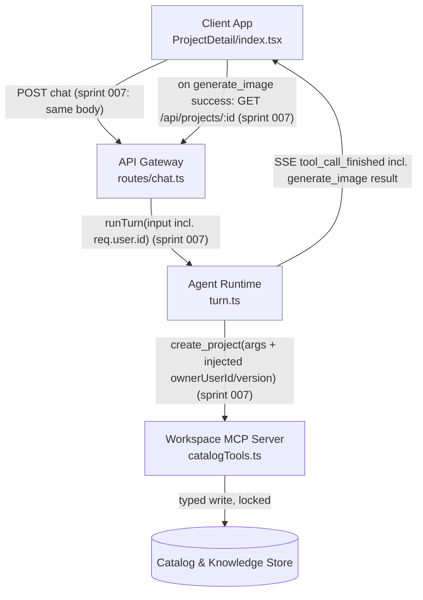

<!-- CLASI: Before changing code or making plans, review the SE process in CLAUDE.md -->

# Sprint 007: Iteration Refresh and Agent Tool Context

## Goals

Fix two live-observed defects in the same conversational/project-view
surface (project 14, "League of Mentors", 2026-07-17):

1. A successful `generate_image` tool call lands its `Iteration` row and
   PNG server-side, but `ProjectDetail`'s client state never picks it up
   -- the user sees a stale gallery and concludes generation failed.
2. The agent asked the end user for an internal `ownerUserId` after a
   `create_project` rename call failed, because the turn controller never
   supplies the identity/version context the tool needs, and nothing in
   the system prompt forbids asking for internal IDs or requires
   surfacing tool failures.

## Problem

**Issue 1 (`iterations-not-refreshed-after-generation.md`)**:
`handleToolCallFinished` in `client/src/pages/ProjectDetail/index.tsx`
only branches on `name === 'search_catalog'`; every other
`tool_call_finished` event (including a successful `generate_image`) is
silently dropped. `ChatPanel.tsx` already forwards every
`tool_call_finished` event to this callback (ticket 010's seam) and
`OutputPane.tsx` already re-renders from whatever `iterations` prop it is
given -- the only missing piece is `index.tsx` acting on a
`generate_image` completion.

**Issue 2 (`agent-asks-user-for-internal-ids.md`)**: `runTurn`
(`server/src/agent/turn.ts`) dispatches `create_project` through
`DEFAULT_TOOL_HANDLERS` with only the model-supplied `args` -- it never
injects `ownerUserId` (for a create) or the current `version` (for an
update to the project the turn is already scoped to). `catalogTools.ts`'s
`createProject` correctly requires `title` + `ownerUserId` to create, or
`id` + `version` to update (`VersionConflictError` otherwise) -- so a
rename of the *current* project, which should need nothing beyond the
model already knowing it's talking about "this project," fails validation
and the model, with no guardrail against it, asks the human for the
missing field instead of surfacing a plain error. Separately,
`SYSTEM_PROMPT_BASE` gives no instruction either way on this.

## Solution

**Issue 1**: extend `handleToolCallFinished` to also handle a successful,
non-error `generate_image` completion by refetching the project (`GET
/api/projects/:id`, the same `loadProject` the page already calls on
mount) so the new `Iteration` appears in `iterations` and the active
stream re-renders immediately. A full refetch (not a hand-rolled patch of
the tool result into local state) is chosen because `generate_image`'s
result shape is the `GenerateImageResult`/`Iteration` row as recorded by
`createIteration` -- reusing the existing, already-correct
`loadProject`/`setProject` path is less code and can't drift from what
`GET /api/projects/:id` actually returns, at the cost of one extra round
trip per generation (acceptable: generation itself already takes several
seconds).

**Issue 2**: two independent, additive changes, both scoped to the
existing Agent Runtime / API Gateway boundary:
- `runTurn` loads the current `Project` row (it already does, for
  `loadProjectContext`) and, when dispatching `create_project`, fills in
  `ownerUserId` (from the project's existing owner, or from the
  authenticated caller for a genuinely new top-level project) and
  `version` (from the just-loaded row) whenever the model omits them --
  the model only ever needs to know `projectId` (already in its context)
  plus what it wants to change.
- `routes/chat.ts` starts passing the authenticated `req.user.id` into
  `runTurn`'s input, so a *new*-project `create_project` call (no `id`)
  has a real owner to inject even when the model supplies none.
- `SYSTEM_PROMPT_BASE` gains an explicit instruction: never ask the user
  for internal identifiers (IDs, versions, keys); on a tool call that
  returns `isError: true`, state the failure to the user in plain
  language in the next message rather than improvising a follow-up
  question that invents a workaround.

## Success Criteria

- After a `generate_image` tool call completes successfully mid-chat,
  the new iteration appears in the active stream's `OutputPane` without a
  page reload.
- Renaming (or otherwise updating metadata on) the project the turn is
  already scoped to never requires the model to ask the user for
  `ownerUserId`, `version`, or any other internal identifier.
- A tool call that fails (`isError: true`) always results in a
  plain-language failure statement to the user in the same turn, never a
  silent drop or a request for an internal ID as a workaround.

## Scope

### In Scope

- `client/src/pages/ProjectDetail/index.tsx`: `handleToolCallFinished`
  handling for `generate_image`.
- `server/src/agent/turn.ts`: `dispatchToolCall`'s handling of
  `create_project` (identity/version injection), `RunTurnInput`
  (authenticated user id), and `SYSTEM_PROMPT_BASE`.
- `server/src/routes/chat.ts`: threading `req.user.id` into `runTurn`.
- `server/src/agent-mcp/catalogTools.ts`: no behavioral change to
  `createProject` itself -- it already validates correctly; this sprint
  only changes what the turn controller passes in.

### Out of Scope

- Any change to `create_project`'s validation rules or
  `VersionConflictError` semantics.
- Broader "every tool call auto-injects every ID" generalization --
  scoped to the one observed failure (`create_project`'s
  `ownerUserId`/`version`), not a speculative framework for all 15 tools.
- Retrying a failed tool call automatically -- surfacing the failure in
  plain language is this sprint's bar, not auto-recovery.
- Any change to `OutputPane.tsx`'s or `ChatPanel.tsx`'s existing
  `tool_call_finished` forwarding plumbing (both already work correctly;
  only `index.tsx`'s handling of the event is incomplete).

## Test Strategy

- Client: a `ProjectDetail`/`handleToolCallFinished`-level test asserting
  that a successful `generate_image` `tool_call_finished` event triggers
  a refetch (mock `fetch`, assert `GET /api/projects/:id` is called
  again and `iterations` updates), and that an errored `generate_image`
  event does *not* trigger a refetch. Existing `search_catalog` handling
  test continues to pass unchanged.
- Server: `turn.ts` unit tests (mock provider returning a `create_project`
  tool call with `title` only, no `id`/`version`) asserting the
  dispatched args are augmented with the loaded project's `id`,
  `version`, and `ownerUserId` before reaching `catalogTools.createProject`.
  A second case: a brand-new top-level `create_project` call (no
  `projectId` context project, i.e. genuinely new project) asserting
  `ownerUserId` is filled from the authenticated caller when the model
  omits it.
  A third case: a mock tool call that returns `isError: true` asserting
  the system prompt / next-turn framing requirement is testable at the
  unit level only insofar as the error is surfaced in the persisted
  `ChatMessage`/`TurnEvent` stream (prompt wording itself is not
  mechanically testable -- verified by manual review of `SYSTEM_PROMPT_BASE`).
- No new integration/system-level test harness needed -- both fixes are
  additive to existing, already-tested seams (`ChatPanel`'s
  `tool_call_finished` forwarding, `runTurn`'s tool-dispatch loop).

## Architecture

**Sizing decision**: Substantial-but-narrow -- no new module, subsystem,
or data-model change, but the fix spans two existing modules on opposite
sides of the wire boundary (Client App's `ProjectDetail` event handling,
and Agent Runtime's turn controller + system prompt), so the full
7-step methodology is applied at reduced weight: no new component/ERD/
dependency-graph nodes are introduced, so those diagrams show the
existing shape annotated with which edges change, not a new shape.

### Step 1-2: Problem and Responsibilities

Two independent responsibilities, already identified above in Problem,
map to two already-existing modules with no boundary change:

1. **Client-side turn-event reaction** (deciding what to do locally when
   a `tool_call_finished` SSE event arrives) -- changes when the set of
   tool outcomes the UI must react to changes, independently of how the
   SSE stream itself is transported or parsed. Already owned by
   `ProjectDetail/index.tsx`'s `handleToolCallFinished` (Client App).
2. **Tool-call argument completion and failure framing** (what context
   the turn controller supplies a tool call beyond the model's own
   arguments, and what the system prompt tells the model about IDs and
   failures) -- changes when the turn loop's dispatch context or prompt
   policy changes, independently of any individual tool's own validation
   logic. Already owned by `agent/turn.ts` (Agent Runtime), one layer
   above `agent-mcp/catalogTools.ts` (Workspace MCP Server), which is not
   modified.

### Step 3: Subsystems and Modules (existing, unchanged boundaries)

- **Client App** (`client/src/pages/ProjectDetail/`) -- Purpose: renders
  the two-pane project view and reacts to server-sent turn events.
  Boundary: `index.tsx` (owns `iterations` state and `handleToolCallFinished`),
  `ChatPanel.tsx` (already forwards every `tool_call_finished` event,
  unchanged), `OutputPane.tsx` (already re-renders from whatever
  `iterations` it's given, unchanged). Use cases: SUC-001.
- **Agent Runtime** (`server/src/agent/turn.ts`) -- Purpose: drives one
  conversational turn's context-reconstruction/provider/tool-dispatch
  loop. Boundary: `runTurn`, `dispatchToolCall`, `RunTurnInput`,
  `buildSystemPrompt`/`SYSTEM_PROMPT_BASE`. Calls the Workspace MCP
  Server's tool functions in-process (unchanged) and now also reads the
  scoped `Project` row it already loads for `loadProjectContext` to fill
  in `create_project` arguments. Use cases: SUC-002.
- **API Gateway** (`server/src/routes/chat.ts`) -- Purpose: terminates
  the authenticated SSE chat request and starts a turn. Boundary: the
  one `POST /projects/:projectId/chat` handler; gains exactly one field
  threaded from `req.user` into `RunTurnInput`. Use cases: SUC-002.
- **Workspace MCP Server** (`agent-mcp/catalogTools.ts`) -- unchanged;
  `createProject`'s validation (`title`+`ownerUserId` to create,
  `id`+`version` to update) is the contract the other two modules now
  satisfy proactively instead of leaving the model to guess it.

### Step 4: Diagrams

Existing component shape (architecture-001 §Modules, unchanged); edges
touched by this sprint are labeled "(sprint 007)".

No entity-relationship diagram -- no Prisma model or field changes (Step
5). No new dependency-graph nodes; the existing Client App -> API
Gateway -> Agent Runtime -> Workspace MCP Server -> Catalog & Knowledge
Store direction is unchanged, and no new edge crosses that direction
(the Client App's refetch is the same `GET /api/projects/:id` read path
it already uses on mount, not a new dependency).

### Step 5: What Changed / Why / Impact / Migration

**What Changed**:
- `client/src/pages/ProjectDetail/index.tsx`: `handleToolCallFinished`
  gains a `generate_image` branch that calls the existing `loadProject`
  on success.
- `server/src/agent/turn.ts`: `dispatchToolCall`'s `create_project`
  path (or a dedicated pre-dispatch step before it reaches
  `DEFAULT_TOOL_HANDLERS.create_project`) injects `ownerUserId`/`version`
  when omitted; `RunTurnInput` gains an `authenticatedUserId` field;
  `SYSTEM_PROMPT_BASE` gains the no-internal-IDs / surface-failures
  instruction.
- `server/src/routes/chat.ts`: passes `req.user.id` into `runTurn`'s
  input.

**Why**: Directly resolves the two linked issues' observed failures with
the smallest change that closes each gap at its actual source (a missing
event-handler branch; a missing context-injection step and a missing
prompt instruction), reusing existing, already-tested seams in both
cases rather than introducing new ones.

**Impact on Existing Components**: `OutputPane.tsx`, `ChatPanel.tsx`,
`catalogTools.ts`'s `createProject`, and every other Workspace MCP
Server tool are unmodified. `RunTurnInput` gains one optional field
(`authenticatedUserId`), so every existing caller/test that doesn't set
it is unaffected (mirrors the existing `activeFace` optional-field
precedent in the same interface). No other tool's dispatch path changes
-- the `ownerUserId`/`version` injection is scoped to `create_project`
only (Out of Scope: no general auto-injection framework).

**Migration Concerns**: None -- no schema change, no new config, no
deployment-sequencing dependency between the client and server halves of
this sprint (each fix is independently deployable and independently
useful; landing one without the other regresses nothing).

### Design Rationale

**Full refetch vs. patch-in-place for the client fix**: Considered
patching `iterations` locally from the `generate_image` tool result
directly (avoiding an extra round trip). Rejected in favor of reusing
`loadProject`: the tool result's exact shape
(`GenerateImageResult`/`Iteration`) is Agent Runtime-internal and already
duplicated once in `ChatPanel.tsx`'s comment; patching it into
`ProjectDetailDTO`'s `IterationDTO` shape client-side would be a second,
independently-driftable copy of that mapping. `loadProject` already
exists, is already correct, and the added latency (one GET, after a
multi-second generation call already completed) is not user-perceptible
in this flow.

**Injection at the turn-controller layer vs. relaxing `createProject`'s
validation**: Considered making `id`/`ownerUserId`/`version` optional
inside `catalogTools.createProject` itself, defaulting silently.
Rejected: `createProject` is called from more than one context (it is a
registered Workspace MCP Server tool, callable in principle by any future
turn or script, not just this sprint's chat flow), and its current
strict validation is the correct last-line contract for a shared,
optimistically-locked row. The turn controller is the one context that
actually knows "which project this conversation is scoped to" and "who
is authenticated" -- that is where the gap belongs, not in the shared
tool's own validation, which should stay strict for every caller.

**Prompt instruction vs. a hard runtime guard against ID-like questions**:
Considered adding server-side detection/rejection of an assistant message
that asks for an ID (e.g. a regex over the final message). Rejected as
both unreliable (false positives/negatives on natural language) and out
of proportion to the actual defect, which is that the model was never
given the context or the instruction not to ask -- fixing the root cause
(missing context injection, missing prompt guidance) is expected to
eliminate the behavior without needing a brittle output filter.

### Migration Concerns

None -- see Step 5.

### Architecture Self-Review

Run per the `architecture-review` skill's five categories.

**Consistency**: Step 5's "What Changed" list matches Step 3's module
list and Step 4's diagram edges exactly -- three files touched
(`ProjectDetail/index.tsx`, `turn.ts`, `chat.ts`), no module boundary
added or removed, no diagram asserting a change absent from the prose or
vice versa. PASS.

**Codebase Alignment**: Verified directly against the current source
read for this sprint -- `ProjectDetail/index.tsx`'s
`handleToolCallFinished` confirmed to check only `name === 'search_catalog'`
today; `ChatPanel.tsx` confirmed to already forward every
`tool_call_finished` event via `onToolCallFinished` regardless of tool
name (no change needed there); `OutputPane.tsx` confirmed to already
render purely from its `iterations` prop (no change needed there);
`turn.ts`'s `dispatchToolCall` confirmed to pass `call.args` straight
into `DEFAULT_TOOL_HANDLERS[call.name]` with no per-tool augmentation
today, and `loadProjectContext` confirmed to already load the scoped
`Project` row (reusable for the `version`/`ownerUserId` injection rather
than a second query); `catalogTools.ts`'s `createProject` confirmed to
require exactly `title`+`ownerUserId` (create) or `id`+`version`
(update), matching both issues' descriptions; `routes/chat.ts` confirmed
to call `runTurn` with `{ projectId, message, activeFace }` only, no
user id threaded through today; `requireAuth` and `routes/projects.ts`
confirmed `req.user.id` is the established pattern for the authenticated
user's id elsewhere in the codebase. No drift found. PASS.

**Design Quality**:
- *Cohesion*: both touched modules' one-sentence purposes (Step 3) still
  pass the no-"and" test after this sprint's change -- `turn.ts` still
  "drives one conversational turn's loop," now also responsible for
  supplying dispatch context it already has the data for, not a new
  concern.
- *Coupling*: no new inter-module dependency edge; the client's refetch
  reuses the existing `GET /api/projects/:id` read path, and the
  injection reuses `loadProjectContext`'s existing `Project` read.
- *Boundaries*: `catalogTools.createProject`'s own validation is left
  untouched and strict (Design Rationale) -- the turn controller
  satisfies that contract proactively rather than the tool's contract
  being weakened for one caller.
- *Dependency direction*: Presentation (Client App) -> API Gateway ->
  Domain (Agent Runtime) -> Infrastructure (Workspace MCP Server /
  Catalog Store) is unchanged.
  PASS.

**Anti-Pattern Detection**:
- *God component*: none -- `turn.ts` gains a small, scoped
  context-injection step for one tool, not a general-purpose framework.
- *Shotgun surgery*: three files, each touched for exactly one reason;
  no ripple into `OutputPane.tsx`, `ChatPanel.tsx`, or any other
  Workspace MCP Server tool.
- *Feature envy*: none -- the client still only reads its own
  `ProjectDetailDTO`/`IterationDTO` shapes via the existing fetch;
  `turn.ts` reads the `Project` row it already owns the query for.
- *Circular dependencies*: none (no new edges).
- *Leaky abstractions*: none -- the injected `version`/`ownerUserId`
  values come from the same `Project` row `loadProjectContext` already
  loads, not by reaching into `catalogTools.ts`'s internals.
- *Speculative generality*: explicitly scoped to `create_project` only
  (Out of Scope) -- no generalized "auto-inject for every tool"
  machinery is introduced ahead of a second observed need.
  PASS -- no anti-pattern found requiring rework.

**Risks**:
- No breaking change to any existing caller: `RunTurnInput`'s new field
  is optional, `createProject`'s validation is untouched, and the
  client's added branch is additive to an existing switch/if structure.
- Ordering risk: if the client fix ships without the server fix (or vice
  versa), each still independently resolves its own linked issue -- no
  sequencing dependency between the two fixes.
- Residual risk (documented, not blocking): a genuine concurrent-edit
  version conflict on `create_project` can still occur (two turns racing
  to rename the same project) -- SUC-002's alternate flow explicitly
  requires that residual failure to be surfaced in plain language, not
  eliminated; this sprint does not add retry/merge logic for that race.

### Verdict: **APPROVE**

No structural issues -- no circular dependencies, no god component, no
inconsistency between the diagram and the document body, no confirmed
anti-pattern. Both fixes are narrowly scoped, reuse existing seams, and
each is independently valuable. Proceeding to ticketing.

## Use Cases

### SUC-001: New iteration appears immediately after generation
Parent: UC-002 (Generate a design iteration)

- **Actor**: Project owner (end user), conversing with the agent in
  `ProjectDetail`.
- **Preconditions**: An open project; a chat turn is in progress that
  results in a `generate_image` tool call.
- **Main Flow**:
  1. User sends a message asking for a new image.
  2. The turn dispatches `generate_image`; it completes successfully,
     writing a new `Iteration` row and PNG server-side.
  3. `ChatPanel` receives the `tool_call_finished` SSE event and forwards
     it to `index.tsx`'s `handleToolCallFinished`.
  4. `handleToolCallFinished` recognizes a successful `generate_image`
     completion and refetches the project.
  5. `OutputPane` re-renders the active stream with the new iteration
     visible, no reload required.
- **Postconditions**: The new iteration is visible in the active stream
  without any manual page reload.
- **Acceptance Criteria**:
  - [ ] A successful `generate_image` `tool_call_finished` event triggers
        a project refetch.
  - [ ] The new iteration appears in the correct stream (front/back) per
        `activeFace` without a manual reload.
  - [ ] A `generate_image` event with `isError: true` does not trigger a
        refetch (matches existing `search_catalog` error-skip behavior).
  - [ ] Existing `search_catalog` handling is unaffected.

### SUC-002: Renaming the current project never requires an internal ID
Parent: UC-001 (Start/manage a project via conversation)

- **Actor**: Project owner (end user), conversing with the agent about
  the project already open in `ProjectDetail`.
- **Preconditions**: An authenticated user is in a turn scoped to an
  existing `projectId`.
- **Main Flow**:
  1. User asks the agent to rename (or otherwise update metadata on) the
     current project.
  2. The model calls `create_project` with `id` and the new field(s),
     omitting `ownerUserId`/`version`.
  3. `runTurn` loads the current `Project` row (as it already does for
     `loadProjectContext`) and fills in the omitted `version` (and
     `ownerUserId`, unchanged) before dispatching to
     `catalogTools.createProject`.
  4. The update succeeds; the turn's final message confirms the rename.
  5. **Alternate flow (tool failure)**: if the underlying call still
     fails for any reason (e.g. a genuine version conflict from a
     concurrent edit), the turn's final message states the failure in
     plain language rather than asking the user for an ID or any other
     internal identifier.
- **Postconditions**: The project's metadata is updated without the
  model ever asking the user for `ownerUserId`, `version`, or any other
  internal identifier; any residual failure is surfaced plainly.
- **Acceptance Criteria**:
  - [ ] A `create_project` update call scoped to the turn's `projectId`
        succeeds when the model omits `ownerUserId`/`version`.
  - [ ] A brand-new top-level `create_project` call (no scoping project)
        that omits `ownerUserId` is filled from the authenticated caller.
  - [ ] The system prompt instructs the model never to ask the user for
        internal identifiers.
  - [ ] The system prompt instructs the model to surface a tool failure
        (`isError: true`) in plain language in its next message.

## GitHub Issues

(GitHub issues linked to this sprint's tickets. Format: `owner/repo#N`.)

## Definition of Ready

Before tickets can be created, all of the following must be true:

- [ ] Sprint planning document is complete (sprint.md, including its
      Architecture and Use Cases sections)
- [ ] Architecture review passed (or skipped, for changes with no
      architectural impact)
- [ ] Stakeholder has approved the sprint plan

## Tickets

| # | Title | Depends On |
|---|-------|------------|
| 001 | Client: refresh iterations on successful generate_image completion | — |
| 002 | Server: inject ownerUserId/version context into create_project dispatch | — |
| 003 | Server: system prompt guardrail against internal IDs and silent tool failures | 002 |

Tickets execute serially in the order listed.
