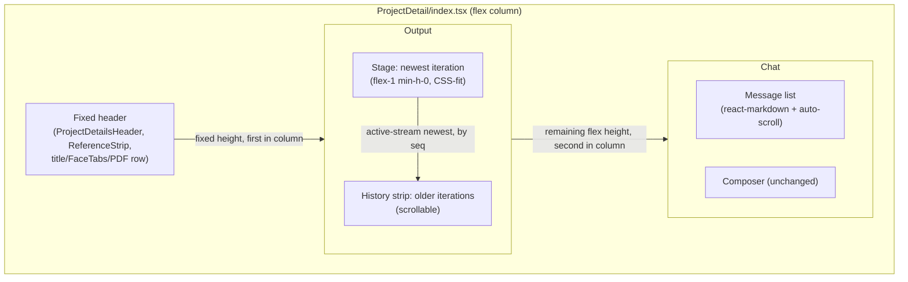
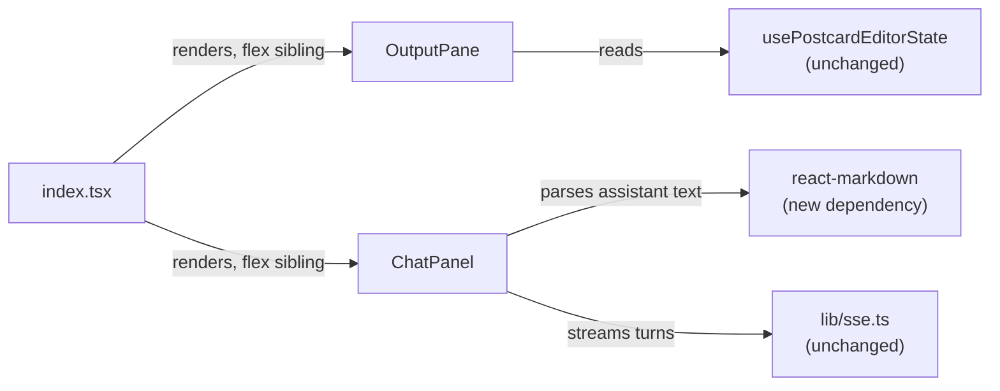

<!-- CLASI: Before changing code or making plans, review the SE process in CLAUDE.md -->

# Sprint 008: Output Fit and Chat Ergonomics

## Goals

Fix two stakeholder-reported ergonomics problems on the project detail
page (`/projects/:id`):

1. Generated iterations (posters) render larger than the space actually
   available between the fixed header and the floating chat panel, so
   the newest iteration is not fully visible without scrolling.
2. The chat box renders agent Markdown as raw text instead of formatted
   HTML, and does not auto-scroll to the newest message (user or agent)
   when one is appended — re-reported by the stakeholder on 2026-07-18
   ("after you get a response, scroll to the bottom").

## Problem

**Viewport fit** (`clasi/issues/iterations-fit-viewport.md`): `OutputPane.tsx`
caps every iteration image at a fixed `800x800` px (`max-h-[800px]
max-w-[800px]`, `IterationImage`). On common laptop screens this is
frequently taller than the actual space between the fixed top region
(`ProjectDetailsHeader` + `ReferenceStrip` + title/tabs/PDF row) and the
floating chat panel, so the newest iteration requires scrolling to see
in full — the stakeholder's literal complaint.

Compounding this: the chat panel is not a real layout participant. In
`ProjectDetail/index.tsx`, `OutputPane` is `flex-1 min-h-0` (correctly
filling the space below the fixed header) but the chat panel is
`position: absolute; bottom: 0` at a hardcoded `CHAT_PANEL_HEIGHT_PX =
288`, floating **over** the bottom of that flex area rather than
alongside it. `OutputPane` compensates by adding
`paddingBottom: scrollPaddingBottomPx` (the same 288 constant) inside its
own scrollable content so real content doesn't render underneath the
overlay. This means "the space between the header and the chat box" is
currently a padding convention duplicated across two files, not a real
CSS quantity — fragile if either the header's actual rendered height or
the chat panel's height ever change, and not something a new "fit the
image to this space" rule can key off cleanly.

**Chat rendering/scroll** (`clasi/issues/chat-box-markdown-rendering-and-scroll.md`):
`ChatPanel.tsx` renders every bubble's `message.text` as a plain string
(`{message.text}`) — no Markdown parsing, so headings/lists/bold/code
blocks the agent produces show up as literal `#`/`*`/backtick characters.
Separately, the messages container (`data-testid="chat-messages"`, `flex-1
overflow-y-auto`) never adjusts scroll position — `appendBubble` and the
`message`/`error` `TurnEvent` handlers push new bubbles into state but
nothing scrolls the container, so a reply that arrives while the user is
scrolled up (or once the history grows past one screen) is invisible
until the user manually scrolls down. No Markdown-rendering or
sanitization dependency exists in `client/package.json` today.

## Solution

1. Make the chat panel a real flex sibling of `OutputPane` (not an
   absolute overlay), so the vertical space "between the header and the
   chat box" becomes an actual CSS quantity (`OutputPane`'s flex-computed
   content-box height) rather than a hand-maintained padding constant.
2. Split `OutputPane` into a non-scrolling "stage" that fits the single
   newest iteration of the active stream to that available space via
   pure CSS (flex + `object-fit: contain`, no JS measurement, responsive
   to resize because flexbox recomputes on every layout pass) plus a
   separate scrollable "history" strip for older iterations in that
   stream — so older iterations remain reachable without constraining
   the newest one's size to whatever the tallest history item needs.
3. Render assistant chat bubbles through `react-markdown` (a small,
   actively maintained library that parses Markdown into React elements
   rather than raw HTML — no `dangerouslySetInnerHTML`, so there is no
   new XSS surface from agent-authored text) instead of literal text.
4. Auto-scroll the messages container to the newest message whenever
   `messages` grows (user or assistant), via a ref + effect keyed on
   message count — no library needed.

## Success Criteria

- A newly generated iteration renders fully within the vertical space
  between the fixed header and the chat panel with no scrolling, at
  typical desktop window sizes, and re-fits correctly when the window is
  resized.
- Agent Markdown (headings, lists, bold, code blocks) renders as
  formatted HTML in the chat box.
- The chat view auto-scrolls to the newest message whenever one is
  appended, whether from the user or the agent.

## Scope

### In Scope

- `ProjectDetail/index.tsx`: convert the chat panel from an absolute
  overlay to a true flex column sibling of `OutputPane`.
- `ProjectDetail/OutputPane.tsx`: split into a "stage" (newest iteration
  of the active stream, CSS-fit to available space) and a "history"
  strip (older iterations of the active stream, scrollable).
- `ProjectDetail/ChatPanel.tsx`: Markdown rendering for assistant bubbles;
  auto-scroll on message append.
- `client/package.json`: add a Markdown-rendering dependency.

### Out of Scope

- Any change to the inline postcard editor (`PostcardFaceEditor.tsx`,
  `PostcardOverlay.tsx`) or its accepted-iteration editing behavior —
  the accepted iteration's editor still renders wherever it currently
  does; only the read-only image sizing changes.
- Markdown rendering for user-authored messages (the issue only calls
  out agent responses; user input is plain text by construction).
- Any change to the SSE wire protocol, `turn.ts`, or server-side chat
  persistence.
- Mobile/narrow-viewport layout (typical desktop window sizes only, per
  the issue's acceptance criteria).

## Test Strategy

Component/unit tests (Vitest + Testing Library, matching this codebase's
existing pattern):

- `OutputPane`: the stage region renders the single newest iteration of
  the active stream (by `seq`); the history strip renders the rest;
  switching `activeTab` re-filters both regions the same way the
  existing single-stream filter does today.
- `ChatPanel`: a message containing Markdown syntax (e.g. `**bold**`,
  a fenced code block) renders as the corresponding HTML elements, not
  literal Markdown characters; appending a bubble (simulate a `message`
  `TurnEvent` and a user send) triggers a scroll-to-bottom call on the
  messages container (jsdom doesn't lay out real pixel heights, so this
  asserts the scroll call/ref behavior, not actual pixel scroll position).
- No new integration/system-level testing needed — both changes are
  confined to client-side rendering/layout of already-fetched data.

## Architecture

**Substantial** — this sprint changes the layout relationship between
two existing components (`OutputPane` and `ChatPanel` go from
overlay-and-padding-constant to real flex siblings), splits `OutputPane`
into two new sub-regions with a new responsibility boundary (stage vs.
history), and adds a new external rendering dependency (`react-markdown`)
to the client. No data model or server-side change; no new
routes/entities.

### Architecture Overview

**Step 1 — Understand the problem**: covered above in Problem/Solution.
The two issues share one root cause worth naming: the current layout
expresses "the space above the chat" as a *hardcoded padding constant*
(`CHAT_PANEL_HEIGHT_PX`) duplicated in two files, rather than as a real
CSS quantity a sibling element can be sized against. Fixing the viewport
issue properly means fixing that first.

**Step 2 — Responsibilities** (new or changed this sprint):
- Reserving the fixed-header / chat-panel gap as an actual flex quantity
  (was: overlay + duplicated padding constant).
- Rendering the *current* iteration of the active stream fit-to-space
  (new — did not exist before; previously every iteration, current or
  not, used the same fixed 800px cap).
- Browsing older iterations of the active stream (existing behavior,
  relocated into its own sub-region rather than sharing one undifferentiated
  scroll list with the current iteration).
- Parsing and rendering Markdown in assistant chat bubbles (new).
- Keeping the chat viewport pinned to the newest message (new).

These group into three independently-changing concerns: **page layout**
(index.tsx), **iteration display** (OutputPane split), and **chat
rendering/scroll** (ChatPanel) — matching the module boundaries below.

**Step 3 — Modules**:

- **`ProjectDetail/index.tsx` (page shell)** — Purpose: arrange the
  page's fixed header, flexible output region, and chat panel as a single
  CSS flex column. Boundary: owns the three-region layout and the
  `activeTab`/project-fetch state it already owns; does not know how
  `OutputPane` renders iterations or how `ChatPanel` renders messages.
  Serves: SUC-016 (below), and the pre-existing page-shell use cases
  unchanged.
- **`OutputPane` (iteration display)** — Purpose: display the active
  stream's iterations. Boundary: now internally split into a **stage**
  (the single newest iteration, sized to fill whatever height its flex
  parent gives it) and a **history strip** (older iterations of the same
  stream, independently scrollable) — both still live in this one
  component/file, this is an internal restructuring, not a new file
  boundary, since both sub-regions share the same `postcardEditor`
  overlay state and accepted-iteration editor logic. Serves: SUC-016,
  and all pre-existing OutputPane use cases (accept/delete/inline edit)
  unchanged.
- **`ChatPanel` (chat rendering/scroll)** — Purpose: render the
  conversation and keep it scrolled to the newest turn. Boundary:
  gains a Markdown-rendering step for assistant bubble text and a
  scroll-to-bottom effect; does not change its SSE/turn-event handling,
  which is unaffected. Serves: SUC-017.

Fan-out unchanged: `index.tsx` still depends on exactly `OutputPane` +
`ChatPanel` + the other existing children; no new cross-module edges.

**Step 4 — Diagrams**:

No entity-relationship diagram: no data model changes this sprint (no
new/changed database entities or DTO shapes — `IterationDTO` and
`ChatMessageDTO` are read, not altered).

**Step 5 — What changed / why / impact**:

- *What changed*: chat panel goes from `position: absolute` overlay to a
  normal flex-column child (`flex-shrink-0` at its existing fixed
  height); `scrollPaddingBottomPx`/`CHAT_PANEL_HEIGHT_PX` padding
  workaround is removed from `OutputPane` since the overlay it was
  compensating for no longer exists; `OutputPane` gains an internal
  stage/history split; `ChatPanel` gains Markdown rendering and
  auto-scroll.
- *Why*: the padding-constant workaround is fragile and was actively
  blocking the viewport-fit fix (see Overview); the stage/history split
  is the direct mechanism for "fit the *newest* iteration to available
  space without cropping older ones out of an equally-constrained
  space"; Markdown/auto-scroll are directly requested by the linked
  issues.
- *Impact on existing components*: `PostcardFaceEditor`,
  `PostcardOverlay`, `usePostcardEditorState`, `FaceTabs`, `ReferenceStrip`,
  `LibraryDrawer` are all unaffected — none of them read
  `CHAT_PANEL_HEIGHT_PX` or `scrollPaddingBottomPx`, and the accepted-
  iteration editor (`PostcardFaceEditor`) continues to render wherever
  the accepted row currently lands (stage if it's the newest, history
  strip otherwise) with no change to its own props or behavior. Existing
  `OutputPane` tests that assume one undifferentiated scroll list will
  need updating to the stage/history split (ticket-level concern, not an
  architectural one).
- *Migration concerns*: none — no data migration, no API contract
  change, no backward-compatibility concern. Purely client-side
  rendering/layout. Deployment is a normal client rebuild.

### Design Rationale

**Decision: chat panel becomes a flex sibling instead of an absolute
overlay.**
- *Context*: the viewport-fit issue needs a real CSS quantity for "space
  between header and chat"; today that space is a duplicated pixel
  constant, not a layout fact.
- *Alternatives considered*: (a) keep the overlay, but read the chat
  panel's actual rendered height via `ResizeObserver`/`getBoundingClientRect`
  and thread that pixel value into `OutputPane` as a prop — works, but is
  exactly the JS-measurement approach the sprint brief asks to avoid
  where CSS suffices, and re-introduces a "keep two constants in sync"
  failure mode the moment the chat panel's height ever changes; (b) make
  it a flex sibling — the browser computes the remaining space for free,
  every time it lays out or re-lays-out on resize, with zero JS and zero
  constants to keep in sync.
- *Why this choice*: (b) is strictly simpler and eliminates a class of
  bugs (the two constants drifting) that exists today.
- *Consequences*: the chat panel's height reverts to being "whatever
  `ChatPanel`'s fixed height is," which is unchanged from today's actual
  value (288px) — visually identical, just expressed correctly in CSS
  instead of duplicated as a padding hack. If a future sprint wants a
  resizable or collapsible chat panel, that panel's height becomes a
  single flex-basis value in one place instead of two synchronized
  constants.

**Decision: split `OutputPane` into stage + history rather than capping
every card at a viewport-derived max-height.**
- *Context*: the issue's acceptance criteria are specifically about "the
  newest iteration" being fully visible without scrolling; it says
  nothing about the same guarantee holding for iterations further back in
  the stream.
- *Alternatives considered*: (a) give every card in the existing single
  scroll list a `max-height` tied to the container's height (e.g. via a
  CSS custom property or `vh`-based calc) — but a plain vertical stack of
  same-sized flex items in a scrolling column doesn't get "one card fills
  the container" for free; every card would need the same height rule,
  which either wastes space once there are several cards on screen at
  once (each shrunk to fit) or requires JS to detect "which card is
  scrolled to the top" to apply the rule selectively — reintroducing the
  JS-measurement complexity the brief wants avoided; (b) pin the single
  newest iteration in its own non-scrolling flex-1 region sized purely by
  its flex parent, with older iterations in a separate, independently
  scrollable region below — the newest fits by construction (its ``
  has `max-h-full max-w-full object-contain` inside a `flex-1 min-h-0`
  stage, sized by CSS layout alone), and older iterations keep their
  existing scrolling behavior, now scoped to their own strip instead of
  competing with the newest for the same fixed-cap treatment.
- *Why this choice*: (b) satisfies the literal acceptance criteria (only
  the newest needs the guarantee) with pure CSS, and does not change how
  older iterations behave (still scrollable, still previewed with the
  same overlay/read-only image treatment).
- *Consequences*: `OutputPane`'s internal structure gains one more
  sub-boundary; existing tests keyed on "the stream is one scrollable
  list" need updating (ticket-level). The accepted-iteration inline
  editor (`PostcardFaceEditor`) is unaffected by which sub-region it
  renders in — its props/behavior don't change.

**Decision: `react-markdown` for Markdown rendering, not
`dangerouslySetInnerHTML` + a Markdown-to-string library.**
- *Context*: agent responses are Markdown text that must render as
  formatted HTML; the source text is model-generated and not
  fully trusted content, so how it gets to the DOM matters.
- *Alternatives considered*: (a) a Markdown-to-HTML-string library (e.g.
  `marked`) piped into `dangerouslySetInnerHTML` — requires a separate
  sanitizer (e.g. `dompurify`) to be safe, two dependencies instead of
  one, and a `dangerouslySetInnerHTML` call to audit; (b) `react-markdown`
  — parses Markdown directly into React elements, never touches
  `innerHTML`, and by default does not render raw HTML embedded in the
  Markdown source (that requires explicitly opting in via a rehype
  plugin, which this sprint does not add) — so agent text like
  `<script>` inside a response renders as literal text, not markup.
- *Why this choice*: (b) is one small, actively maintained dependency
  with no sanitizer needed and no `dangerouslySetInnerHTML` surface to
  review, which is the safer default for model-generated content.
- *Consequences*: adds one new client dependency
  (`react-markdown`, plus its `unified`/`remark` transitive tree). If a
  future sprint wants tables/strikethrough (GFM) beyond `react-markdown`'s
  commonmark default, that's an additive `remark-gfm` plugin at that
  time — not needed for this sprint's plain headings/lists/bold/code
  acceptance criteria.

### Migration Concerns

None — no data migration, no API/DTO contract change, no backward-
compatibility concern. Client-only rendering/layout change plus one new
client dependency; a normal client rebuild picks it up.

### Open Questions

- Should the history strip show older iterations as full-size images
  (current behavior, just relocated) or shrink to thumbnails? This
  sprint keeps them full-size/scrollable (matching current behavior) —
  flagged in case the stakeholder wants thumbnails in a later sprint.
- Exact desktop breakpoint(s) to validate "typical desktop window sizes"
  against — left to ticket-level QA judgment (e.g. 1366×768 and
  1920×1080) rather than a hard-coded breakpoint in the architecture,
  since the CSS-flex approach is breakpoint-agnostic by construction.

## Use Cases

### SUC-016: View the newest iteration fit to the available screen space
Parent: UC (iteration review / postcard generation flow)

- **Actor**: Stakeholder/user reviewing generated iterations
- **Preconditions**: A project is open with at least one iteration in
  the active stream (front or back).
- **Main Flow**:
  1. User generates a new iteration (or switches `activeTab`, or simply
     has the page open).
  2. The newest iteration of the active stream renders in a
     non-scrolling "stage" region sized to exactly fill the space between
     the fixed header and the chat panel.
  3. The image scales down to fit that space, preserving aspect ratio
     (no cropping, no distortion).
  4. User resizes the browser window; the stage region and the image
     within it re-fit automatically.
- **Postconditions**: The newest iteration is entirely visible with no
  scrolling required, at the current window size.
- **Acceptance Criteria**:
  - [ ] A newly generated iteration is entirely visible between the
        header and the chat box with no scrolling, at typical desktop
        window sizes.
  - [ ] Aspect ratio is preserved; the image scales down to fit, never
        cropped or distorted.
  - [ ] Resizing the browser window re-fits the displayed iteration
        without requiring a page reload.
  - [ ] Older iterations of the same stream remain reachable via the
        history strip (existing scroll/accept/delete behavior unchanged).

### SUC-017: Read agent responses formatted, always scrolled into view
Parent: UC (conversational chat flow)

- **Actor**: Stakeholder/user chatting with the agent
- **Preconditions**: A project's chat panel is open.
- **Main Flow**:
  1. User sends a message, or the agent's response arrives via the SSE
     stream.
  2. The new bubble (user or assistant) is appended to the message list.
  3. If the appended bubble is from the assistant and contains Markdown
     (headings, lists, bold text, code blocks), it renders as formatted
     HTML rather than literal Markdown characters.
  4. The chat view scrolls so the newly appended message is visible,
     without the user needing to scroll manually.
- **Postconditions**: The newest message is visible and, if from the
  agent, legibly formatted.
- **Acceptance Criteria**:
  - [ ] Agent responses containing Markdown (headings, lists, bold,
        code blocks) render as formatted HTML in the chat box.
  - [ ] When a new message (user or agent) is appended, the chat view
        scrolls so the new message is visible.
  - [ ] Non-Markdown plain-text agent responses continue to render
        correctly (no literal formatting artifacts introduced).

## GitHub Issues

(GitHub issues linked to this sprint's tickets. Format: `owner/repo#N`.)

## Definition of Ready

Before tickets can be created, all of the following must be true:

- [ ] Sprint planning document is complete (sprint.md, including its
      Architecture and Use Cases sections)
- [ ] Architecture review passed (or skipped, for changes with no
      architectural impact)
- [ ] Stakeholder has approved the sprint plan

## Tickets

| # | Title | Depends On | Use Cases | Completes Issue |
|---|-------|------------|-----------|-----------------|
| 001 | Flex-layout the chat panel and split OutputPane into a fit-to-space stage + scrollable history | — | SUC-016 | iterations-fit-viewport.md |
| 002 | Render assistant chat bubbles as Markdown (react-markdown) | — | SUC-017 | chat-box-markdown-rendering-and-scroll.md (Markdown criterion) |
| 003 | Auto-scroll the chat view to the newest message on append | 002 | SUC-017 | chat-box-markdown-rendering-and-scroll.md (scroll criterion) |

Tickets execute serially in the order listed. 001 is independent of 002/003
(different concern, different sub-region of the page) and could run in
either order relative to them; 003 is sequenced after 002 because both
touch `ChatPanel.tsx`'s render/effect structure and sequencing avoids
rebasing one change on top of the other mid-flight. Both source issues
have been moved to `clasi/sprints/008-output-fit-and-chat-ergonomics/issues/`
(in-progress) by `create_ticket`; each will be archived to that
directory's `done/` subfolder automatically once every ticket
referencing it reaches `done`.
