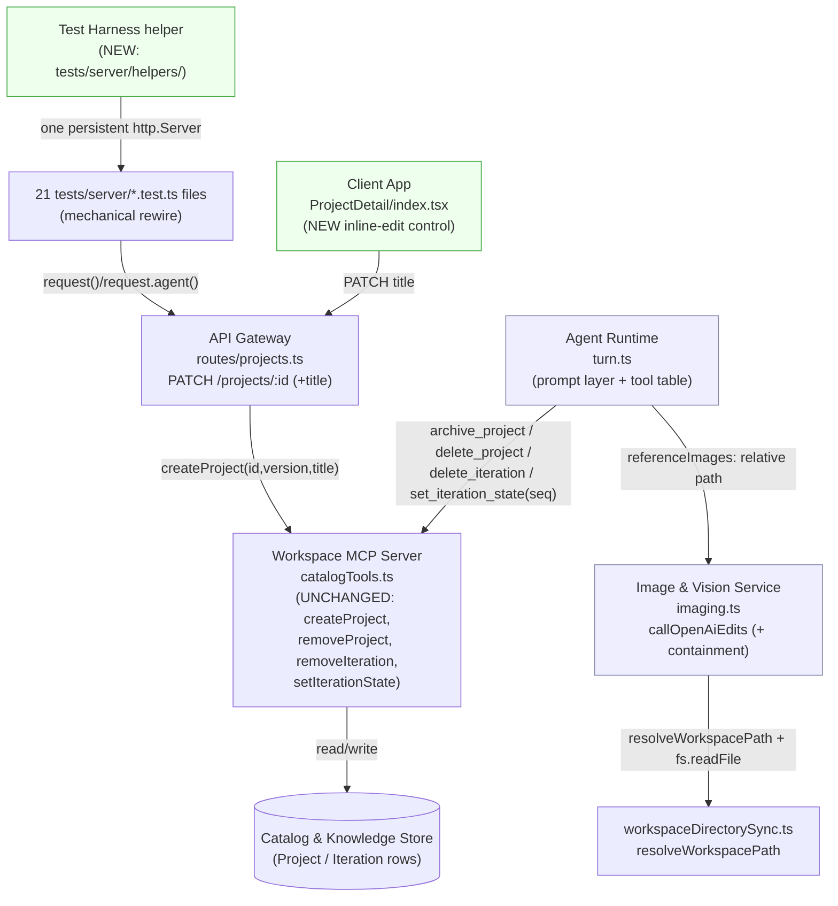
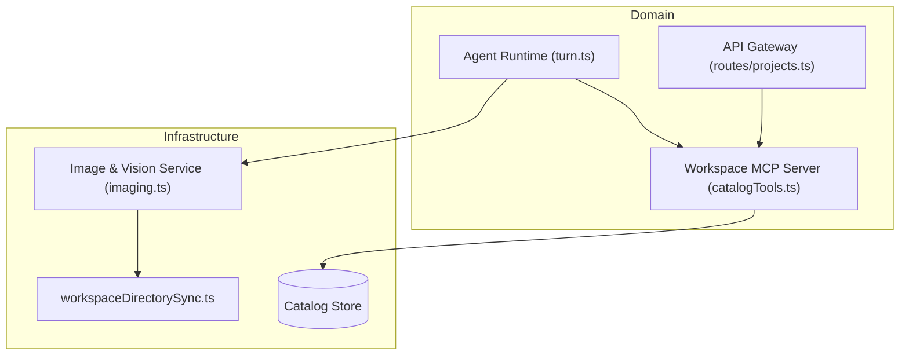

<!-- CLASI: Before changing code or making plans, review the SE process in CLAUDE.md -->

# Sprint 013: Project & Iteration Management and Reliability

## Goals

Bundle five pending, independently-scoped issues that together round out
project/iteration lifecycle management and close reliability gaps
discovered during recent sprint closes:

1. Kill the residual test-suite flake that has repeatedly complicated
   sprint closes (structural fix, not another hardening patch).
2. Stop `Iteration.modelParams` from persisting/serializing an absolute
   host filesystem path; move the containment check to the actual file
   read.
3. Let a user rename a project by clicking its title in the iteration
   view, without going through chat.
4. Stop the agent from parroting a stale "I can't do that" refusal from
   conversation history instead of actually calling a tool that works.
5. Give the agent real, safely-guarded tools to manage a project's and
   an iteration's lifecycle (rename, archive, delete a project; delete
   or move an iteration between streams) through chat.

## Problem

Each issue is independently motivated (full detail in the linked issue
files); in combination they form one coherent theme: the project/
iteration data model is maturing past "create and iterate" into "also
manage, correct, and clean up" -- and the tooling that verifies all of
this (the test suite) needs to stop being the thing that blocks closing
sprints.

- **Reliability**: sprint 002's ticket 002 investigation found the
  suite's ~9% flake rate is structural (ephemeral `http.Server` churn
  per supertest call, not a data/session bug); hardening already landed
  but didn't eliminate it.
- **Information disclosure / data hygiene**: sprint 010's image-edit
  source passthrough resolves an edit's source image to an absolute
  host path in `turn.ts` and that absolute path rides, unmodified, all
  the way into the persisted `Iteration.modelParams` JSON column --
  which `GET /api/projects`/`GET /api/projects/:id` then serialize to
  every authenticated browser on the project.
- **Missing UI affordance**: renaming a project today requires asking
  the agent in chat; there is no direct click-to-edit path, and (see
  next point) the chat path is currently unreliable for exactly this
  action.
- **Agent trust**: a live incident (project 14, 2026-07-20) shows the
  model refusing to rename a project by re-asserting a stale,
  pre-sprint-007 "I need the owner user ID" refusal already sitting in
  chat history, without ever attempting the (working) tool. Diagnosis
  confirms this is poisoned-history parroting, not a tool defect.
- **Incomplete agent capability**: the agent can create, iterate, and
  (per sprint 007) rename a project, but has no tool for archiving or
  deleting a project, deleting an iteration, or explicit stream-move --
  despite most of the underlying persistence logic already existing.

## Solution

1. Replace supertest's per-call ephemeral `http.Server` with one
   persistent server per test file, mechanically applied across all 21
   affected files in `tests/server/`.
2. Keep `Iteration.modelParams.referenceImages` workspace-relative
   end-to-end; resolve to an absolute path (with a containment check)
   only at `imaging.ts`'s `callOpenAiEdits`, immediately before
   `fs.readFile`.
3. Add an inline, click-to-edit control for the project title in
   `ProjectDetail` (the real render site is `index.tsx`'s header row,
   not `ProjectDetailsHeader.tsx` -- see Architecture § Codebase
   Alignment), backed by a small, additive extension to the existing
   `PATCH /api/projects/:id` route.
4. Add a system-prompt directive instructing the model to act on
   current tool capability and never re-assert a past refusal/
   limitation from the transcript without actually attempting the
   tool call and reporting the real result; add a regression test with
   a poisoned-history fixture.
5. Audit and extend the chat agent's tool surface (`turn.ts`'s
   `DEFAULT_TOOL_HANDLERS`/`WORKSPACE_TOOL_DEFINITIONS`) with
   `archive_project`, `delete_project`, and `delete_iteration`; migrate
   `set_iteration_state`'s agent-facing addressing from a raw
   `Iteration.id` (which the model has no legitimate way to know) to
   the UI-facing `seq` number, matching `generate_image`'s
   `editSourceIteration` precedent; require an explicit `confirm: true`
   argument on the two hard-delete tools.

## Success Criteria

- The full server test suite passes with zero flakes across 20
  consecutive runs (locally and/or in CI), with no change to test
  assertions' meaning.
- No `GET /api/projects*` response, and no freshly-written
  `Iteration.modelParams` row, contains an absolute filesystem path.
- A user can click a project's title in the iteration view, edit it,
  and have the change persist and render without a full reload;
  Escape/blur-cancel leaves it unchanged.
- Given a conversation history containing an earlier "can't rename
  without the owner ID" assistant message, a new rename request
  produces a real, populated `create_project` tool call, not a
  repeated refusal.
- The agent can, through chat, rename, archive, and delete the current
  project, delete an iteration by its UI seq number, and move an
  iteration between the front/back streams -- every destructive action
  requires the model to have been given explicit user intent, and the
  two hard-delete tools additionally require an explicit `confirm: true`
  argument.

## Scope

### In Scope

- `tests/server/helpers/` (new persistent-server test helper) and the
  21 `tests/server/*.test.ts` files that call `request(app)` /
  `request.agent(app)`.
- `server/src/agent/turn.ts`: `dispatchToolCall`, `DEFAULT_TOOL_HANDLERS`,
  `WORKSPACE_TOOL_DEFINITIONS`, `SYSTEM_PROMPT_BASE`.
- `server/src/services/imaging.ts`: `callOpenAiEdits`'s reference-image
  read path.
- `client/src/pages/ProjectDetail/index.tsx` (project title render site)
  and a new small inline-edit component.
- `server/src/routes/projects.ts`: `PATCH /projects/:id` (extended to
  accept `title`).
- `client/src/pages/ProjectDetail/types.ts`: `ProjectDetailDTO` gains
  `version`.

### Out of Scope

- Any change to `catalogTools.ts`'s persistence functions themselves
  (`removeProject`, `removeIteration`, `setIterationState`,
  `createProject`) -- all already exist, are already tested at that
  layer, and are reused unmodified. This sprint only changes what
  calls them and with what arguments.
- Any change to `registerCatalogTools`'s external MCP tool surface
  (`remove_project`/`remove_iteration` are already registered there for
  MCP clients with legitimate raw-ID access) -- this sprint's new/
  changed tool wiring is scoped entirely to `turn.ts`'s separate,
  in-process chat-agent dispatch table.
- A stateful, multi-turn "pending confirmation" flow -- `runTurn` is
  stateless (D8); this sprint uses a prompt-level behavioral guard plus
  a required `confirm: true` argument on hard-delete tools instead (see
  Design Rationale R4).
- Per-owner authorization filtering on any tool (the app's existing
  shared-trust model -- `requireAuth` only, no per-user isolation below
  USER/ADMIN -- is retained unchanged; see Design Rationale R5).
- Any Prisma schema/migration change -- none of this sprint's five
  issues require one.

## Test Strategy

- **Ticket 001** is a pure test-infrastructure change verified by its
  own success criterion (repeated full-suite runs, zero flakes) rather
  than new unit tests of product code.
- **Ticket 002**: unit tests in `agent-turn.test.ts` (two existing
  assertions at lines 1205/1261 updated from an absolute
  `resolveWorkspacePath(...)` expectation to the relative
  `Iteration.imagePath` value) and `imaging.test.ts` (the two existing
  reference-image fixtures relocated under a test-scoped `WORKSPACE_DIR`,
  plus a new containment-escape test at the `callOpenAiEdits` level).
- **Ticket 003**: a new client test for the inline-edit component/flow,
  plus a `projects-route.test.ts` addition covering `PATCH /projects/:id`
  with `title`.
- **Ticket 004**: a new `agent-turn.test.ts` regression test seeding a
  poisoned-history fixture (an assistant message asserting a rename
  block, with empty `toolCalls`) and asserting the next turn still
  dispatches a real `create_project` call, plus a system-prompt content
  assertion mirroring the existing internal-ID guardrail test style
  (~line 2121).
- **Ticket 005**: `agent-turn.test.ts` additions covering each new/
  changed tool's dispatch (`archive_project`, `delete_project`,
  `delete_iteration`, `set_iteration_state`'s new `seq` addressing), the
  `confirm: true` gate on the two hard-delete tools, and a system-prompt
  content assertion for the destructive-intent guard. No new
  persistence-layer tests -- `agent-mcp-catalog-tools.test.ts` already
  covers `removeProject`/`removeIteration`/`setIterationState` fully.

## Architecture

**Sizing**: Substantial -- five issues touch five different modules
(test infrastructure, the Image & Vision Service's read sink, the
Client App, the Agent Runtime's prompt layer, and the Agent Runtime's
tool-dispatch surface), one of them (ticket 005) adds new agent-facing
tool capability with a genuine addressing-scheme change
(`iterationId` -> `seq`), and the sprint as a whole changes how the
chat agent is allowed to act on destructive operations. No single
"one changed module" characterization fits; the full methodology and
diagrams apply.

### Problem & Responsibilities

Five distinct responsibilities, each changing for its own reason,
independently of the others:

1. **Test execution reliability** -- changes when the test harness's
   transport mechanics change, never when product behavior changes.
   Owns a new `tests/server/helpers/` module and touches (mechanically)
   21 existing test files. Serves no end-user use case directly; it is
   what makes every other ticket's own tests (and this sprint's final
   close) trustworthy.
2. **Iteration provenance & path containment** -- changes when the rule
   for "what image-edit provenance data is safe to persist/serialize"
   or "where containment is enforced" changes. Owns the reference-image
   handoff between `turn.ts`'s `dispatchToolCall` and `imaging.ts`'s
   `callOpenAiEdits`.
3. **Project identity editing (client-direct)** -- changes when the
   client-facing affordances for editing a project's own metadata
   change, independently of the chat-driven path. Owns a new inline-edit
   control in `ProjectDetail` and one additive field on the existing
   `PATCH /projects/:id` route.
4. **Agent trust & behavior guardrails** -- changes when a new
   prompting failure mode is discovered (parroting, hedging, false
   refusals), independently of which tools exist. Owns additions to
   `SYSTEM_PROMPT_BASE`.
5. **Agent data-control tool surface** -- changes when the set of
   data-mutating operations the chat agent can invoke changes, or when
   how it addresses their targets changes. Owns `turn.ts`'s
   `DEFAULT_TOOL_HANDLERS`/`WORKSPACE_TOOL_DEFINITIONS` entries and the
   small pre-dispatch translation helpers that resolve a UI-facing
   value (a project's own scoped `projectId`, or an iteration's `seq`)
   to the internal shape the underlying `catalogTools.ts` function
   needs.

Modules 4 and 5 both live inside `server/src/agent/turn.ts`, but are
kept conceptually separate (per the cohesion test): 4 changes when a
prompting/trust failure is found in production, regardless of the tool
roster; 5 changes when a new capability is added, regardless of whether
any trust issue exists. They are not merged into one module below.

### Modules

**Test Harness (Reliability)**
- *Purpose*: Give every server test file one persistent HTTP listener
  instead of one ephemeral listener per assertion.
- *Boundary*: new `tests/server/helpers/` server-lifecycle helper; the
  21 test files that currently call `request(app)`/`request.agent(app)`
  (list in Ticket 001). Does not touch `server/src/app.ts`'s route
  logic (only, optionally, its test-mode `Connection: close` shim, at
  the implementing ticket's discretion once the real fix lands).
- *Use cases served*: SUC-024.

**Image & Vision Service -- reference-image containment (existing
module, imaging.ts; boundary extended)**
- *Purpose*: Read a caller-identified reference image's bytes for an
  OpenAI edits call, validating that the path stays inside the
  workspace root.
- *Boundary*: `server/src/services/imaging.ts`'s `callOpenAiEdits`
  gains a `resolveWorkspacePath` call (new import from
  `services/workspaceDirectorySync.ts`, an Infrastructure-to-
  Infrastructure dependency, no cycle) immediately before
  `fs.readFile`. `server/src/agent/turn.ts`'s `dispatchToolCall` keeps
  its existing containment check (for its own early-reject behavior and
  test coverage) but stops storing the *resolved* absolute value into
  `modelParams.referenceImages` -- it stores the original,
  already-workspace-relative `Iteration.imagePath` instead.
- *Use cases served*: SUC-025.

**Project Identity Editing (Client App; new)**
- *Purpose*: Let the currently-open project's title be edited directly
  from the iteration view, without chat.
- *Boundary*: a new small component under `client/src/pages/
  ProjectDetail/` rendering/replacing the `<h1>{project.title}</h1>`
  `index.tsx` already renders (see Codebase Alignment below -- not
  `ProjectDetailsHeader.tsx`, which renders only the `detailsHeader`
  style/output-type/goal/description summary and never the title
  itself); `ProjectDetailDTO` gains `version`; `PATCH /projects/:id`
  gains an optional `title` field alongside its existing `status`
  field, both still delegating to `catalogTools.createProject`'s
  existing version-checked update branch.
- *Use cases served*: SUC-026.

**Agent Trust & Behavior Guardrails (Agent Runtime; existing module,
turn.ts; prompt layer extended)**
- *Purpose*: State the chat agent's fixed behavioral rules for acting
  under an imperfect or adversarial conversation history.
- *Boundary*: `SYSTEM_PROMPT_BASE` in `turn.ts` gains one additional
  guardrail sentence (alongside the existing internal-ID and
  iteration-numbering guardrails it already carries). No new files, no
  new tool.
- *Use cases served*: SUC-027 (and, transitively, unblocks the rename
  half of SUC-028).

**Agent Data-Control Tool Surface (Agent Runtime; existing module,
turn.ts; tool table extended)**
- *Purpose*: Let the chat agent invoke project- and iteration-lifecycle
  operations that already exist as `catalogTools.ts` functions, safely
  and without ever needing a raw database ID.
- *Boundary*: `turn.ts`'s `DEFAULT_TOOL_HANDLERS`/
  `WORKSPACE_TOOL_DEFINITIONS` gain `archive_project`, `delete_project`,
  `delete_iteration`; `set_iteration_state`'s entry is changed from
  `iterationId`-addressed to `seq`-addressed. `dispatchToolCall` gains
  small pre-dispatch translation branches for these four tool names,
  mirroring the existing `injectCreateProjectArgs`/
  `resolveEditSourceIteration` pattern -- never a new `catalogTools.ts`
  function, never a change to that file's external MCP registration
  (`registerCatalogTools`, a separate surface for separate consumers,
  untouched).
- *Use cases served*: SUC-028, SUC-029.

### Diagrams

No ERD -- no Prisma schema or migration change anywhere in this
sprint (verified: `Project`/`Iteration` models are read/written exactly
as already shaped).





No cycles. `Imaging` gains one new outward edge (to `WorkspaceSync`) --
still Infrastructure-to-Infrastructure, so the Presentation -> Domain ->
Infrastructure direction is unchanged and `Imaging` remains a leaf
relative to every Domain-layer node. `Turn`'s fan-out (`CatalogTools`,
`Imaging`) is unchanged at 2. The test-harness module is deliberately
omitted from this dependency graph -- it has no production-code runtime
dependency edge; it only wires how test files reach `app`, which is
already shown as reachable via `ProjectsRoute` above for context.

### What Changed / Why (per issue)

**1. Test harness (`test-harness-persistent-server.md`)**: Replace
`request(app)`/`request.agent(app)` (supertest wrapping the bare Express
app -- an ephemeral `http.Server` bound and torn down per call) with one
`http.Server` created and listened on once per test file, passed to
every `request()`/`request.agent()` call in that file instead of `app`.
Removes the structural churn sprint 002's investigation identified as
the residual flake's root cause. Mechanical across the 21 files that
currently import and pass `app` to supertest.

**2. `Iteration.modelParams` path leak
(`iteration-modelparams-leaks-absolute-path.md`)**: `turn.ts`'s
`dispatchToolCall` (the `generate_image` branch) currently does:

```
modelParams.referenceImages = [resolveWorkspacePath(sourceImagePath)];
```

-- validating containment *and* converting to an absolute path in the
same call, then that absolute value is spread verbatim into
`recordedModelParams` in `realImageVisionClient.ts` and persisted.
Fix: keep calling `resolveWorkspacePath(sourceImagePath)` for its
containment check (preserving the existing "escapes workspace root"
early-reject behavior and its test), but store the original relative
`sourceImagePath` into `modelParams.referenceImages`, discarding the
resolved absolute value rather than keeping it. `imaging.ts`'s
`callOpenAiEdits` -- which does an unguarded `fs.readFile(refPath)`
today, trusting turn.ts to have been the only caller -- gains its own
`resolveWorkspacePath` call at the read site, so containment is
enforced at the sink regardless of caller convention (the issue's
"Secondary" defense-in-depth note).

**3. Inline project title editing
(`edit-project-title-inline.md`)**: `client/src/pages/ProjectDetail/
index.tsx` gains a small click-to-edit control replacing its current
static `<h1>{project.title}</h1>`. `routes/projects.ts`'s `PATCH
/projects/:id` (today `status`-only) gains an optional `title` field,
both routed through the same existing read-current-row-for-version,
then `catalogTools.createProject({ id, version, ...})` pattern the
`status` branch already uses -- no new route, no new tool.

**4. Anti-parroting guardrail
(`agent-falsely-refuses-rename-parrots-history.md`)**: One additional
sentence in `SYSTEM_PROMPT_BASE`, alongside the existing internal-ID
and iteration-numbering guardrails: the model must act on its current
tool capability and never re-assert a past refusal or limitation
already sitting in the transcript without actually attempting the
corresponding tool call this turn and reporting the real result.

**5. Agent data-control tools
(`agent-full-data-control-tools.md`)**: `turn.ts` gains three new
chat-agent tool entries (`archive_project`, `delete_project`,
`delete_iteration`) and changes one existing entry's addressing
(`set_iteration_state`: `iterationId` -> `seq`). See Design Rationale
R2/R3 for exactly how each is shaped and why.

### Codebase Alignment (verified against the actual repo)

- `client/src/pages/ProjectDetail/ProjectDetailsHeader.tsx` (read in
  full) renders only `detailsHeader`'s `style`/`outputType`/`goal`/
  `description` fields -- it never receives or renders `project.title`.
  The actual `<h1>{project.title}</h1>` is in `index.tsx` line 265,
  inside the fixed-top `<header>` row alongside the back-link and
  `FaceTabs`. Ticket 003 targets `index.tsx` (and a new small extracted
  component), not `ProjectDetailsHeader.tsx` -- the issue's stated file
  is corrected here, not silently followed.
- `ProjectDetailDTO` (`client/src/pages/ProjectDetail/types.ts`) does
  not declare a `version` field today, even though `GET /api/projects/
  :id` already returns it (Prisma's default `findUnique` returns every
  scalar column; the include only adds relations). Ticket 003 adds
  `version: number` to the type -- no server change needed for this
  part, only a client type gap.
- `routes/projects.ts`'s `PATCH /projects/:id` (lines ~425-453) accepts
  only `status` today; there is no existing REST path for a client to
  set `title` directly -- confirmed by grep across the route file and
  `ProjectList.tsx`. The issue's framing ("persisting via the existing
  project-update path") describes the *pattern* (version-checked
  `createProject` update), not an already-title-capable route; ticket
  003 extends the pattern to cover `title`.
- `server/src/agent-mcp/catalogTools.ts` already defines and registers
  `removeIteration`/`removeProject` (lines 996-1108, 1358-1374) --
  both are OOP follow-ups (2026-07-15) already used by `routes/
  projects.ts`'s `DELETE /projects/:id/iterations/:iterId` and `DELETE
  /projects/:id`, and already registered on the external MCP server.
  Neither appears in `turn.ts`'s `DEFAULT_TOOL_HANDLERS` or
  `WORKSPACE_TOOL_DEFINITIONS` (lines 147-388) -- the chat agent cannot
  reach either today. This confirms the issue's own audit instruction:
  most of the persistence logic already exists; only chat-agent
  reachability is missing.
- `set_iteration_state`'s existing agent-tool definition (lines
  340-353) requires `iterationId` (a raw `Iteration.id`). No context
  the model ever receives -- `loadProjectContext`'s iteration `select`
  (line 528: `seq`, `role`, `accepted`, `promptUsed`) and every
  `generate_image`/`create_iteration` result shape the model would
  realistically see -- ever exposes a raw `Iteration.id`. This means
  `set_iteration_state` is effectively unreachable by the model in
  practice today despite being wired, not merely inconvenient to use --
  a genuine, verified gap, not a hypothetical. Ticket 005 fixes this by
  changing its agent-facing addressing to `seq` (matching
  `generate_image`'s `editSourceIteration` numeric-seq precedent
  exactly), which directly satisfies issue 5's own acceptance criterion
  ("the agent references iterations by their UI seq number and never
  asks for internal IDs").
- `imaging.test.ts`'s two existing reference-image tests (lines 98-133,
  184-203) write their fixture file under `os.tmpdir()` and pass that
  absolute path straight through as `referenceImages` -- outside any
  workspace root. Adding `resolveWorkspacePath` inside `callOpenAiEdits`
  means these fixtures must move under a test-scoped `WORKSPACE_DIR`
  (the pattern `workspaceDirectorySync.ts`'s own `getWorkspaceRoot` doc
  comment already names as the sanctioned test convention: "so tests
  can point `WORKSPACE_DIR` at a scratch directory per run"), not a
  bare tmp path. Flagged here so ticket 002 budgets for updating both
  tests, not just adding the containment logic.
- `agent-turn.test.ts` lines 1205 and 1261 currently assert
  `calls[0].modelParams.referenceImages` equals
  `[resolveWorkspacePath(iteration.imagePath)]` (the absolute form).
  Ticket 002 updates both to assert the relative `iteration.imagePath`
  value instead -- the fix's core, directly-observable behavior change.
  Line 1511's "Path containment" test is unaffected in spirit but must
  keep passing (it asserts an escaping path is rejected before any
  `imageVisionClient` call is made -- still true under the fixed code,
  since `resolveWorkspacePath` is still called for validation, only its
  absolute return value is no longer what gets stored).
- `agent-turn.test.ts` line 1918 dispatches `set_iteration_state` with
  `{ iterationId: iteration.id, accepted: true }`. Ticket 005 updates
  this to `{ seq: iteration.seq, accepted: true }`, matching the new
  addressing scheme.

### Design Rationale

**R1: Path-containment check lives at both `turn.ts` (early reject,
preserves existing test/behavior) and `imaging.ts`'s `callOpenAiEdits`
(defense-in-depth at the actual read site), while only the *persisted*
value changes.**
- *Context*: the leak is specifically that the *absolute, resolved*
  path was what got stored; the containment check itself was already
  correct, just single-point-of-failure (turn.ts being the only caller
  that validates).
- *Alternatives considered*: (a) move containment entirely out of
  `turn.ts` into `imaging.ts`, removing the `resolveWorkspacePath` call
  from `dispatchToolCall` -- rejected: this would remove `turn.ts`'s
  existing fast, early-reject behavior (and its test, line 1511) for no
  benefit, replacing "reject before ever calling the image-vision
  client" with "reject only once the real HTTP-edits call is already
  underway"; (b) fix only the persistence (store relative) without ever
  adding a check to `imaging.ts` -- rejected: leaves `callOpenAiEdits`
  trusting caller convention forever, exactly the defense-in-depth gap
  the issue's "Secondary" section calls out.
- *Why this choice*: (c), both -- `turn.ts` keeps validating early (so
  a malicious/broken path is rejected as a normal tool-call error before
  any network call), and `imaging.ts` independently validates at its
  own read site (so the guarantee holds even if some future caller of
  `imaging.generateImage` isn't `turn.ts`). Only the *value that gets
  stored* changes, from absolute to relative.
- *Consequences*: `imaging.ts`'s module header claim of "zero outward
  dependencies on any other Flyerbot module" is updated to note the
  one, Infrastructure-to-Infrastructure exception
  (`workspaceDirectorySync.ts`, itself dependency-free) -- a narrower,
  accurate claim, not a broken one. `imaging.test.ts`'s two
  reference-image fixtures move under a test-scoped `WORKSPACE_DIR`
  (Codebase Alignment above).

**R2: Agent-facing iteration targeting is always by `seq`, resolved to
the internal row inside `turn.ts`'s dispatch -- never a raw
`Iteration.id`.**
- *Context*: `set_iteration_state`'s existing agent-tool shape requires
  an id the model has no legitimate way to obtain (Codebase Alignment
  above) -- a real reachability gap, not a style preference.
- *Alternatives considered*: (a) expose `Iteration.id` in PROJECT
  CONTEXT so the model has something to pass -- rejected: reintroduces
  exactly the internal-identifier exposure `summarizeStream`'s own
  docstring and the sprint-007 guardrail were written to prevent; (b)
  leave `set_iteration_state` agent-unreachable and only add the two new
  tools with fresh, correctly-designed schemas -- rejected: issue 5's own
  acceptance criterion explicitly requires "reassigning role" (the
  move-between-streams capability) to work through chat, which requires
  fixing this tool's reachability, not routing around it.
- *Why this choice*: mirrors the already-proven, already-tested
  `resolveEditSourceIteration` numeric-`seq` branch pattern exactly --
  resolve `{ projectId: ctx.projectId, seq }` to the real row inside
  `dispatchToolCall`, throw a clear "no iteration #N found" error
  (surfaced via the existing `isError` tool-result path) when it
  doesn't exist, and pass the resolved `iterationId` into the unchanged
  `catalogTools.setIterationState`/`removeIteration` call.
- *Consequences*: `set_iteration_state`'s agent-tool definition's input
  schema changes (`iterationId` -> `seq`); its REST-facing shape
  (`PATCH /projects/:id/iterations/:iterId`, keyed by the real DB id
  the client already has from `IterationDTO`) is untouched -- no
  reachability gap exists on that path, so no reason to change it
  (Open Questions #4). `agent-turn.test.ts` line 1918 is updated
  (Codebase Alignment above).

**R3: `archive_project`/`delete_project` take no project-identifying
argument at all (always `ctx.projectId`); the two hard-delete tools
require an explicit `confirm: true` argument; `archive_project` is a
thin `turn.ts`-level alias over the existing `create_project` update
path, not a new `catalogTools.ts` function.**
- *Context*: a chat turn is always scoped to exactly one project
  (`RunTurnInput.projectId`) -- there is no legitimate scenario where
  the model would ever need to name a *different* project's id for a
  "manage the project I'm in" action, and no stateful mechanism exists
  (`runTurn` is stateless, D8) for a separate "are you sure?" round
  trip.
- *Alternatives considered*: (a) give `delete_project`/`archive_project`
  a `projectId` argument like `create_project` has, relying only on the
  system prompt to tell the model to use `ctx.projectId` -- rejected:
  weaker than structurally removing the argument, since there would be
  nothing stopping a args-shape that names a different project; (b) a
  stateful two-turn "confirm this?" conversational flow -- rejected,
  out of scope (Scope, "Out of Scope"): bigger than this sprint's ask,
  and D8 makes it a much larger change than a same-turn argument gate;
  (c) a brand-new `catalogTools.archiveProject` function duplicating
  `createProject`'s version-checked update branch for zero new
  behavior -- rejected as needless duplication.
- *Why this choice*: `delete_project`/`delete_iteration`'s required
  `confirm: true` argument is a concrete, server-enforced speed bump
  (dispatch throws, surfaced as a normal `isError` tool result, when
  omitted or falsy) layered under the system-prompt instruction that
  the model may only set it after the user has explicitly asked, in
  this conversation, to delete that specific target -- belt-and-
  suspenders, not reliance on model behavior alone. `archive_project`
  is reversible (a `Project.status` flag, trivially undone by calling
  it again) and the existing REST UI itself has no confirmation dialog
  for archiving (only for delete, per `routes/projects.ts`'s own
  comments) -- so no `confirm` argument is added there, matching that
  established proportionality. `archive_project` reuses
  `injectCreateProjectArgs` (already fetches `version`/`ownerUserId`
  from the existing row given an `id`) by constructing `{ id:
  ctx.projectId, status }` internally before calling it -- zero new
  persistence code.
- *Consequences*: the chat-agent tool names (`archive_project`,
  `delete_project`, `delete_iteration`) are intentionally distinct from
  the MCP-registered names for the same underlying operations
  (`create_project` with `status`, `remove_project`, `remove_iteration`)
  -- two different consumers (a conversational end user via the chat
  agent; a direct MCP client with legitimate raw-ID access) with two
  different addressing/trust conventions over the same
  `catalogTools.ts` functions. This is a deliberate surface split, not
  duplication to reconcile.

**R4: Destructive-intent confirmation is a prompt-level behavioral
guard plus a required tool argument, not a stateful confirmation
round-trip.**
- *Context*: `runTurn` reconstructs all context fresh from the DB every
  call (D8) -- there is no in-memory "awaiting confirmation" slot to
  set and check on a follow-up turn without a real schema/persistence
  addition.
- *Alternatives considered*: (a) a `PendingConfirmation` table/column
  -- rejected, out of scope, more machinery than this sprint's five
  issues ask for; (b) require the *client UI* to intercept and confirm
  destructive tool calls before they reach the server -- rejected, chat
  tool dispatch happens server-side mid-turn with no synchronous
  round-trip back to the browser possible at that point.
- *Why this choice*: matches this codebase's existing, already-proven
  guardrail pattern (the internal-ID guardrail, the iteration-numbering
  trust statement) -- a system-prompt instruction, tested via content
  assertion -- combined with the `confirm: true` structural gate from
  R3 for the two irreversible operations.
- *Consequences*: this is a behavioral guard, not a proof of user
  consent -- a sufficiently adversarial or confused model could still
  set `confirm: true` speculatively. Accepted for this sprint's scope
  (Open Questions #3); the REST UI's own client-side confirm popups
  remain the stronger guarantee for the non-chat path, unchanged.

**R5: The app's existing shared-trust authorization model (`requireAuth`
only, no per-owner filtering) is retained unchanged for every new/
exposed agent tool.**
- *Context*: issue 5 asks that destructive actions be "scoped to the
  caller's own projects." `architecture-001`'s stated model (restated in
  `routes/projects.ts`'s own header) is shared-trust: any authenticated
  League staff member can already act on any project via the existing
  REST routes (including the existing `DELETE /projects/:id`) -- there
  is no per-owner filter anywhere in the app today.
- *Alternatives considered*: (a) add an `ownerUserId` check to the new
  agent tools' dispatch only -- rejected: would make the chat path
  *stricter* than the REST UI path for the identical underlying
  operation, inconsistent, and would not close any actual access-control
  gap (a user blocked in chat could just use the existing delete
  button); (b) add per-owner filtering app-wide -- rejected, a much
  larger change than this sprint's five issues, and not requested by
  any of them individually.
- *Why this choice*: consistency with the existing, deliberate,
  already-documented trust model. The real scoping mechanism for the
  new agent tools is *contextual*, not authorization-based: a chat turn
  only ever has one `projectId` in scope, and `delete_project`/
  `archive_project` take no project argument at all (R3) -- there is no
  mechanism for the model to even name a different project.
- *Consequences*: whether the app should eventually adopt real per-user
  isolation is a genuinely open, larger question, flagged in Open
  Questions #1, not decided here.

**R6: One persistent, explicitly-created `http.Server` per test file,
passed to every `request()`/`request.agent()` call in that file, in
place of the bare Express `app`.**
- *Context*: sprint 002's investigation already identified supertest's
  per-call ephemeral server creation as the flake's structural cause;
  this sprint executes that investigation's own recommended follow-up.
- *Alternatives considered*: (a) a shared server across *all* test
  files -- rejected: vitest already runs each file in its own forked
  process (confirmed, `tests/server/setup.ts`'s own comment), so a
  single cross-file server isn't meaningful and would reintroduce
  cross-file state coupling the current per-file-process isolation
  avoids; (b) further hardening of the ephemeral-per-call pattern (e.g.
  connection-pool tuning) -- rejected, already tried (`Connection:
  close` in test mode) and explicitly documented as insufficient
  (`app.ts`'s own comment).
- *Why this choice*: matches the issue's own stated fix directly, and
  is the smallest change that removes the actual root cause (server
  churn) rather than another symptom-level mitigation.
- *Consequences*: mechanical changes across 21 files; the existing
  test-mode `Connection: close` middleware in `app.ts` becomes
  optional cleanup (harmless either way) once the real fix lands --
  left to the ticket's implementation judgment, not a hard requirement.

**R7: `PATCH /projects/:id` gains an optional `title` field rather than
a new route or a new `catalogTools.ts` function.**
- *Context*: no existing client-facing route can set a project's
  title; the agent-facing `create_project` update path already does
  exactly this internally.
- *Alternatives considered*: (a) a new `PATCH /projects/:id/title`
  route -- rejected, needless proliferation for a single-field addition
  to a route that already does version-checked partial updates of this
  same row; (b) a new dedicated `renameProject` catalogTools function
  -- rejected, duplicates `createProject`'s existing update branch for
  zero new behavior.
- *Why this choice*: `PATCH /projects/:id` already reads the current
  row for its version and calls `catalogTools.createProject({ id,
  version, ...})` for `status`; adding `title` to that same body/call
  is a one-field, additive change to an already-proven pattern.
- *Consequences*: `PATCH /projects/:id`'s body validation must accept
  either or both of `title`/`status` present (today it requires exactly
  a valid `status`) -- a small, backward-compatible relaxation.

### Migration Concerns

None -- no Prisma schema or migration change anywhere in this sprint.
No new environment variable. No deployment-sequencing dependency
between tickets beyond the stated execution order (test harness first,
so every other ticket's new tests run on the fixed harness; ticket 005
after ticket 004, so the "data-control tools" ticket can rely on and
reference the anti-parroting fix already being in place for its rename
sub-component rather than re-solving it). The 21-file test-harness
change and the two-line `agent-turn.test.ts` assertion updates (R1/R2)
are test-only edits, not a product migration.

### Open Questions

1. **Whether the app should eventually adopt real per-user/per-owner
   authorization** (R5) beyond the current shared-trust model, given
   that destructive tools now exist for both projects and iterations.
   Not decided here -- consistent with the app's existing, deliberate
   model; a future sprint's call if the stakeholder wants per-user
   isolation.
2. **Exact internal shape of the persistent-server test helper**
   (single shared module-scoped `http.Server` vs. a small per-file
   local variable, and whether/how `app.ts`'s test-mode `Connection:
   close` shim is revisited) -- left to ticket 001's implementation,
   not decided here; the architectural requirement is only "one
   persistent server per file, not one per call."
3. **Whether the prompt-level + `confirm: true` guard (R3/R4) proves
   sufficient in practice**, or whether real usage shows the model
   still fires a destructive tool too eagerly -- if so, a future sprint
   could add a genuine stateful confirmation round-trip. Not built
   speculatively here (Scope, Out of Scope).
4. **Whether `set_iteration_state`'s REST-facing shape** (`PATCH
   /projects/:id/iterations/:iterId`, still `iterId`-keyed) should also
   move to `seq` for consistency with its new agent-facing shape --
   out of scope: the REST route already has the real DB id from
   client-side `IterationDTO` state, so no reachability gap exists
   there, unlike the agent path (R2). Flagged for awareness only.

### Architecture Self-Review

Run per the `architecture-review` skill's five categories.

**Consistency**: "What Changed / Why" (per issue) matches the five
modules in "Modules" and both diagrams exactly -- one new module (Test
Harness), one extended existing module (Image & Vision Service, one new
outward edge to `workspaceDirectorySync.ts`), one new Client App
component + one additive route field (Project Identity Editing), and
two changes to the same existing Agent Runtime module kept
conceptually separate (Trust & Behavior Guardrails; Data-Control Tool
Surface) -- no section asserts a module or dependency not reflected in
the diagrams. R1-R7 each trace to exactly one "What Changed" item, with
no contradiction between a Design Rationale's stated consequence and
the corresponding Codebase Alignment finding (e.g. R1's "only the
persisted value changes" is exactly what the two updated `agent-turn.
test.ts` assertions at lines 1205/1261 confirm). PASS.

**Codebase Alignment**: every claim above was checked against the
actual current files, not assumed from the issue text -- including one
place where the issue's own stated file location was wrong
(`ProjectDetailsHeader.tsx` never renders `project.title`; `index.tsx`
line 265 does) and one place where an issue's framing implied an
already-working path that does not, in fact, exist yet (no REST route
sets `title` today) and one place where a capability the issue treated
as "just needs confirming" turned out to have a real, verified
reachability gap (`set_iteration_state`'s `iterationId` addressing is
unreachable by the model given what PROJECT CONTEXT actually exposes).
Line numbers cited throughout (`turn.ts` 147-388, 841-861, 889-915,
917-988; `catalogTools.ts` 996-1108, 1358-1385; `imaging.ts` 380-414;
`routes/projects.ts` 425-453; `agent-turn.test.ts` 1205, 1261, 1511,
1918, 2121-2138; `imaging.test.ts` 98-133, 184-203) were read directly,
not inferred. No drift found beyond what is explicitly called out
above. PASS.

**Design Quality**:
- *Cohesion*: every module's purpose sentence passes the no-"and"
  test. The Agent Trust & Behavior Guardrails / Agent Data-Control Tool
  Surface split (both inside `turn.ts`) was deliberately kept as two
  modules rather than one, since they change for independent reasons
  (Problem & Responsibilities) -- not an oversight.
- *Coupling*: `imaging.ts` gains exactly one new outward edge
  (`workspaceDirectorySync.ts`, itself dependency-free) -- still a
  leaf relative to every Domain-layer node. `turn.ts`'s fan-out
  (`CatalogTools`, `Imaging`) is unchanged at 2, well under the 4-5
  ceiling. No module's fan-out increases beyond what's shown in the
  dependency graph.
- *Boundaries*: no new `catalogTools.ts` function is added for any of
  the five issues -- every new agent capability is a thin dispatch-
  layer translation over an already-existing, already-tested
  persistence function (R2/R3/R7). The external MCP tool registration
  boundary (`registerCatalogTools`) is explicitly left untouched,
  preserving the existing two-surface split (chat agent vs. MCP
  client) rather than blurring it.
- *Dependency direction*: Presentation (Client App / API Gateway) ->
  Domain (Agent Runtime / Workspace MCP Server) -> Infrastructure
  (Image & Vision Service / workspaceDirectorySync / Catalog Store)
  holds throughout; no new edge points the wrong way.
  PASS.

**Anti-Pattern Detection**:
- *God component*: none -- `turn.ts` gains small, narrowly-scoped
  additions to functions/tables it already owns (tool dispatch, system
  prompt), not a new centralized responsibility.
- *Shotgun surgery*: the test-harness change is mechanical but
  contained to test files only (zero production-code call sites); the
  `modelParams` path fix touches exactly two functions
  (`dispatchToolCall`, `callOpenAiEdits`); the title-edit change touches
  one route handler and one small client component; the two `turn.ts`
  changes (guardrail sentence, tool table) are additive to existing
  constants, not restructuring.
- *Feature envy*: none of the five changes reach into another module's
  internal state -- `imaging.ts`'s new `resolveWorkspacePath` call uses
  that module's own public, already-shared function; `turn.ts`'s new
  tool dispatch calls `catalogTools.ts`'s existing public functions
  exactly as `dispatchToolCall` already does for every other tool.
- *Circular dependencies*: none (both diagrams above are acyclic,
  verified).
- *Leaky abstractions*: R1-R7 are each an explicit, documented decision
  with alternatives considered -- none of this sprint's choices are an
  implicit "we just didn't add X."
- *Speculative generality*: R3 explicitly declines a stateful
  confirmation mechanism and a new persistence function for archive;
  R4 explicitly declines building a two-step conversational confirm
  flow no issue actually asked for. Nothing here serves a hypothetical
  beyond the five issues' stated acceptance criteria.
  PASS -- no anti-pattern found requiring rework.

**Risks**:
- **Mechanical-but-wide test-file change (ticket 001)**: touches 21
  files. Mitigated by being a pure transport-layer swap with no
  assertion-meaning change, verified by repeated full-suite runs before
  the ticket is considered done.
- **Two existing test assertions change meaning, not just format**
  (ticket 002, `agent-turn.test.ts` lines 1205/1261: absolute ->
  relative path). Explicitly identified above, not a silent break to be
  discovered later.
- **Confirm-gate is a behavioral, not cryptographic, guarantee** (R4) --
  named explicitly as an accepted limitation with a stated future
  escalation path (Open Questions #3), not hidden.
- **Shared-trust model is unchanged, not hardened** (R5) -- a
  deliberate, consistent choice, not an oversight; flagged as a
  standing, pre-existing characteristic of the app rather than
  something this sprint introduces or worsens.
- No breaking changes to any currently-used component; no deployment-
  sequencing risk beyond the stated ticket order (Migration Concerns).

### Verdict: **APPROVE**

No structural issues -- no circular dependencies, no god component, no
inconsistency between this section's diagrams and its prose. Every
module traces to at least one use case; every use case is covered by
at least one planned ticket (Tickets, below). The two most significant
judgment calls this sprint makes (R3's zero-argument
`archive_project`/`delete_project` plus `confirm: true` gate, and R2's
`seq`-based re-addressing of `set_iteration_state`) are each backed by
a verified, cited codebase finding, not speculation. Proceeding to
ticketing.

## Use Cases

### SUC-024: Server test suite runs reliably, free of transport-layer flakes
Parent: N/A -- engineering/CI reliability; no stakeholder-facing flow.
Serves every other use case indirectly by making their own acceptance
tests (and this sprint's own close) trustworthy.

- **Actor**: The engineering process itself, via CI/local `npm test`
  runs.
- **Preconditions**: The full `tests/server/*.test.ts` suite (38 files,
  21 of which currently drive supertest against the bare Express `app`).
- **Main Flow**:
  1. A developer or CI runs the full server test suite.
  2. Every test file that makes HTTP assertions does so against one
     persistent `http.Server` instance created once for that file,
     never a fresh ephemeral server per assertion.
  3. The suite completes with no intermittent, load-sensitive failures
     ("socket hang up", "Parse Error: Expected HTTP/", or a response
     that doesn't match the request sent).
- **Postconditions**: Sprint closes (this one and future ones) are no
  longer blocked or complicated by transport-layer test flakiness.
- **Exception**: A genuine product-code regression still fails its
  specific test deterministically -- this use case is only about
  eliminating *non-deterministic* transport-layer failures, never about
  masking a real bug.
- **Acceptance Criteria**:
  - [ ] All 21 identified test files use a persistent per-file
        `http.Server` instead of passing the bare `app` to supertest.
  - [ ] The full suite passes 20 consecutive times with zero
        intermittent failures.
  - [ ] No test's assertions change in meaning -- only the transport
        object each `request()`/`request.agent()` call targets.

### SUC-025: Iteration provenance never leaks the server's absolute filesystem layout
Parent: UC-006 (Generate and iterate images); secondary: UC-013
(Multi-user concurrent use of the shared environment -- the disclosure
is to other authenticated users of the same shared instance).

- **Actor**: Any authenticated user viewing a project with at least one
  edit-sourced iteration.
- **Preconditions**: An edit-style `generate_image` call has run for
  this project (an `editSourceIteration` was resolved).
- **Main Flow**:
  1. The agent edits an existing iteration; `turn.ts` resolves the
     source iteration's already-workspace-relative `imagePath` and
     validates it stays inside the workspace root.
  2. The new `Iteration` row's `modelParams.referenceImages` records
     that same relative path -- never the absolute, host-specific form.
  3. `imaging.ts`'s `callOpenAiEdits` independently resolves that
     relative path to an absolute one (with its own containment check)
     immediately before reading the file's bytes.
  4. `GET /api/projects` and `GET /api/projects/:id` serialize the
     iteration row, including only the relative path.
- **Postconditions**: No response body and no freshly-written database
  row ever contains an absolute host filesystem path for this feature.
  The edit read still works end-to-end.
- **Exception**: A path that would escape the workspace root is
  rejected (at either the `turn.ts` early check or the `imaging.ts`
  sink check) rather than silently passed through.
- **Acceptance Criteria**:
  - [ ] A freshly-created edit-sourced `Iteration.modelParams` contains
        no absolute filesystem path.
  - [ ] `GET /api/projects`/`GET /api/projects/:id` never expose an
        absolute path in any iteration's `modelParams`.
  - [ ] `imaging.ts`'s `callOpenAiEdits` rejects a reference-image path
        that would escape the workspace root, independent of any
        caller-side check.
  - [ ] The edit-read still succeeds end-to-end for a valid,
        in-workspace reference image.

### SUC-026: Edit a project's title directly from the iteration view
Parent: UC-003 (Create a project via chat) -- extends it with a
direct-edit affordance that does not require chat.

- **Actor**: Any authenticated user viewing an open project.
- **Preconditions**: A project is open in `ProjectDetail`
  (`client/src/pages/ProjectDetail/index.tsx`).
- **Main Flow**:
  1. User clicks the project title in the header row.
  2. The title becomes an editable text field, pre-filled with the
     current title.
  3. User edits the text and confirms (Enter, or blur).
  4. The client sends `PATCH /api/projects/:id` with the new `title`
     and the project's current `version`.
  5. On success, the header re-renders the new title without a full
     page reload.
- **Postconditions**: The project's title is updated and visible
  immediately.
- **Exception (cancel)**: Pressing Escape, or otherwise cancelling,
  reverts the field to the original title with no network call.
- **Exception (conflict)**: A stale `version` (concurrent edit)
  surfaces `createProject`'s existing `VersionConflictError` as a 409,
  same as the existing `status`-toggle path; the client reverts to the
  last-known-good title and surfaces a plain error.
- **Acceptance Criteria**:
  - [ ] Clicking the project title in the iteration view makes it
        editable.
  - [ ] Confirming an edit persists it via `PATCH /api/projects/:id`
        and updates the header without a full reload.
  - [ ] Cancelling/escaping leaves the title unchanged, with no network
        call.
  - [ ] `PATCH /api/projects/:id` accepts `title` (in addition to its
        existing `status`), version-checked exactly like the existing
        `status` path.

### SUC-027: Agent acts on current tool capability instead of parroting a stale refusal
Parent: UC-003 (Create a project via chat).

- **Actor**: Any authenticated user, conversing with the agent about a
  project whose history contains an earlier assistant message claiming
  a block/refusal.
- **Preconditions**: The conversation history contains at least one
  prior assistant message asserting an inability to perform an action
  (e.g. "I need the owner user ID"), with no corresponding tool call in
  that same message (an empty/absent `toolCalls`).
- **Main Flow**:
  1. User asks the agent to perform the action again (e.g. "set the
     title to X").
  2. The agent does not repeat or reference the old refusal as if it
     still applied; instead it actually attempts the corresponding tool
     call this turn.
  3. The tool call succeeds (the capability was never actually broken);
     the agent reports the real result.
- **Postconditions**: The transcript's stale refusal never blocks a
  genuine retry; the agent's response is grounded in an actual attempt,
  not a memory of a past claim.
- **Exception**: If the tool call genuinely fails this time (e.g. a
  real version conflict), the agent states the real failure plainly
  (existing internal-ID/tool-failure guardrail, unchanged) -- it still
  never falls back to re-asserting the old, unattempted refusal as the
  reason.
- **Acceptance Criteria**:
  - [ ] `SYSTEM_PROMPT_BASE` instructs the model to act on current tool
        capability and never re-assert a past refusal/limitation from
        the transcript without actually attempting the corresponding
        tool call and reporting the real result.
  - [ ] A regression test: given a history containing a prior "can't
        rename without the owner ID" assistant message (empty
        `toolCalls`), a new rename request produces a real, populated
        `create_project` tool call in the new turn.

### SUC-028: Agent manages a project's lifecycle through chat, safely and without internal IDs
Parent: UC-003 (Create a project via chat).

- **Actor**: Any authenticated user, conversing with the agent about
  the project currently open in this chat.
- **Preconditions**: An authenticated user is in a turn scoped to an
  existing `projectId`.
- **Main Flow (rename)**: covered by SUC-027 plus the pre-existing
  sprint-007 `create_project` update path -- no new tool.
- **Main Flow (archive/restore)**:
  1. User asks to archive (or restore) the current project.
  2. The agent calls `archive_project` with `{ archived: true|false }`
     -- no project id is ever supplied or asked for; it always applies
     to the turn's own `projectId`.
  3. The project's `status` updates accordingly; the agent confirms.
- **Main Flow (delete)**:
  1. User explicitly asks to delete the current project.
  2. The agent calls `delete_project` with `{ confirm: true }`, having
     been instructed to set `confirm: true` only after explicit user
     intent for this specific action, this project, this conversation.
  3. The project (and its chat/reference/iteration rows, and workspace
     files) are removed; the agent confirms.
- **Postconditions**: The project's lifecycle state reflects the
  requested change; no step ever required the user to supply a
  database ID.
- **Exception**: `delete_project` called without `confirm: true`
  (omitted or falsy) is rejected as a tool-call error before any
  deletion occurs.
- **Acceptance Criteria**:
  - [ ] `archive_project` and `delete_project` are reachable chat-agent
        tools, each always scoped to the turn's own `projectId`.
  - [ ] `delete_project` requires `confirm: true`; omitting or falsifying
        it is rejected without deleting anything.
  - [ ] The system prompt instructs the model to set `confirm: true`
        only after explicit user intent for that specific destructive
        action.
  - [ ] Each new tool has `agent-turn.test.ts` dispatch coverage.

### SUC-029: Agent manages an iteration's lifecycle through chat, addressed by seq
Parent: UC-006 (Generate and iterate images).

- **Actor**: Any authenticated user, conversing with the agent about an
  existing project with one or more iterations.
- **Preconditions**: The active or another stream has at least one
  `Iteration` row.
- **Main Flow (delete)**:
  1. User explicitly asks to delete a specific iteration by its UI
     number ("delete iteration 3").
  2. The agent calls `delete_iteration` with `{ seq: 3, confirm: true }`.
  3. `turn.ts` resolves seq 3 to the real `Iteration` row for this
     project (regardless of stream/role/accepted status, matching the
     `editSourceIteration` numeric-seq precedent), then deletes it and
     best-effort removes its backing file.
- **Main Flow (move between streams)**:
  1. User asks to move an iteration to the other stream ("move
     iteration 2 to the back").
  2. The agent calls `set_iteration_state` with `{ seq: 2, role:
     'back' }`.
  3. `turn.ts` resolves seq 2 to the real row, then calls the unchanged
     `catalogTools.setIterationState` with the resolved `iterationId`.
- **Postconditions**: The targeted iteration is deleted or moved; no
  step ever required the user to supply, or the model to reference, a
  raw database ID.
- **Exception**: A nonexistent seq (for either tool) surfaces a clear
  "no iteration #N found" error via the existing `isError` tool-result
  path, without crashing the turn. `delete_iteration` without `confirm:
  true` is rejected before any deletion occurs.
- **Acceptance Criteria**:
  - [ ] `delete_iteration` is a reachable chat-agent tool, addressed by
        `seq` (never a raw `iterationId`), requiring `confirm: true`.
  - [ ] `set_iteration_state`'s agent-facing addressing changes from
        `iterationId` to `seq`; its underlying persistence function and
        REST-facing route are unchanged.
  - [ ] A nonexistent seq for either tool surfaces a plain error without
        crashing the turn.
  - [ ] A regression test proves an agent-dispatched `set_iteration_state`
        call can change an iteration's `role` (not only `accepted`).

## GitHub Issues

None -- all five issues are local CLASI issue files with no linked
GitHub issue.

## Definition of Ready

Before tickets can be created, all of the following must be true:

- [x] Sprint planning document is complete (sprint.md, including its
      Architecture and Use Cases sections)
- [x] Architecture review passed (or skipped, for changes with no
      architectural impact)
- [ ] Stakeholder has approved the sprint plan

## Tickets

| # | Title | Depends On |
|---|-------|------------|
| 001 | Test harness: one persistent HTTP server per test file | — |
| 002 | Fix `Iteration.modelParams` absolute-path leak; enforce containment at the `imaging.ts` read sink | 001 |
| 003 | Inline project title editing in the iteration view | 001 |
| 004 | Anti-parroting guardrail: act on current tool capability, never re-assert a stale refusal | 001 |
| 005 | Agent data-control tools: archive/delete a project, delete/move an iteration, seq-based addressing | 001, 004 |

Tickets execute serially in the order listed. Ticket 001 is a
prerequisite for all others only in the sense that every later ticket's
new/updated tests should run on the fixed harness, not because of any
production-code dependency. Ticket 005 has a real, narrative dependency
on ticket 004 (it reuses and references the anti-parroting fix for
rename reliability rather than re-solving it -- see Design Rationale
R2/R3 and Scope's overlap note). Tickets 002, 003, and 004 have no
production-code dependency on one another and could execute in any
relative order; they are sequenced this way to keep unrelated `turn.ts`
edits (002's `dispatchToolCall` change, 004's `SYSTEM_PROMPT_BASE`
addition, 005's tool-table addition) from landing in overlapping
diffs.
