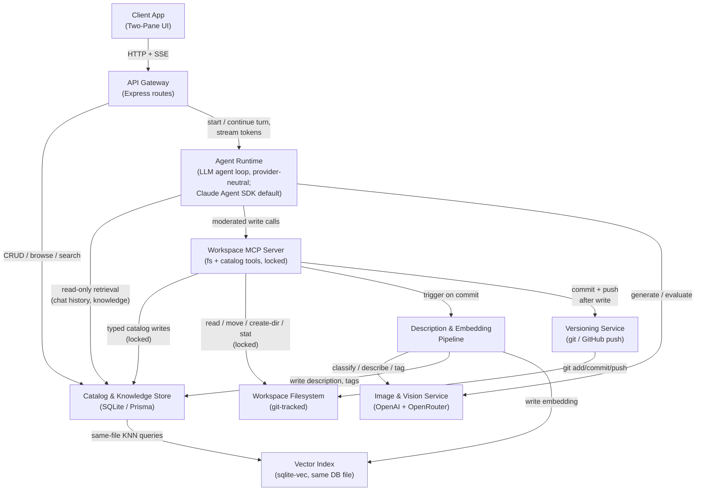
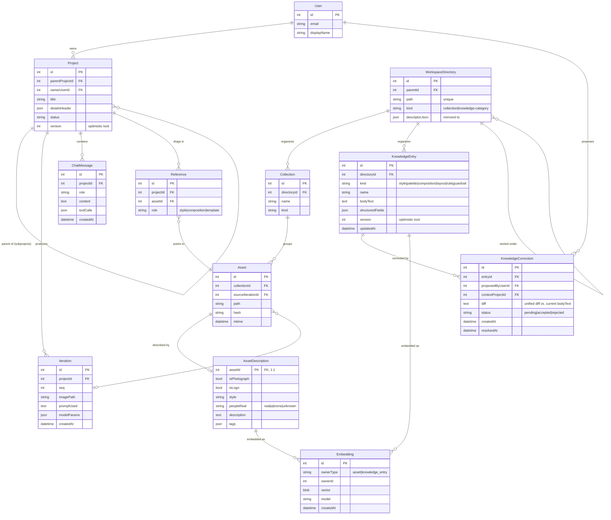
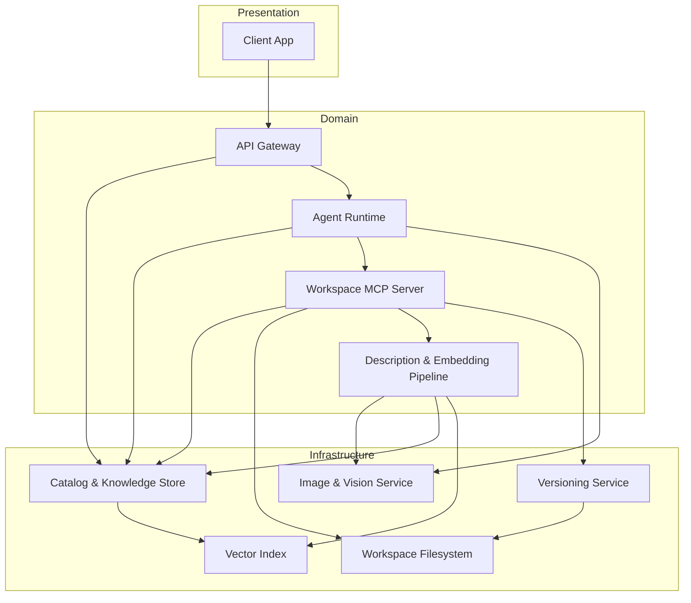

<!-- CLASI: Before changing code or making plans, review the SE process in CLAUDE.md -->

# Flyerbot — Architecture (Initial)

This is the first system-level architecture document for Flyerbot. It
covers the "design it" phase between the approved specification
(`docs/design/specification.md`, all §16 questions RESOLVED) and the
build. It supersedes the *scope* of `docs/architecture/architecture-update-001.md`
(Sprint 001, auth cleanup + wireframes) by designing the real
project/asset/style/knowledge-base/agent domain that sprint deliberately
left undesigned — while incorporating Sprint 001's outcomes as a starting
condition, not re-litigating them.

Grounded in: `docs/design/overview.md`, `docs/design/usecases.md`
(UC-001–UC-014), `docs/design/specification.md`,
`docs/design/stakeholder-spec-2026-07-13.md`, the current repo state
(Express + Prisma 7/SQLite + React 19/Vite/Tailwind, Google-only auth,
`client/src/pages/mockups/*` wireframes), and the predecessor `marketing`
app explored read-only for precedent.

---

## Architecture Overview

Flyerbot is a single Express/Node server plus a React SPA, backed by one
SQLite database, that hosts a conversational agent loop per project,
specified against a provider-neutral LLM interface and driven by the
Claude Agent SDK as its first/default provider implementation (see
**Amendment (2026-07-14)**). The user's two-pane experience (left: browsable catalog of
assets/styles/projects; right: project outputs over a chat box) is a thin
presentation layer over three domain concerns:

1. **The catalog** — a single SQLite database holding assets, collections,
   one polymorphic knowledge store (styles/palettes/compositions/layouts/
   rules), correction history, projects, iterations, chat transcripts, and
   a lightweight in-database vector index for semantic retrieval.
2. **The workspace filesystem** — a git-tracked directory tree holding the
   actual image bytes and rendered outputs the catalog's rows point to.
3. **The agent runtime** — an agent loop against a provider-neutral LLM
   interface (chat completions + tool use), driven today by the Claude
   Agent SDK, one active conversation per project, whose only path to
   mutating the catalog or filesystem is a moderated in-process MCP server
   exposing a narrow, lockable tool surface (read/move/create-directory/stat
   for files; typed create/update/propose-correction operations for the
   catalog — never raw shell, never raw SQL).

Everything server-side runs as part of the existing Express app (no new
services to deploy); "moderation" and "locking" are architectural
boundaries inside that one process, not separate infrastructure.

## Technology Stack

| Concern | Choice | Notes |
|---|---|---|
| Server runtime | Node + TypeScript, Express | existing |
| Database | SQLite via Prisma 7 (`@prisma/adapter-better-sqlite3`) | existing; firm decision, no Postgres (spec §16 Q1 RESOLVED) |
| Vector search | `sqlite-vec` loadable extension via `better-sqlite3` | new dependency; see Design Rationale D1 |
| Full-text search | SQLite `FTS5` virtual table | new; keyword/tag fallback path alongside vector search |
| Client | React 19 + Vite + Tailwind, React Router v7, TanStack Query | existing |
| Auth | Passport Google OAuth only | existing, Sprint 001 |
| Agent runtime | Claude Agent SDK (`@anthropic-ai/claude-agent-sdk` or equivalent), behind a provider-neutral LLM interface | new dependency; **not** Claude Code (spec §16 Q7 RESOLVED); Anthropic SDK is the first/default provider implementation, not an Anthropic-locked runtime — see **Amendment (2026-07-14)** and **D10** |
| Agent↔workspace mediation | `@modelcontextprotocol/sdk` (already a server dependency), in-process transport | reuses the SDK already used by `server/src/mcp/*`; new, separate server instance — see D5 |
| Image generation | OpenAI `gpt-image-2` (`/v1/images/generations`, `/v1/images/edits`) | direct, not via OpenRouter |
| Vision evaluation / description | OpenRouter (model per `OPENROUTER_MODEL`) | generation vs. evaluation split preserved from predecessor |
| Streaming chat transport | Server-Sent Events over the existing Express app | avoids adding a WebSocket layer |
| Versioning | `git` (via `simple-git` or `execFile('git', …)`), pushed to a GitHub remote | see D7 for scope (workspace content, not the live `.db` file) |
| Config/secrets | Existing dotconfig cascade (`config/{dev,prod}/{public,secrets}.env`) | `OPENROUTER_API`, `OPENROUTER_MODEL`, `IMAGE_MODEL` must be added (currently missing per spec §14) |

## Module Design

Ten modules. Presentation → Domain → Infrastructure, consistent with the
skill's dependency-direction rule.

### 1. Client App (Two-Pane UI)
- **Purpose**: Renders the shared workspace as a browsable left-side
  catalog beside a right-side project view driven by chat.
- **Boundary**: `client/src/` — the promoted-to-real versions of
  `pages/mockups/MockupLeftBrowser.tsx`, `MockupOutputPane.tsx`,
  `MockupChatPanel.tsx`, `MockupNewProject.tsx`, `MockupPostcardEdit.tsx`.
  Talks to the server only over HTTP/SSE through the API Gateway; never
  reads the database or filesystem directly.
- **Use cases**: UC-002, UC-003, UC-004, UC-006, UC-009, UC-010, UC-013,
  UC-014.

### 2. API Gateway (Express routes)
- **Purpose**: Authenticates browser requests then routes them to
  catalog, project, or agent-runtime services.
- **Boundary**: `server/src/routes/*` (existing auth/admin routes plus new
  `catalog.ts`, `projects.ts`, `chat.ts` route modules). Owns session
  auth and request validation; contains no domain logic of its own —
  delegates to the Catalog & Knowledge Store or the Agent Runtime.
- **Use cases**: UC-001 (directly); transport layer for all others.

### 3. Agent Runtime (LLM agent loop, provider-neutral interface)
- **Purpose**: Drives an agent loop per active project conversation,
  translating chat input into moderated tool calls.
- **Boundary**: new `server/src/agent/` module. Reads chat history and
  retrieved knowledge from the Catalog & Knowledge Store directly
  (read-only, unmoderated — see D9); every write goes through the
  Workspace MCP Server; every image request goes through the Image &
  Vision Service. Stateless between turns — see D8.
- **Provider interface (Amendment, 2026-07-14 — see D10)**: the loop's
  contract — turn lifecycle (receive message, plan, call tools, stream a
  response), tool dispatch to the Workspace MCP Server, session
  persistence (reconstructed each turn per D8), and token/event streaming
  to the client (see **Streaming chat transport** in Technology Stack) —
  is specified against a provider-neutral LLM interface: chat completions
  plus tool use, independent of any one vendor's SDK. The Claude Agent SDK
  is the first/default implementation of that interface, not a hard
  dependency baked into the loop contract. Swapping the underlying
  provider must not require changes to the loop contract itself, to the
  Workspace MCP Server's tool definitions, or to session/chat storage
  (`ChatMessage`, per **Data Model**) — only to the provider-adapter layer
  inside this module. The Workspace MCP Server already being a standard,
  provider-neutral MCP tool surface (rather than an Anthropic-specific
  tool-calling format) is what makes this swap contained to the adapter.
- **Use cases**: UC-003, UC-004, UC-005, UC-006, UC-007, UC-009, UC-010,
  UC-011, UC-012.

### 4. Workspace MCP Server
- **Purpose**: Mediates every workspace mutation the agent requests
  through a narrow, locked tool surface.
- **Boundary**: new `server/src/agent-mcp/` module, a **second, separate**
  `McpServer` instance from the existing `server/src/mcp/*`
  (`get_version`, `list_users` — a CLASI/admin dev-tooling endpoint
  exposed over HTTP at `/api/mcp`). The Workspace MCP Server is invoked
  in-process by the Agent Runtime, not exposed over HTTP, and is the
  **only** writer path for agent-initiated filesystem or catalog changes.
  Exposes two tool families: filesystem tools (`read_file`, `move_file`,
  `create_directory`, `stat` — no shell, per spec §9) and catalog tools
  (`create_knowledge_entry`, `propose_correction`, `add_asset_to_collection`,
  `create_iteration`, `create_agent_page`, …). Acquires a Lock before any
  write; releases it after.
- **Use cases**: UC-007, UC-008, UC-011, UC-013 (the enforcement point for
  all of them).

### 5. Catalog & Knowledge Store (SQLite via Prisma)
- **Purpose**: Persists the canonical record of assets, collections,
  knowledge entries, projects, iterations, chat messages.
- **Boundary**: extends `server/prisma/schema.prisma` with the new models
  in **Data Model** below, alongside the existing `Config`/`User`/
  `UserProvider`/`ScheduledJob`/`Session` models (untouched). The only
  component that opens the SQLite file for writes outside of migrations;
  reads are also served to the Agent Runtime and API Gateway directly.
- **Use cases**: UC-002, UC-005, UC-007, UC-008, UC-009, UC-010, UC-011,
  UC-012, UC-013, UC-014.

### 6. Vector Index (`sqlite-vec`)
- **Purpose**: Answers nearest-neighbor similarity queries over embedded
  workspace content.
- **Boundary**: a `vec0` virtual table living inside the same SQLite
  file as the Catalog & Knowledge Store (not a separate database or
  process). Populated by the Description & Embedding Pipeline; queried
  by the Catalog Store's search functions on behalf of UC-014 and the
  Agent Runtime's knowledge-retrieval step (UC-005).
- **Use cases**: UC-005, UC-014.

### 7. Workspace Filesystem
- **Purpose**: Stores the binary images, rendered outputs, generated
  files referenced by catalog path pointers.
- **Boundary**: a git-tracked directory tree (`workspace/`, see
  **File-System Layout**) mounted into the server container/host. The
  filesystem holds bytes and rendered artifacts only — style/prompt/rule
  *text* lives in the Catalog & Knowledge Store, not `.md` files (a
  deliberate departure from the predecessor, spec §16 Q3 RESOLVED).
  Written only by the Workspace MCP Server and the Description &
  Embedding Pipeline (for generated output files).
- **Use cases**: UC-003, UC-004, UC-006, UC-008, UC-010, UC-011.

### 8. Description & Embedding Pipeline
- **Purpose**: Turns a newly committed asset into a classification,
  description, tag set, embedding vector at commit time.
- **Boundary**: new `server/src/services/description.ts`. Triggered
  synchronously by the Workspace MCP Server's `add_asset_to_collection`
  tool (or queued for retry on vision-model failure, per UC-008 E4).
  Calls the Image & Vision Service for the vision-model pass; writes only
  to the Catalog & Knowledge Store and the Vector Index — never touches
  the Workspace Filesystem directly (the asset file itself was already
  placed there by the MCP tool that triggered this pipeline).
- **Use cases**: UC-008, UC-014.

### 9. Image & Vision Service
- **Purpose**: Wraps the external image-generation, vision-evaluation
  APIs behind one internal interface.
- **Boundary**: new `server/src/services/imaging.ts`. Stateless HTTP
  client wrapper around OpenAI (`gpt-image-2`, generation) and
  OpenRouter (vision, evaluation/description). No DB or filesystem
  access of its own — returns bytes/JSON to whichever caller invoked it
  (Agent Runtime for generation/rubric evaluation; Description &
  Embedding Pipeline for commit-time description).
- **Use cases**: UC-006, UC-008, UC-010.

### 10. Versioning Service
- **Purpose**: Commits workspace content changes to git, pushing them to
  the workspace's GitHub remote.
- **Boundary**: new `server/src/services/versioning.ts`. Invoked by the
  Workspace MCP Server after a successful filesystem or catalog write
  (batched per agent turn, not per file — see D8/D9 for git-automation
  scope). Operates only on the Workspace Filesystem tree plus periodic
  JSON export snapshots of the Catalog & Knowledge Store (see D7) — never
  commits the live `.db` file.
- **Use cases**: UC-012.

## Diagrams

### Component / Module Diagram



### Entity-Relationship Diagram



### Dependency Graph



No cycles. Maximum fan-out is Agent Runtime and Workspace MCP Server at 3
each — within the 4-5 guideline. `Catalog & Knowledge Store` and
`Vector Index` have zero outward dependencies (pure infrastructure), as
does `Workspace Filesystem`.

## Data Model

The data model realizes the stakeholder's **single knowledge store**
decision (spec §16 Q2 RESOLVED) as one polymorphic `KnowledgeEntry` table
— styles, palettes, compositions, layouts, standing do/don't rules, and
brand guardrails are all rows distinguished by `kind`, not separate
tables. This is a direct implementation of "there's basically one
knowledge store... good indexing," not a simplification imposed by this
document.

Key points not fully captured by the ER diagram's field lists:

- **`Project.version` / `KnowledgeEntry.version`**: an integer bumped on
  every write, used for optimistic locking (see **Locking/Concurrency
  Model**).
- **`KnowledgeCorrection.diff`**: a unified-diff-style text against the
  entry's current `bodyText`, per spec §16 Q3 RESOLVED ("I think you're
  proposing a diff"). Accepting a correction applies the diff and bumps
  `KnowledgeEntry.version`; it does not overwrite `bodyText` directly from
  chat.
- **Tags**: stored as a JSON array on `AssetDescription` rather than a
  normalized `Tag`/join table. The tag vocabulary is explicitly
  undecided (spec §16 Q8 remainder) — a free-form JSON list avoids
  committing to a schema for a vocabulary that doesn't exist yet, while
  `FTS5` (see **Indexing Strategy**) still makes tags searchable.
- **`WorkspaceDirectory`**: represents both asset-collection folders
  (`stock-art/`, `logos/`, …) and knowledge-category folders inside the
  agent-reorganizable style collection (spec §16 Q4 RESOLVED). Its
  `descriptorJson` is the canonical value; a `_dir.json` file mirroring it
  is written to the corresponding filesystem path for human/agent
  legibility when browsing the raw tree (see D6).

### Indexing Strategy

Two complementary indexes, both inside the one SQLite file:

1. **`sqlite-vec` (`vec0` virtual table)** — nearest-neighbor search over
   `Embedding.vector`, keyed to `AssetDescription`/`KnowledgeEntry` rows
   by `(ownerType, ownerId)`. Powers the primary conversational retrieval
   path (UC-014's "show me the assets with robots in them").
2. **`FTS5` virtual table** — indexes `AssetDescription.description`,
   `AssetDescription.tags`, `KnowledgeEntry.bodyText`, `KnowledgeEntry.name`
   for literal/keyword matching. Powers the secondary filter-bar path
   (UC-014) and acts as a cheap pre-filter the Agent Runtime can combine
   with vector search for hybrid retrieval, without building a separate
   ranking service.

See **Design Rationale D1** for why `sqlite-vec` was chosen over a
separate vector database or a brute-force in-memory scan, and the
fallback if it proves undeployable.

## File-System Layout

```
workspace/                     # git repo root for content (see D7)
  assets/                      # WorkspaceDirectory-backed collections
    logos/
    stock-art/
    prior-art/
    <agent-created-collections>/
      _dir.json                 # mirror of WorkspaceDirectory.descriptorJson
  knowledge/                   # agent-reorganizable style/palette/etc. tree
    styles/<style-slug>/
      _dir.json                 # organizational only — bodyText lives in the DB
      reference-images/         # optional example images, not the prompt text
    palettes/<palette-slug>/
    compositions/<composition-slug>/
    layouts/<layout-slug>/
  projects/
    <project-slug>/
      sources/                  # copies of dragged-in references
      iterations/                # iter-NNN.<ext>, never overwritten (spec §6)
      outputs/                   # rendered postcard.html/pdf, agent-authored pages
  exports/                     # periodic JSON snapshots — see D7
```

The database is the source of truth for *metadata and text* (paths,
descriptions, tags, style/prompt bodies, correction history). The
filesystem is the source of truth for *bytes* (images, rendered HTML/PDF,
agent-authored page markup). `WorkspaceDirectory` rows and `_dir.json`
files are kept in sync by the Workspace MCP Server on every directory
create/move — the JSON file is a convenience mirror for anyone (human or
agent) browsing the raw tree outside the app, not an independent source
of truth (spec §16 Q4 RESOLVED: "Directories are expected to carry a JSON
file... or a corresponding database entry" — this document picks the DB
entry as canonical and derives the file, rather than the reverse, so a
concurrent writer never has to reconcile two authoritative copies).

## Agent Runtime Details

- **Session model**: one Agent Runtime "turn" is scoped to a single
  `Project`. There is no separate session-persistence layer — a turn's
  context (system prompt + retrieved `KnowledgeEntry` rows + the
  project's `ChatMessage` history) is reconstructed from the Catalog Store
  on every turn (see D8). This means the Node process can restart between
  turns with no loss of conversational state.
- **Concurrency within a project**: only one active agent turn per
  project at a time, enforced by the same Lock table the Workspace MCP
  Server uses (`resourceType = 'project_turn'`). A second user's message
  into the same project while a turn is in flight is queued, not dropped
  or run concurrently — this keeps prompt assembly (UC-005) from racing
  itself within one project, while still allowing different projects
  (or read-only browsing, UC-002/UC-014) to proceed fully in parallel.
- **Tool mediation**: the Agent Runtime's only tools are those exposed by
  the Workspace MCP Server (filesystem: `read_file`, `move_file`,
  `create_directory`, `stat`; catalog: `create_knowledge_entry`,
  `propose_correction`, `add_asset_to_collection`, `create_project`,
  `create_iteration`, `create_agent_page`) plus a direct (unmoderated,
  read-only) knowledge/asset retrieval function and the Image & Vision
  Service client. No shell tool exists at any layer.
- **Image generation loop**: chat feedback → Agent Runtime re-invokes
  prompt assembly (knowledge retrieval + rewrite into one voice, per spec
  §8) → Image & Vision Service (`gpt-image-2`, `/v1/images/edits` when
  references are attached) → `create_iteration` catalog tool call through
  the MCP server → new `Iteration` row + file in `iterations/`, prior
  iterations untouched (UC-006).
- **Agent-authored pages**: a single general mechanism, not three
  features (spec §11). The `create_agent_page` MCP tool writes a
  self-contained page definition (markup/schema + optional small script)
  to `projects/<slug>/outputs/` and a matching `AgentPage`-shaped record
  (folded into `Iteration`/output metadata — no separate top-level entity
  needed, since an agent page is just another typed project output). The
  postcard text-region form (UC-010) is the concrete, must-have instance:
  its inputs are generated directly from the region-definition JSON on
  the postcard's template iteration.

## Locking/Concurrency Model

Scoped, per the stakeholder (spec §16 Q5 RESOLVED), to exactly two
surfaces:

1. **Database**: optimistic locking via a `version` integer on
   `Project` and `KnowledgeEntry` (the two row types multiple
   users/agents plausibly edit concurrently — UC-007 E2, UC-013 E1).
   A write includes the version it read; a mismatch is rejected and
   surfaced back to the writer (chat message for the agent, an inline
   error for direct API writers) rather than silently overwritten. This
   document **proposes** reject-and-surface over last-write-wins because
   silent loss of a style correction (UC-007) is a worse failure mode
   than asking a user to re-state a conflicting edit — flagged as **Open
   Question 2** for stakeholder confirmation, since the spec left the
   exact mechanism open.
2. **Workspace MCP Server (file editing surface)**: a `Lock` table keyed
   by `resourceType` + `resourceKey` (a directory path, a project id for
   the per-project turn lock described above). The MCP server acquires a
   lock before any filesystem move/create or catalog write, releases it
   after, and rejects a conflicting acquisition rather than queuing
   indefinitely (a bounded wait with a clear chat-surfaced timeout,
   consistent with UC-011 E2's "warn before destructive operations").

Read paths (browsing, UC-002; semantic search, UC-014; the Agent
Runtime's own knowledge retrieval, UC-005) are **not** moderated or
locked — they query the Catalog Store and Vector Index directly. Locking
exists to protect writers from each other, not to serialize reads behind
writes (see D9).

## Web App Structure

The mockups from Sprint 001 map directly onto real components, resolving
that sprint's Open Question 3 ("Sidebar fate"):

- `MockupMain.tsx`'s two-pane layout becomes the **sole authenticated
  home route**. `AppLayout.tsx`'s sidebar collapses to a minimal top bar
  (account menu, admin link for `ADMIN` role) — it does not disappear
  entirely (admin routes under `/admin` still need a shell), but it no
  longer carries a `MAIN_NAV` product sidebar.
- `MockupLeftBrowser.tsx` becomes the real catalog browser: a category
  tree backed by `WorkspaceDirectory`/`Collection`/`KnowledgeEntry`, plus
  a query bound to the conversational semantic-filter state (UC-014) and,
  secondarily, a literal filter bar hitting `FTS5` directly.
- `MockupOutputPane.tsx` becomes the iteration gallery for the open
  project (`Iteration` rows, newest first, all retained) plus the render
  surface for agent-authored pages (an `<iframe>` or in-tree component
  render of the `create_agent_page` output for the postcard-form case).
- `MockupChatPanel.tsx` becomes the SSE-streaming chat UI: it POSTs a
  message to the API Gateway, then subscribes to an SSE stream carrying
  token deltas and tool-call/status events from the Agent Runtime for
  that project's current turn.
- `MockupNewProject.tsx` becomes the create-project flow (UC-003):
  project-details header, empty output area, chat box — populated as
  Claude asks clarifying questions and fills in `Project.detailsHeader`.
- `MockupPostcardEdit.tsx` becomes the real rendering of a
  `create_agent_page` output for the postcard case (UC-010).

## Security Considerations

- **No shell, ever**: the Workspace MCP Server's filesystem tool family
  is fixed (`read_file`, `move_file`, `create_directory`, `stat`) — there
  is no generic command-execution tool at any layer the Agent Runtime can
  reach, matching spec §9's explicit constraint.
- **Path containment**: every filesystem tool call is resolved against
  `workspace/` as an enforced root; the MCP server rejects any resolved
  path (including via `move_file`) that escapes it, and rejects symlink
  traversal out of the root.
- **Auth boundary unchanged**: all new routes sit behind the existing
  Google-only session auth (Sprint 001); the Agent Runtime and Workspace
  MCP Server are never reachable directly from the browser — only through
  authenticated API Gateway requests that start or continue a project
  turn.
- **The existing `/api/mcp` endpoint is unrelated**: it is a
  token-authenticated, HTTP-exposed dev-tooling MCP server
  (`get_version`, `list_users`) for CLASI/admin use, unchanged by this
  document. It must not be confused with, or extended to become, the new
  in-process Workspace MCP Server described here.
- **Secrets**: `OPENROUTER_API`, `OPENAI_API_KEY`, `ANTHROPIC_API_KEY`,
  `GITHUB_TOKEN` (for the Versioning Service's push) flow through the
  existing dotconfig cascade and `Config`/env-var pattern already in
  place; none are logged (existing `pino`/`logBuffer` redaction
  practices apply unchanged) and none are ever written into
  `KnowledgeEntry`/`AssetDescription` text that the Agent Runtime might
  echo back in chat.
- **Prompt-injection surface**: retrieved `KnowledgeEntry`/asset
  description text is user- and agent-authored content that gets
  concatenated into the system/tool context for prompt assembly (UC-005).
  It is treated as data, not instructions, in the Agent Runtime's system
  prompt — standard LLM system-prompt hygiene, called out explicitly
  because this system's whole point is letting that data grow over time.
- **Shared-trust model, by design**: all League staff share one
  workspace with no per-user data isolation (spec §12 — "all users work
  in the same environment"). This is an intentional trust decision, not
  a gap to close; it does mean there is no per-user access control below
  the existing `USER`/`ADMIN` role split, which should be stated
  explicitly rather than assumed.
- **Cost containment** (not specified by the stakeholder): image
  generation and vision calls are metered, uncapped API cost per project.
  Flagged as **Open Question 7**.

## Design Rationale

### D1: `sqlite-vec` for vector search, not a separate vector database or brute-force scan
- **Context**: spec §16 Q1 RESOLVED wants "lightweight vector search…
  inside SQLite," explicitly not a heavyweight vector DB, and the
  existing stack is already committed to `better-sqlite3`.
- **Alternatives considered**: (a) a standalone vector DB (Chroma,
  Qdrant, pgvector) — a new service to deploy/operate, directly
  contradicts "not a heavyweight usage"; (b) brute-force cosine
  similarity over a plain BLOB embedding column, computed in JS — zero
  new dependencies, but scales linearly with corpus size and needs the
  whole table loaded into memory per query.
- **Why this choice**: `sqlite-vec` is a loadable SQLite extension with
  prebuilt native binaries, queryable via `better-sqlite3.loadExtension`,
  living in the same `.db` file — no new service, no new database
  connection, and real KNN indexing instead of O(n) scans.
- **Consequences**: adds one native-binary dependency to the Docker
  build; prebuilt-binary platform coverage must be confirmed for the
  deployment target before implementation (see **Open Questions**). If
  it proves undeployable, the fallback is the brute-force BLOB approach
  above — the `Embedding` table's shape (owner type/id, vector, model) is
  identical either way, so this is a swappable implementation detail
  behind the Catalog Store's search functions, not a data-model change.

### D2: One polymorphic `KnowledgeEntry` table, not separate tables per kind
- **Context**: spec §16 Q2 RESOLVED — "there's basically one knowledge
  store... good indexing," explicitly rejecting separate mechanisms for
  styles vs. palettes vs. do/don't rules.
- **Alternatives considered**: separate `Style`, `Palette`,
  `Composition`, `Layout`, `Rule` tables, each with its own correction
  mechanism.
- **Why this choice**: separate tables would each need their own
  correction-diff, embedding, and directory-organization machinery,
  duplicated five times, for entries that the stakeholder explicitly
  described as one thing. A single table with a `kind` discriminator
  gets correction history, embeddings, and directory placement "for
  free," uniformly.
- **Consequences**: `structuredFields` (JSON) absorbs whatever
  kind-specific shape a style vs. a layout needs (e.g. a layout's
  zone-map reference vs. a style's do/don't list), rather than a rigid
  per-kind schema — consistent with "not formalizing this too much."

### D3: Corrections as a proposed diff requiring resolution, not an autonomous edit
- **Context**: spec §16 Q3 RESOLVED — "I think you're proposing a diff,"
  explicitly not an autonomous rewrite.
- **Alternatives considered**: the agent edits `KnowledgeEntry.bodyText`
  directly and reports the change after the fact.
- **Why this choice**: matches the stakeholder's own words exactly, and
  keeps a style's evolution auditable — every change to shared,
  persistent knowledge has a `KnowledgeCorrection` row recording who
  proposed what and why, before it takes effect.
- **Consequences**: the Agent Runtime needs a resolution step (confirm in
  chat, per UC-007 step 4) between proposing and applying a correction;
  this is one additional MCP tool call (`resolve_correction`), not a new
  module.

### D4: Style/prompt text lives in the database; the filesystem holds only bytes and organizational markers
- **Context**: spec §16 Q3 RESOLVED explicitly departs from the
  predecessor's `.md`-file-per-style model — "they don't need to be .md
  files… in a database that you know how to read."
- **Alternatives considered**: keep the predecessor's file-based
  prompt-as-data pattern, with the DB only indexing file paths.
- **Why this choice**: the stakeholder resolved this directly. It also
  simplifies concurrency — text edits go through the `version`-based
  optimistic locking already defined on `KnowledgeEntry` (see **Data
  Model**) instead of needing file-level diff/merge logic for prose
  files.
- **Consequences**: the `knowledge/` filesystem tree (see **File-System
  Layout**) holds only `_dir.json` organizational markers and optional
  reference images — it is not, and must not become, a second copy of
  style prose. Anyone inspecting the raw git history of `knowledge/`
  will not see prompt-text diffs there; those live in
  `KnowledgeCorrection.diff` and the periodic export snapshots (D7).

### D5: A second, separate, in-process MCP server for the agent — distinct from the existing `/api/mcp` dev endpoint
- **Context**: `server/src/mcp/*` already exists (`get_version`,
  `list_users`), HTTP-exposed at `/api/mcp` with token auth, for
  CLASI/admin tooling. The stakeholder's "moderated by an MCP server"
  requirement (spec §9) is a different concern: the *runtime* boundary
  around the Agent Runtime's own tool access.
- **Alternatives considered**: extend the existing MCP server with
  workspace tools; give the Agent Runtime direct Prisma/`fs` access and
  enforce the "no shell" rule only by convention in code review.
- **Why this choice**: reusing the existing server for two unrelated
  audiences (CLASI dev tooling vs. the product's own AI agent) would
  couple their auth models and tool surfaces for no benefit, and blur
  exactly the moderation boundary the spec calls for. A second
  `McpServer` instance, using the same already-installed
  `@modelcontextprotocol/sdk`, connected in-process (not over HTTP) to
  the Agent Runtime, keeps the two cleanly separate while reusing the
  library.
- **Consequences**: two `McpServer` instances exist in the codebase; both
  should be named distinctly in code and docs (`devMcpServer` /
  `workspaceMcpServer`) to avoid the confusion flagged in **Security
  Considerations**.

### D6: `WorkspaceDirectory` rows are canonical; `_dir.json` files are a derived mirror
- **Context**: spec §16 Q4 RESOLVED leaves "JSON file… or a corresponding
  database entry" as an either/or, without picking one as authoritative.
- **Alternatives considered**: the JSON file is canonical and the DB
  indexes it (requires a filesystem scan/reconciliation step whenever the
  DB might be stale); no DB entry at all, JSON files only (loses
  queryability, FTS5/vector-index join-ability).
- **Why this choice**: a DB-canonical model gives one writer path (the
  Workspace MCP Server, already the lock-holder for both surfaces) and
  avoids a reconciliation problem between two authoritative copies during
  concurrent reorganization (UC-011, UC-013).
- **Consequences**: the `_dir.json` mirror can theoretically drift if
  written out-of-band (e.g. someone edits the workspace tree outside the
  app); this is accepted as a known, low-probability edge case for a
  "not formalizing this too much" system, not solved with a reconciliation
  job at this stage.

### D7: Git tracks workspace content plus periodic knowledge-store export snapshots, not the live `.db` file
- **Context**: spec §12 — "everything commits to GitHub for version
  control." The live SQLite file is the transactional source of truth
  for text/metadata and is already covered by the existing backup
  service (`BACKUP_DIR`); committing a binary, concurrently-written
  database file to git is merge-hostile and not what git is for.
- **Alternatives considered**: commit the raw `.db` file on every change
  (rejected — binary diffs, corruption risk under concurrent writers,
  no meaningful code review/diff value); commit nothing from the DB side
  at all (rejected — loses the human-diffable audit trail the
  stakeholder explicitly wants for "everything").
- **Why this choice**: git tracks the `workspace/` filesystem tree (which
  already holds all the bytes worth versioning — images, rendered
  outputs) plus a periodic JSON export of `KnowledgeEntry` and
  `Collection` rows into `workspace/exports/`, giving human-reviewable,
  diffable history for the knowledge base without git ever touching the
  live database file.
- **Consequences**: this document proposes `workspace/` as its **own**
  git repository (separate from the app source repo checked out here),
  pushed to a dedicated GitHub remote, so that generated binary content
  never enters the app's CI/PR history. This is a real design choice the
  stakeholder has not confirmed — flagged as **Open Question 3**.

### D8: The Agent Runtime is stateless between turns
- **Context**: multi-user concurrency (spec §12) and server restarts
  both need to not lose conversational state.
- **Alternatives considered**: an in-memory or Redis-backed session store
  keyed by project, holding live conversation state across turns.
- **Why this choice**: `ChatMessage` history plus the current
  `KnowledgeEntry`/asset retrieval already fully reconstructs a turn's
  context; a dedicated session store would duplicate data already
  persisted in the Catalog Store and introduce a second source of truth
  for "what has this project's agent already said."
- **Consequences**: every turn re-runs retrieval (D1's vector index and
  FTS5) rather than reusing a cached context window; acceptable given
  SQLite's read latency and the interactive, human-paced nature of chat.

### D9: Reads bypass the Workspace MCP Server; only writes are moderated and locked
- **Context**: the spec's "moderated by an MCP server" language (§9) is
  about the agent's ability to *change* things; browsing (UC-002) and
  semantic search (UC-014) are explicitly read-only use cases with their
  own postconditions stating "no state changes."
- **Alternatives considered**: route all Catalog Store access, including
  reads, through the Workspace MCP Server for a single uniform boundary.
- **Why this choice**: locking exists to prevent writers from
  corrupting or racing each other; forcing reads through the same locked,
  serialized path would make browsing/search contend with in-flight
  writes for no correctness benefit, directly hurting the "browser"
  half of the two-pane UI's responsiveness.
- **Consequences**: the Agent Runtime and API Gateway both hold direct
  read access to the Catalog Store/Vector Index; only the Workspace MCP
  Server holds write access. This is an intentional asymmetry, not an
  oversight — documented here so a future reviewer doesn't "fix" it into
  a single moderated path.

### D10: Agent Runtime loop specified against a provider-neutral LLM interface; Anthropic SDK as first/default provider (Amendment, 2026-07-14)
- **Context**: `docs/design/stakeholder-spec-2026-07-13.md`, "Agent-loop
  requirement (2026-07-14, build planning)": the agent the user converses
  with must have an agent loop; the Anthropic SDK is an acceptable —
  probably helpful — default, but "we don't really care" which provider,
  and for distribution the system "probably needs to work with a provider
  other than Anthropic." The agent loop itself is the near-certain
  requirement; the provider is explicitly swappable. This sharpens, but
  does not reverse, spec §16 Q7 RESOLVED ("not Claude Code... an agent
  loop built on the Claude Agent SDK") — that resolution ruled out Claude
  Code as the runtime; it never ruled in Anthropic-only as a permanent
  constraint.
- **Alternatives considered**: (a) build the loop directly against the
  Claude Agent SDK's own types/session model, with no abstraction layer —
  simplest to build first, but every subsequent provider swap would touch
  the loop, the tool-call translation, and potentially session shape; (b)
  build a full multi-provider abstraction library up front, with adapters
  for several providers implemented immediately — more work than the
  stakeholder asked for ("we don't really care" which provider, not "we
  need three providers now"), and speculative given no second provider is
  actually named yet.
- **Why this choice**: a provider-neutral interface (chat completions +
  tool use) with exactly one implemented adapter (Anthropic, via the
  Claude Agent SDK) satisfies the hard requirement — the loop contract,
  tool surface, and storage never assume a specific vendor — without
  building speculative adapters for providers nobody has named. The
  Workspace MCP Server (Module 4) already exposes a standard MCP tool
  surface rather than an Anthropic-specific tool-calling format, so most
  of the provider-neutrality work is already done by that boundary; this
  decision makes the Agent Runtime's own internals (turn lifecycle,
  session reconstruction per D8, streaming) honor the same boundary
  rather than leaking a vendor-specific shape into `ChatMessage` storage
  or the loop's control flow.
- **Consequences**: the Agent Runtime module gains an internal
  provider-adapter seam (Anthropic adapter first); no new top-level module
  is introduced — this is a boundary inside Module 3, not a new module,
  so it does not change the Component/Module Diagram, the dependency
  graph, or module count. `ChatMessage.toolCalls` (see **Data Model**)
  must be stored in a provider-neutral shape (tool name + structured
  args/results), not a raw copy of any one SDK's wire format, so a future
  second adapter can read the same history. No second provider is
  implemented by this amendment — see **Open Question 9**.

## Migration Concerns

- **New Prisma models**: `Project`, `Iteration`, `ChatMessage`,
  `Reference`, `Collection`, `Asset`, `AssetDescription`, `KnowledgeEntry`,
  `KnowledgeCorrection`, `Embedding`, `WorkspaceDirectory`, `Lock` are all
  additive migrations. `Config`, `User`, `UserProvider`, `ScheduledJob`,
  `Session` are untouched. `Counter` (an explicitly-labeled demo model)
  should be removed in a future sprint but is orthogonal to this work.
- **`sqlite-vec` deployment**: the Docker image build must bundle the
  correct prebuilt native binary for the deployment architecture; this
  needs verification before implementation begins (see **Open
  Questions**).
- **`OPENROUTER_API` / `OPENROUTER_MODEL` / `IMAGE_MODEL`**: not yet
  present in the flyerbot dotconfig cascade (spec §14) — must be added to
  `config/{dev,prod}` as part of implementation; `OPENAI_API_KEY` already
  exists in both the flyerbot and marketing dotconfig files and should be
  reconciled, not duplicated.
- **GitHub remote — app repo (ops precondition)**: per the task
  framing this document was commissioned under, the flyerbot repo's own
  git remote currently points at its template origin and must be
  repointed to the project's real repo before any of this project's own
  commits are meaningfully pushed. Unrelated to, but a precondition
  alongside, the next item.
- **GitHub remote — workspace repo (new precondition, this document)**:
  if the separate-repo proposal in D7 is confirmed, a new GitHub
  repository for `workspace/` content needs to be created and its
  credentials added to the dotconfig cascade before UC-012 can push
  anything.
- **No user-data migration**: pre-launch, no existing Flyerbot users or
  projects to migrate. The predecessor `marketing` app's content
  (`images/catalog.json`, `projects/*/project.json`, `app/prompts/*`) is
  a candidate for a one-time import job into the new schema, but that
  import is out of scope for this document — flagged as a natural
  Sprint 002+ ticket, not an architectural concern.
- **Deployment sequencing**: the Catalog & Knowledge Store schema, the
  Workspace MCP Server, and the Agent Runtime are tightly coupled and
  should land in dependency order within a sprint (schema → MCP tools →
  agent loop → UI wiring), not deployed independently mid-sprint.

## Non-Goals (explicit, honoring "not formalizing this too much")

- No standalone vector-database service (Chroma, Qdrant, Pinecone, …).
- No Postgres migration path being actively pursued — Prisma's provider
  abstraction remains a theoretical escape hatch, not a planned one.
- No per-user workspace isolation or multi-tenancy; the shared-trust
  model is intentional (see **Security Considerations**).
- No fine-grained RBAC beyond the existing `USER`/`ADMIN` split.
- No automatic cost-billing or hard rate-limiting system for image
  generation at v1 (flagged as an open question, not built speculatively).
- No offline/desktop client.
- No non-Google auth path (Sprint 001 already settled this).
- No third-party/plugin MCP tool system — the Workspace MCP Server's tool
  set is fixed and reviewed, not user-extensible.
- No full WYSIWYG drag-drop page builder for agent-authored pages — the
  mechanism generates form/markup definitions from data (e.g. a region
  JSON), it does not host a visual editor.
- No real-time collaborative cursors/presence UI for multi-user editing
  — UC-013's concurrency handling is conflict-avoidance (locking), not
  live co-editing affordances.

## Migration/Growth Path

This architecture is meant to support the initial build, not to
anticipate scale the stakeholder hasn't asked for. If growth ever
requires revisiting a "not heavyweight" decision made here, the natural
seams are already isolated by module boundary: the Vector Index sits
behind the Catalog Store's search functions (swap `sqlite-vec` for
something else without touching callers); the Image & Vision Service is
a thin wrapper (swap providers without touching the Agent Runtime); the
Workspace MCP Server's tool set can grow (new catalog tools) without
changing its enforcement model. No component was designed to require a
rewrite to extend.

## Relationship to Sprint 001

`docs/architecture/architecture-update-001.md` remains valid as the
historical record of Sprint 001's auth-cleanup and wireframe work — it is
not overwritten or retracted. This document treats Sprint 001's outcome
as a starting condition:

- Google-only auth (UC-001) is reused as-is; no changes proposed here.
- The four mockup pages are promoted into real components (see **Web App
  Structure**) rather than replaced.
- Sprint 001's Open Question 3 ("Sidebar fate") is resolved here: the
  two-pane layout becomes the sole authenticated home route, and
  `AppLayout` collapses to a minimal top bar.
- Sprint 001's Open Questions 1 (GitHub/password backend scope) and 2
  (mockup route exposure pre-deployment) are **not** addressed by this
  document — they are orthogonal to the domain design here and remain
  open for whichever sprint next touches auth surface or deployment
  gating.

## Amendment (2026-07-14): Provider-Neutral LLM Interface for the Agent Runtime

**Source**: `docs/design/stakeholder-spec-2026-07-13.md`, "Agent-loop
requirement (2026-07-14, build planning)."

This is a dated amendment to the Module 3 (Agent Runtime) design above,
not a renumbering or reversal of any existing decision — spec §16 Q7
RESOLVED ("not Claude Code... an agent loop built on the Claude Agent
SDK") stands unchanged; this amendment sharpens what "built on the Claude
Agent SDK" means architecturally.

**What Changed**: the Agent Runtime module's loop — turn lifecycle
(receive message, plan, call tools, stream a response), tool dispatch to
the Workspace MCP Server, session persistence (reconstructed per turn,
D8), and token/event streaming to the client — is now specified against a
provider-neutral LLM interface (chat completions + tool use), documented
in Module 3's new **Provider interface** bullet and **D10**. The Claude
Agent SDK / Anthropic remains the first and default provider
implementation; the Technology Stack table's Agent runtime row is updated
to reflect this. No module was added or removed; no diagram or module
count changed (see D10 **Consequences**).

**Why**: the agent loop is the stakeholder's near-certain requirement;
the provider is explicitly not — "we don't really care" which provider is
used, and distribution likely requires supporting a provider other than
Anthropic. Locking the loop contract to one vendor's SDK would make that
future swap a rewrite instead of an adapter change.

**Impact on Existing Components**: none of the other nine modules change.
The Workspace MCP Server (Module 4) already being a standard MCP tool
surface — not an Anthropic-specific tool-calling format — is what
contains this amendment's blast radius to Module 3's internals; it is
called out explicitly in Module 3's **Provider interface** bullet and in
D10 as the reason a second provider would not require touching the tool
layer. `ChatMessage` (Data Model) is unaffected in shape but is now
explicitly required (D10 **Consequences**) to store `toolCalls` in a
provider-neutral form rather than a vendor-specific wire format.

**Migration Concerns**: none for this amendment specifically — no second
provider is implemented now, no schema change, no deployment-sequencing
change. It is a constraint on how Module 3 is *built* (adapter seam
present from the start) rather than a change to what is built this
sprint-cycle. See **Open Question 9**.

## Sprint Changes

Not applicable — this is the initial architecture document; there is no
prior consolidated architecture to diff against. Future sprint-scoped
`architecture-update-NNN.md` documents will diff against this baseline
(`architecture-001.md`) going forward, per the `consolidate-architecture`
skill's numbering convention. This document's own **Amendment (2026-07-14)**
section above is a direct in-place amendment (per this dispatch's explicit
write scope), not a sprint-scoped update file — it does not create a new
`architecture-update-NNN.md`.

## Open Questions

1. **`sqlite-vec` platform coverage**: confirm prebuilt binaries exist
   for the deployment target's Docker base image/architecture before
   committing to it as the vector-search implementation; if not, fall
   back to the brute-force BLOB approach in **D1** without a data-model
   change.
2. **Conflict-resolution mechanism (locking)**: this document proposes
   optimistic-lock rejection with the conflict surfaced to the writer
   (chat message for the agent, inline error for direct API writers)
   over last-write-wins. Spec §16 Q5 left the exact mechanism open —
   confirm this default is acceptable.
3. **One workspace repo or two**: this document proposes `workspace/`
   as its own git repository with its own GitHub remote, separate from
   the flyerbot app source repo, to keep generated binary content out of
   the app's CI/PR history (**D7**). Confirm, or state a preference for
   a single combined repo.
4. **Subproject inheritance**: does a subproject start with the parent
   project's `detailsHeader` pre-filled, or blank (spec §16 Q6
   remainder)? This document takes no position and leaves the field
   nullable either way — a Sprint 002+ ticket should decide.
5. **Tag vocabulary**: still genuinely undecided (spec §16 Q8
   remainder). This document stores tags as a free-form JSON list with
   no fixed vocabulary at launch, letting usage converge organically
   under vision-model guidance. Confirm this is acceptable for v1, or
   provide a starter vocabulary.
6. **Brand-guardrail rubric enforcement (UC-006 E2)**: automatic
   regeneration on a failed rubric score, or surface-only (let the user
   decide)? Left as an implementation-time judgment call by the spec;
   this document does not resolve it — needs a stakeholder preference
   before the Agent Runtime's generation loop is built.
7. **Image-generation cost containment**: no rate limit or budget
   control is specified. Propose a simple per-project soft cap
   surfaced in the admin UI (reusing the existing admin panel pattern)
   as a starting point — confirm or reject before implementation.
8. **Git-automation timing** (spec §16 Q1 remainder): this document
   assumes the Versioning Service commits automatically after each
   successful Workspace MCP Server write, batched per agent turn rather
   than per file. The stakeholder's "which may be behind the scenes, or
   maybe something the agent can control" was never fully resolved —
   confirm automatic-and-batched is acceptable, or whether the agent
   should have an explicit "commit now" tool instead/also.
9. **Second LLM provider timeline** (**Amendment 2026-07-14** / **D10**):
   the stakeholder said distribution "probably" needs a non-Anthropic
   provider but named none and set no timeline. This document keeps the
   loop contract provider-neutral and implements only the Anthropic
   adapter now. Confirm whether a second provider adapter should be
   built proactively (e.g. before first external distribution) or only
   when a concrete second-provider need arises — this document takes no
   position and treats it as a future ticket, not a gap in this
   amendment.

---

## Architecture Self-Review

Run per the `architecture-review` skill's criteria, against this
document's own draft (no prior architecture version to diff, so "Version
Consistency" is evaluated as internal consistency only).

**Internal Consistency**: The Module Design, Data Model, and both
diagrams agree on all ten modules and their edges; no module appears in
one section and not another. The Design Rationale entries (D1-D9, plus
D10 added by the **Amendment (2026-07-14)** below) each trace back to a
specific spec-resolved open question or an explicit gap this document
had to fill, and are cross-referenced from the body sections that rely on
them (Data Model → D2/D3/D4; File-System Layout → D6; Locking → D9;
Module 3/Technology Stack → D10). PASS.

**Codebase Alignment**: Verified against the actual repo, not just the
spec's grounding notes — `server/prisma/schema.prisma` (existing models
confirmed unmodified in this proposal), `server/src/mcp/{server,tools}.ts`
(confirmed as a separate, existing dev-tooling MCP server — D5 depends on
this being accurate), `server/src/app.ts` (confirmed session/auth
middleware ordering this document builds on top of, not around), and
`client/src/pages/mockups/*` (confirmed the five components this
document promotes into real UI actually exist with those names/shapes).
No drift found between documented and actual current-state architecture.
PASS.

**Design Quality**:
- *Cohesion*: every module's purpose sentence passed the no-"and" test
  during authoring (see Module Design). Vector Index and Description &
  Embedding Pipeline were kept as separate modules from Catalog Store
  specifically because they change for different reasons (embedding
  model/vision-prompt tuning vs. catalog CRUD schema) — a deliberate
  cohesion decision, not an oversight.
- *Coupling*: dependency graph fan-out tops out at 3 (Agent Runtime,
  Workspace MCP Server), well under the 4-5 guideline. No component
  outside the Catalog Store and Workspace MCP Server touches the
  filesystem directly.
- *Boundaries*: the Agent Runtime/Workspace MCP Server split is the
  narrowest interface in the system by design — a fixed tool list, no
  shell, no raw SQL — matching the spec's explicit moderation
  requirement.
- *Dependency direction*: Presentation → Domain → Infrastructure holds
  throughout; Infrastructure-layer modules (Catalog Store, Vector Index,
  Workspace Filesystem, Image & Vision Service, Versioning Service) have
  zero outward dependencies except Versioning Service → Workspace
  Filesystem and Catalog Store → Vector Index, both same-layer.
  PASS.

**Anti-Pattern Detection**:
- *God component*: none — the two busiest modules (Agent Runtime,
  Workspace MCP Server) each have a single, narrow purpose (drive the
  loop; moderate writes), not "does most of the work."
- *Shotgun surgery*: the single-`KnowledgeEntry`-table decision (D2)
  specifically avoids this for the styles/palettes/compositions/layouts
  domain, where a naive per-kind-table design would have spread
  correction/embedding/directory logic five ways.
- *Feature envy / shared mutable state*: the DB-canonical /
  filesystem-mirror split (D6) and the Lock table exist specifically to
  give every piece of shared mutable state (directories, `Project` and
  `KnowledgeEntry` rows) one clear owner and one write path.
- *Circular dependencies*: none in the dependency graph (verified above).
- *Leaky abstractions*: the read/write asymmetry (D9) is the one place
  this document deliberately breaks a single uniform boundary; it is
  documented explicitly as intentional, with the risk (a future reviewer
  "fixing" it) called out in the rationale itself, rather than left to be
  discovered as an inconsistency.
- *Speculative generality*: the Migration/Growth Path section explicitly
  declines to build for scale not requested; Non-Goals lists ten things
  deliberately not built. No module here exists to serve a hypothetical
  future requirement.
  PASS — no anti-pattern found requiring rework.

**Risks**:
- The `sqlite-vec` native-binary deployment risk (D1/Open Question 1) is
  real and unresolved by this document — flagged, not hidden.
- The two-git-repo proposal (D7/Open Question 3) is a genuine design
  choice the stakeholder has not seen; if rejected in favor of a single
  repo, D7's rationale and the File-System Layout section would need a
  small revision (git root would move to the app repo's root with
  `workspace/` as a subdirectory) — contained, not structural, so it
  would not require a REVISE-level rewrite of this document.
- No breaking changes to existing components (Config/User/Session/auth
  all untouched); no deployment-sequencing risk beyond the
  schema-before-tools-before-UI ordering already noted in **Migration
  Concerns**.

### Verdict: **APPROVE WITH CHANGES**

No structural issues (no circular dependencies, no god components, no
inconsistency between diagrams and document body) — the significant
open items are unresolved stakeholder decisions (D1's binary-platform
verification, D7's one-repo-vs-two proposal, and the git-automation
timing question carried over from the spec itself), not architectural
defects. These are captured as **Open Questions 1-8** above and should be
confirmed with the stakeholder before or during Sprint 002 ticketing;
none of them blocks starting that planning work, since each has a stated
default this document is prepared to implement against if no correction
comes back.

### Amendment Self-Review (2026-07-14)

Re-reviewed against the same five categories, scoped to the **Amendment
(2026-07-14)** / **D10** change only (the rest of the document's original
review above is unaffected and not re-litigated).

- **Consistency**: the amendment's substance appears in exactly three
  places — Module 3's new **Provider interface** bullet, the Technology
  Stack table's Agent runtime row, and **D10** — and all three
  cross-reference each other and the Amendment section. No other module,
  diagram, or data-model section asserts a vendor-specific claim that now
  contradicts this. PASS.
- **Codebase Alignment**: no code exists yet for the Agent Runtime module
  (Migration Concerns already lists it as net-new); there is nothing to
  drift from. Not applicable / PASS by default.
- **Design Quality**: this amendment narrows Module 3's own interface
  (adds an adapter seam), it does not add a module, edge, or dependency —
  fan-out, dependency direction, and the Component/Module Diagram are
  unchanged in shape (only Module 3's diagram label text changed, for
  accuracy). Cohesion holds: Module 3's purpose sentence is still
  one sentence, no "and." PASS.
- **Anti-Pattern Detection**: an internal provider-adapter seam with
  exactly one implementation (Anthropic) is the minimum structure that
  satisfies the requirement — not speculative generality, since the
  requirement itself (spec: "probably needs to work with a provider
  other than Anthropic" for distribution) is the stated reason, not a
  hypothetical. No god component, shotgun surgery, or circular dependency
  introduced. PASS.
- **Risks**: none new. No breaking change (no code exists yet to break);
  no data migration (schema unaffected); no deployment-sequencing change.
  The only follow-up is **Open Question 9** (second-provider timeline),
  which is a scheduling question, not a structural risk.

**Verdict: APPROVE.** No revision needed; the amendment is folded into
the document's existing structure without altering the original
**APPROVE WITH CHANGES** verdict's basis.
