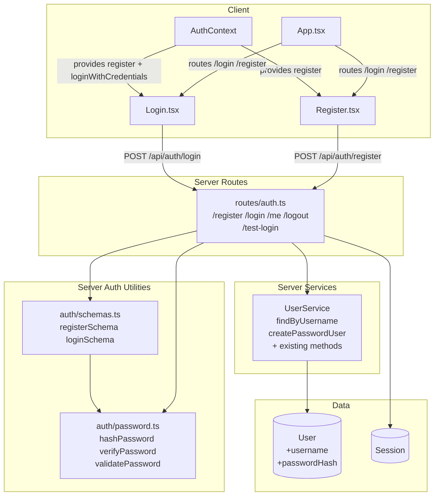
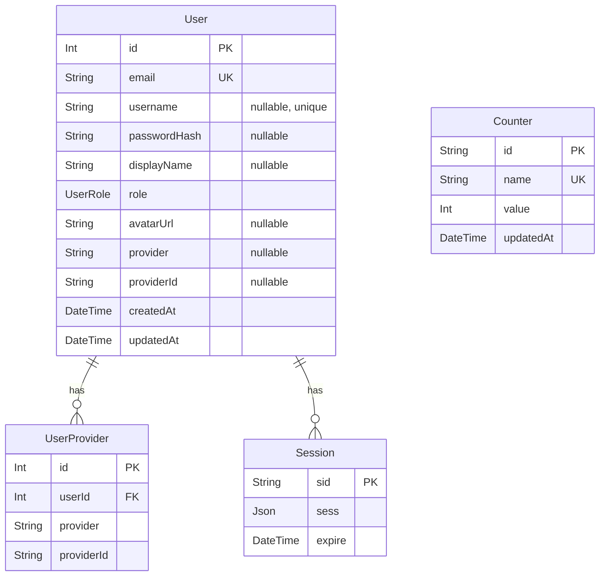

<!-- CLASI: Before changing code or making plans, review the SE process in CLAUDE.md -->

# Architecture Update — Sprint 020: User Registration with Real Password Auth

## What Changed

### Data Model

**Modified: `User`**
- Added `username String? @unique` — required for password-registered users; null for OAuth
  users.
- Added `passwordHash String?` — bcrypt hash of the user's password; null for OAuth users.

Both fields are nullable so the migration applies cleanly to existing OAuth rows with no
backfill.

### Server: New Modules

**`server/src/auth/password.ts`** (new)
- Single responsibility: bcryptjs operations and the password strength rule.
- Exports: `hashPassword(plain)`, `verifyPassword(plain, hash)`, `validatePassword(plain)`.
- Rule: ≥6 characters and ≥2 of {lowercase, uppercase, digit, symbol}.
- No imports from the rest of the server codebase (pure utility).

**`server/src/auth/schemas.ts`** (new)
- Single responsibility: Zod validation schemas for auth payloads.
- Exports: `registerSchema` (username, email, password with custom refine),
  `loginSchema` (username, password).
- Imports `validatePassword` from `password.ts`. No other server imports.

### Server: Modified Routes (`server/src/routes/auth.ts`)

**Added:**
- `POST /api/auth/register` — validates with `registerSchema`, checks uniqueness via
  `UserService`, hashes password, creates user (first-user → ADMIN), calls `req.login()`,
  returns 201 `{ user }`.
- `POST /api/auth/login` — validates with `loginSchema`, looks up user by username via
  `UserService.findByUsername`, calls `verifyPassword`, calls `req.login()`, returns 200
  `{ user }`.

**Removed:**
- `POST /api/auth/demo-login` — replaced by the seeded-user approach (SUC-003).

**Unchanged:**
- `POST /api/auth/test-login` (NODE_ENV-gated test helper).
- All OAuth routes, `/api/auth/me`, `/api/auth/logout`.

### Server: Modified Service (`server/src/services/user.service.ts`)

**Added methods:**
- `findByUsername(username: string)` — returns User | null.
- `createPasswordUser({ username, email, passwordHash, displayName?, role? })` — creates a
  User with password fields; applies first-user ADMIN promotion.

**Unchanged:** all existing methods (`list`, `getById`, `getByEmail`, `getByProvider`,
`upsertByProvider`, `create`, `updateRole`, `update`, `delete`, `count`).

### Server: Modified Seed (`server/prisma/seed.ts`)

Adds two `user.upsert` calls keyed by `username` after the counter seed:
- `user / pass / user@demo.local / USER`
- `admin / admin / admin@demo.local / ADMIN`

Both rows get `passwordHash` generated by `hashPassword(...)` at seed time. The upsert
updates `passwordHash` on re-run (idempotent if the plain password hasn't changed).

### Client: Modified `AuthContext` (`client/src/context/AuthContext.tsx`)

- `loginWithCredentials` POST target changed from `/api/auth/demo-login` to
  `/api/auth/login`.
- New export: `register({ username, email, password })` → returns
  `{ ok: boolean; error?: string; field?: 'username' | 'email' | 'password' }`.

### Client: New Page (`client/src/pages/Register.tsx`)

- Fields: `username`, `email`, `password`, `confirmPassword`.
- Client-side check: passwords must match before submit.
- Maps server error codes to field-level messages:
  - `username_taken` → under username field
  - `email_taken` → under email field with link to `/login`
  - `invalid_password` → under password field
- On success: AuthContext re-fetches `/api/auth/me`, navigates to `/`.

### Client: Modified Login Page (`client/src/pages/Login.tsx`)

- Adds "No account yet? Register" text link pointing to `/register` below the form.
- No other changes to login form behavior.

### Client: Modified Route Table (`client/src/App.tsx`)

- Adds `<Route path="/register" element={<RegisterPage />} />` alongside `/login`.

---

## Why

The existing `demo-login` endpoint hardcodes credentials in source and supports no
registration path. This sprint replaces it with a real password flow so the template can
serve as a foundation for apps that need signup. The design keeps OAuth users unaffected
by making the new fields nullable — a single User model serves both identity paths.

bcryptjs is chosen over `bcrypt` to avoid native binary compilation issues in Codespaces.
The first-user ADMIN promotion rule (already present in the demo-login route) is preserved
unchanged — the `createPasswordUser` method applies the same count-based guard.

---

## Component Diagram

## Entity-Relationship Diagram (Post-Sprint Data Model)

---

## Impact on Existing Components

| Component | Impact |
|-----------|--------|
| `routes/auth.ts` | `demo-login` removed; `register` and `login` added; all other routes unchanged |
| `UserService` | Two new methods added; existing interface fully preserved |
| `seed.ts` | Gains demo user upserts; counter seed unchanged |
| `AuthContext` | `loginWithCredentials` URL updated; `register()` added; existing types extended non-breakingly |
| `Login.tsx` | Register link added; no form logic changes |
| `App.tsx` | One new route added; all existing routes unchanged |
| OAuth strategies | No changes; `username` / `passwordHash` remain null for OAuth users |
| `test-login` | Unchanged; still required by server test suite |
| Admin user panel | Unaffected; UserService existing methods unchanged |

---

## Migration Concerns

**Schema migration:** Run `npx prisma migrate dev --name add-username-password`. Adds two
nullable columns to the `User` table. No backfill required — existing OAuth rows get
`username = null`, `passwordHash = null`.

**Seed step:** The seed upserts demo users by `username`. On a fresh DB the rows are created.
On an existing dev DB they are updated (passwordHash refreshed). The upsert key is `username`,
so a uniqueness constraint violation is not possible if the column is newly added as nullable.
Implementer note: the seed imports `hashPassword` from `password.ts` — confirm the import path
resolves correctly from `server/prisma/seed.ts`.

**`demo-login` removal:** The client's `loginWithCredentials` call site in `AuthContext` must
be updated in the same PR as the route removal. The test file `auth-demo-login.test.ts` must
be deleted or migrated to `auth-login.test.ts`.

**Session store:** No session schema change. Existing sessions remain valid after migration.

---

## Design Rationale

### Decision: nullable username and passwordHash rather than a separate PasswordCredential model

**Context:** The User model already has OAuth identity fields (`provider`, `providerId`).
Adding a separate table for password credentials would require a join on every login and
complicate the session deserialization.

**Alternatives considered:**
1. Separate `PasswordCredential` model with a User FK.
2. Nullable columns on `User`.

**Choice:** Nullable columns. The User model is already polymorphic (OAuth fields are
nullable); adding two more nullable fields follows the existing pattern. The sprint scope
does not require multiple credential methods per user.

**Consequences:** A user cannot have both an OAuth identity and a password credential in the
same row. Acceptable for this template; future multi-provider linking is a separate concern.

### Decision: bcryptjs over bcrypt

**Context:** `bcrypt` requires native compilation via node-gyp. This fails silently or
noisily in Codespaces and on some CI images.

**Choice:** `bcryptjs` — pure JavaScript, identical API, no native build step.

**Consequences:** Slightly slower hashing at cost factor 10 (negligible for a demo app).

### Decision: server-only password validation (no client-side strength check)

**Context:** Duplicating the rule in client TypeScript and server TypeScript risks drift.

**Choice:** The server is the single source of truth. The client surfaces the error code
to the correct form field. This keeps `validatePassword` in one place (`password.ts`).

**Consequences:** The user experiences a round-trip before seeing a strength error. Acceptable
at demo scale.

---

## Open Questions

1. **`seed.ts` import path for `hashPassword`:** The seed file lives in `server/prisma/seed.ts`
   and `password.ts` will be in `server/src/auth/password.ts`. Confirm the relative import
   `'../src/auth/password.js'` resolves correctly when `prisma db seed` runs, or use a direct
   `bcryptjs` call in the seed file to avoid the dependency.

2. **Register button style on Login page:** The TODO specifies a small text-link ("No account
   yet? Register"). If the stakeholder prefers a full-width white button styled like the OAuth
   buttons, swap the `
` for a `<Link>` with button styling — flag in the Login page ticket.
