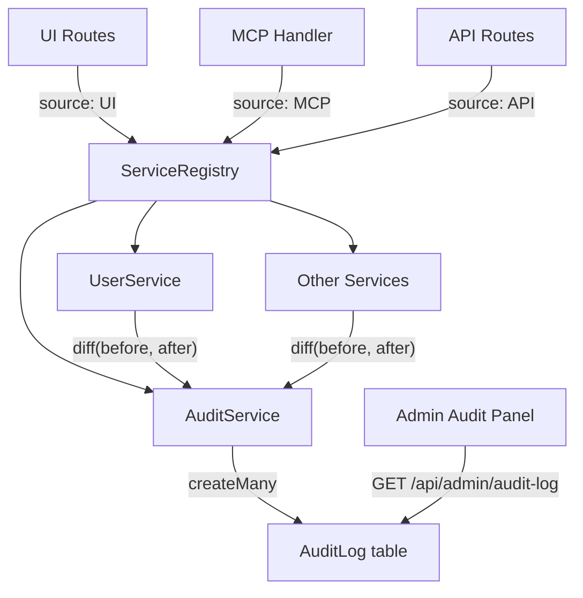
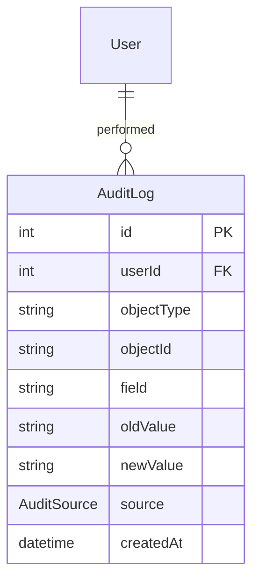

# Architecture

## Architecture Overview

This sprint adds a field-level audit logging system that records all write
operations across the application. The system integrates with the existing
ServiceRegistry to automatically track the source of changes.



## Technology Stack

- **TypeScript** — AuditService, admin routes
- **Prisma** — AuditLog model, migration
- **Express** — Admin audit log API routes
- **React** — Admin audit log panel

## Component Design

### Component: AuditLog Model

**Purpose**: Store field-level change records for all write operations.

**Boundary**: Inside — Prisma model, database table, indexes. Outside — service layer queries.

**Use Cases**: SUC-001

Fields: id, userId, objectType, objectId, field, oldValue, newValue, source, createdAt.
Indexes on (objectType, objectId), userId, and createdAt.

### Component: AuditService

**Purpose**: Provide write() and diff() methods for recording audit entries.

**Boundary**: Inside — entry creation, field comparison logic. Outside — service mutation logic, admin queries.

**Use Cases**: SUC-001, SUC-002

`write(entries)` — bulk-creates audit log entries.
`diff(userId, objectType, objectId, oldObj, newObj, fields, source)` — compares
two object snapshots, writes entries for changed fields only.

### Component: ServiceRegistry Audit Integration

**Purpose**: Propagate audit source from route context to all service operations.

**Boundary**: Inside — AuditService instantiation with source. Outside — route middleware setup.

**Use Cases**: SUC-002

ServiceRegistry constructor accepts source parameter (already exists).
AuditService is added as a new registry member, inheriting the source.
Services receive a reference to AuditService for calling diff() after mutations.

### Component: Admin Audit Log Panel

**Purpose**: Display filterable, paginated audit log to administrators.

**Boundary**: Inside — admin API route, React panel component. Outside — audit data creation.

**Use Cases**: SUC-003

Route: `GET /api/admin/audit-log?objectType=&objectId=&userId=&from=&to=&page=&limit=`
Returns paginated entries with user display info joined from User table.

## Dependency Map

```
AuditService → Prisma (AuditLog model)
UserService → AuditService (calls diff after mutations)
PermissionsService → AuditService (calls diff after mutations)
ChannelService → AuditService (calls diff after mutations)
ConfigService → AuditService (calls diff after mutations)
ServiceRegistry → AuditService (creates and injects)
AdminAuditRoute → Prisma (queries AuditLog directly)
AdminAuditPanel → AdminAuditRoute (fetches data)
```

## Data Model



AuditSource enum: UI, IMPORT, API, MCP, SYSTEM

## Security Considerations

- Audit log is append-only from the application's perspective
- Only admin users can view the audit log panel
- Audit entries for sensitive fields (passwords, tokens) should store
  "[redacted]" rather than actual values
- Audit log API requires admin authentication

## Design Rationale

**Field-level over record-level**: Field-level auditing provides much
more useful information for debugging. "Role changed from USER to ADMIN"
is far more useful than "User record updated."

**Source enum over free-text**: A fixed set of sources makes filtering
reliable and prevents inconsistencies.

**diff() helper over manual logging**: Centralizing the comparison logic
in diff() prevents services from accidentally logging unchanged fields
or missing changed ones.

## Open Questions

None — the audit logging pattern is well-proven in the inventory app
and the existing ServiceRegistry already supports source propagation.

## Sprint Changes

Changes planned:

### Changed Components

**Added:**
- `server/prisma/schema.prisma` — AuditLog model, AuditSource enum
- `server/src/services/audit.service.ts` — AuditService with write/diff
- `server/src/routes/admin/audit.ts` — Admin audit log API
- `client/src/pages/admin/AuditLogPanel.tsx` — Admin audit log UI

**Modified:**
- `server/src/services/service.registry.ts` — Add AuditService member
- `server/src/services/user.service.ts` — Add audit logging to mutations
- `server/src/services/permissions.service.ts` — Add audit logging to mutations
- `server/src/services/channel.service.ts` — Add audit logging to mutations
- `server/src/services/config.ts` — Add audit logging to setConfig

### Migration Concerns

- New AuditLog table requires a Prisma migration
- No data migration needed — audit log starts empty
- Backward compatible — existing functionality unchanged
