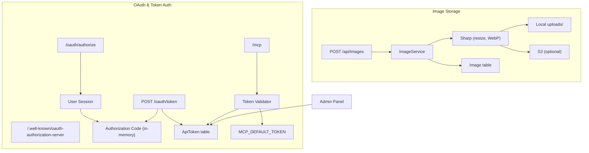
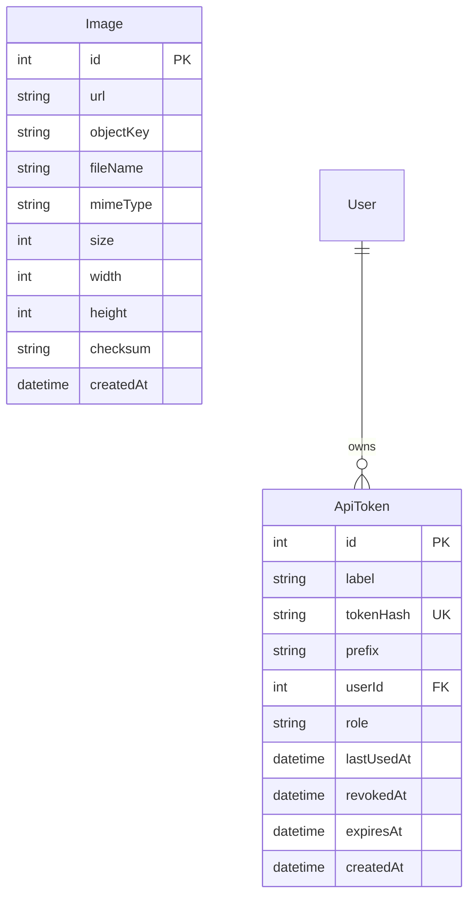

# Architecture

## Architecture Overview

This sprint adds two independent subsystems: an image processing and
storage pipeline, and an OAuth2 authorization server for MCP client
authentication. Both require new Prisma models and database migrations.



## Technology Stack

- **TypeScript** — ImageService, OAuth routes, token validation
- **Prisma** — Image and ApiToken models, migrations
- **Sharp** — Image resize and WebP conversion (new dependency)
- **@aws-sdk/client-s3** — S3 upload (existing dependency)
- **Express** — Image routes, OAuth routes
- **crypto** — SHA256 checksums, PKCE verification, token hashing
- **React** — Admin token management panel

## Component Design

### Component: Image Model & Service

**Purpose**: Process, store, and serve uploaded images.

**Boundary**: Inside — Sharp processing, local/S3 storage, Image DB records.
Outside — consuming features (avatars, attachments), CDN.

**Use Cases**: SUC-001, SUC-002

ImageService methods:
- `create(file)` — process and store an uploaded file
- `createFromUrl(url)` — fetch and process an image from a URL
- `delete(id)` — remove from local, S3, and database
- `getById(id)` — retrieve image metadata

Processing pipeline: resize to 1600px max → WebP quality 80 → SHA256 checksum.
Storage: local `uploads/images/{checksum}.webp` + optional S3 mirror.

### Component: OAuth Authorization Server

**Purpose**: Issue access tokens to external MCP clients via standard OAuth2 flow.

**Boundary**: Inside — discovery, authorize, token endpoints, PKCE validation.
Outside — MCP endpoint (consumes tokens), external OAuth clients.

**Use Cases**: SUC-003

Endpoints:
- `GET /.well-known/oauth-authorization-server` — RFC 8414 metadata
- `GET /oauth/authorize` — start authorization flow, redirect to login if needed
- `POST /oauth/token` — exchange authorization code + PKCE verifier for token

Authorization codes: stored in a Map with 10-minute TTL, single-use.
Tokens: SHA256 hashed before storage, first 8 chars stored as prefix for identification.

### Component: ApiToken Model

**Purpose**: Store database-backed API tokens with revocation and expiry.

**Boundary**: Inside — token records, hash/prefix storage. Outside — token issuance (OAuth), token validation (MCP middleware).

**Use Cases**: SUC-003, SUC-004

Fields: id, label, tokenHash (unique), prefix, userId, role, lastUsedAt,
revokedAt, expiresAt, createdAt.

### Component: Token Validator

**Purpose**: Validate bearer tokens against both static and database sources.

**Boundary**: Inside — static token check, database token lookup, expiry/revocation checks. Outside — MCP route middleware.

**Use Cases**: SUC-003, SUC-004

Validation order:
1. Check against static MCP_DEFAULT_TOKEN (backward compat)
2. Hash the token, look up in ApiToken table
3. Reject if revoked or expired
4. Update lastUsedAt timestamp

### Component: Admin Token Panel

**Purpose**: Manage API tokens through the admin dashboard.

**Boundary**: Inside — token list, revoke, create UI. Outside — OAuth flow.

**Use Cases**: SUC-004

Admin API routes for listing, creating, and revoking tokens.
React panel showing token table with revoke actions.

## Dependency Map

```
ImageService → Sharp (image processing)
ImageService → S3Client (optional upload, existing dep)
ImageService → Prisma (Image model)
ImageRoutes → ImageService
OAuthRoutes → Session (existing Express session)
OAuthRoutes → AuthCodeStore (in-memory Map)
OAuthRoutes → Prisma (ApiToken model)
TokenValidator → Prisma (ApiToken model)
TokenValidator → MCP_DEFAULT_TOKEN env var
MCPMiddleware → TokenValidator
AdminTokenPanel → Prisma (ApiToken model)
```

## Data Model



## Security Considerations

- Token values are never stored — only SHA256 hashes. The raw token is
  returned once at creation and cannot be retrieved later.
- PKCE prevents authorization code interception attacks
- Authorization codes are single-use and expire after 10 minutes
- Revoked tokens are immediately rejected (checked on every request)
- Image uploads are size-limited via multer (e.g., 10MB max)
- Uploaded files are processed through Sharp before storage (prevents
  serving raw user-uploaded content)
- Static MCP_DEFAULT_TOKEN is checked first for performance; its
  existence should be logged as a deprecation warning in production

## Design Rationale

**PKCE over client_secret**: PKCE is the modern standard for public
clients (like Claude Desktop) that can't securely store a client secret.

**In-memory auth code store over database**: Authorization codes are
short-lived (10 min) and single-use. A Map with TTL cleanup is simpler
and faster than database records. In a multi-node deployment, the user
would hit the same node for both authorize and token exchange within
the session.

**SHA256 token hashing**: Same approach as passwords — we never want
to store the raw token value. The prefix (first 8 chars) allows admins
to identify tokens without seeing the full value.

**Sharp over alternatives**: Sharp is the fastest Node.js image processing
library, backed by libvips. It's a well-maintained standard choice.

## Decisions

1. **Image upload size limit**: 10MB max — reasonable default for web
   image uploads. Can be changed via environment variable if needed.
2. **Token expiry duration**: Revoke-only, no automatic expiry. The
   `expiresAt` field remains in the model for optional per-token expiry,
   but tokens are created without an expiry by default. Admins revoke
   tokens manually when needed.

## Sprint Changes

Changes planned:

### Changed Components

**Added:**
- `server/prisma/schema.prisma` — Image model, ApiToken model
- `server/src/services/image.service.ts` — ImageService
- `server/src/routes/images.ts` — Image API routes
- `server/src/routes/oauth.ts` — OAuth authorization server
- `server/src/routes/admin/tokens.ts` — Admin token management API
- `client/src/pages/admin/TokensPanel.tsx` — Admin token management UI

**Modified:**
- `server/src/services/service.registry.ts` — Add ImageService
- `server/src/routes/mcp.ts` — Update token validation to check database
- `server/src/app.ts` — Register new routes, static uploads serving
- `package.json` — Add sharp dependency

### Migration Concerns

- Two new tables (Image, ApiToken) require Prisma migration
- No existing data affected
- MCP token validation is backward compatible (static token still works)
- Sharp requires platform-specific binaries; Docker build may need update
